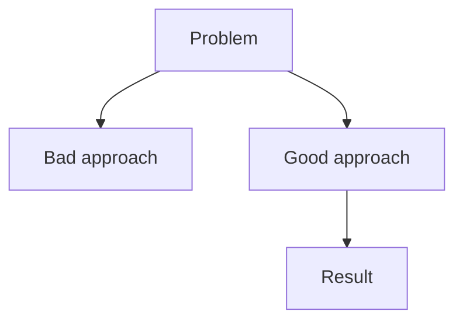

# Blog: The Unwrap

A programming craftsmanship blog. Opinionated, specific, actionable. Not a tutorial site—a knowledge garden documenting hard-won engineering principles.

**Audience**: Senior developers who already know how to program. Do not explain basics.

**Voice**: First person. Direct. Angry when the situation calls for it. A craftsperson who has been burned by bad code too many times and is done pretending it's fine.

The writing must be edgy and rude when the situation calls for it. Words like "vomit", "shit", "what the fuck", "disaster", "garbage" are not just allowed — they are expected when describing bad patterns. Sanitized writing is a failure mode. If bad code doesn't feel bad to read about, the article failed.

Do not soften criticism of bad practices. Name them clearly. "This is wrong." not "This can sometimes be suboptimal." The reader is a senior developer. They can handle it. They've probably written this code themselves and they know it.

---

# Writing Rules

## Tone — Read This First

**No AI writing patterns.** This is the most important rule.

Prohibited:
- Em dashes used for dramatic effect (`—`)
- Filler transitions ("In conclusion", "It's worth noting", "This is crucial")
- Hedging language ("arguably", "perhaps", "might be", "it depends")
- Hyperbole ("game-changing", "revolutionary", "powerful")
- Apologies ("I think maybe...", "one could argue...")
- Passive voice where active works ("methods should be sorted" → "sort your methods")

**Reference tone** — this is what the writing should sound like:

> Programming is drowning in its own confusion.
>
> You open a codebase. You see a `UserService` that doesn't serve anything. A `CustomerController` that doesn't control. A `PaymentUseCase` that... what does a use case even do? The developer who wrote this will tell you they're following Domain-Driven Design. They're not. They've cargo-culted the vocabulary without understanding the grammar.
>
> Meanwhile, AI is making this worse. Much worse.
>
> LLMs generate code that works but reads like a stream of consciousness from a very competent, very drunk programmer. It solves the problem. It passes the tests. It's also architectural vomit: inconsistent naming, mixed abstraction levels, no guiding principles. Just tokens predicting tokens.
>
> Here's the uncomfortable truth: Most human-written code isn't much better.

Short paragraphs. Sentences that land. No softening. The reference above is the floor, not the ceiling — go further when the subject warrants it.

**What makes this voice work:**
- Specific, real-world pain. Not "this can cause issues" but "you spent three days debugging this and the culprit was a nullable boolean."
- Momentum. Short declarative sentences followed by the gut-punch. "It works. It passes the tests. It's also garbage."
- Complicity. The reader wrote this code too. "You know this codebase. You wrote half of it."
- Earned contempt. Mock the pattern, not the person. The `UserService` is stupid. The developer who wrote it was following bad advice from a bad ecosystem.

---

# Article Structure

Every article follows this shape, in this order:

## 1. The Principle

Lead with a bold, unambiguous statement of what to do.

```
**Sort your methods alphabetically.**
```

Not "you might want to consider sorting" — just the claim.

## 2. The Demonstration

Prove it. Show code. Use real examples. Explain the underlying mechanism.

Connect to broader principles when relevant. Show before/after comparisons.

## 3. When This Doesn't Apply

Every principle has limits. Name them explicitly. This is what separates a principle from a dogma.

## 4. FAQ / Counterarguments

Anticipate the objections. Answer them directly. 2-3 is enough.

```
**Q: What about [objection]?**

A: [Direct answer. No hedging.]
```

---

# MDX Formatting

## Code Blocks

Always provide examples in both TypeScript and Rust using the Tab component:

```mdx
<Tabs items={['TypeScript', 'Rust']}>
  <Tab value="TypeScript">
  ```typescript
  // example
  ```
  </Tab>
  <Tab value="Rust">
  ```rust
  // example
  ```
  </Tab>
</Tabs>
```

Exception: infrastructure/tooling articles where TypeScript/Rust don't apply (SQL, shell, etc.) — use whatever languages are relevant.

## Mermaid Diagrams

Every article must have at least one Mermaid diagram.

Use them for: decision flows, before/after states, dependency graphs, process sequences.



Color nodes with CSS class names: `class NodeName green`, `class NodeName red`, `class NodeName yellow`.

Keep diagrams narrow: maximum 3-4 nodes wide horizontally. Diagrams that are too wide render too small to read. Prefer depth over breadth — split into multiple diagrams if needed.

---

# What to Avoid

- Long introductions before the theorem
- Explaining concepts the audience already knows
- Tutorial-style step-by-step instructions (unless making a point)
- Generic section titles ("Overview", "Introduction", "Summary")
- Padding paragraphs that don't advance the argument

---

# File Conventions

- Articles go in `content/docs/<category>/<number>-<slug>.mdx`
- Categories: `fundamentals` (code quality principles), `infrastructure` (tools, env, database patterns)
- Frontmatter requires `title` and `description`
- `description` should be the principle in one sentence, not a topic label

---

# Final Checklist

- [ ] Starts with the theorem, not an introduction
- [ ] At least one Mermaid diagram
- [ ] Shows why, not just what
- [ ] Addresses at least one counterargument
- [ ] No em dashes, hedging, or AI filler
- [ ] Every paragraph serves the central argument
- [ ] You'd want to read this yourself in 2 years
