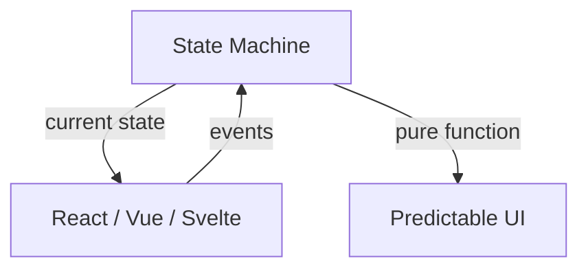
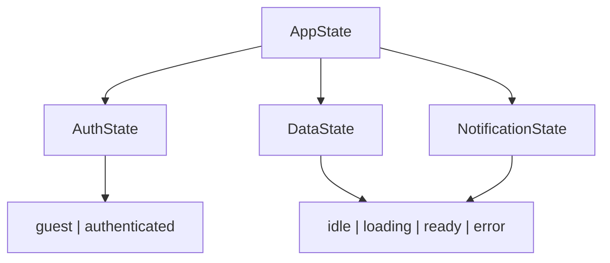
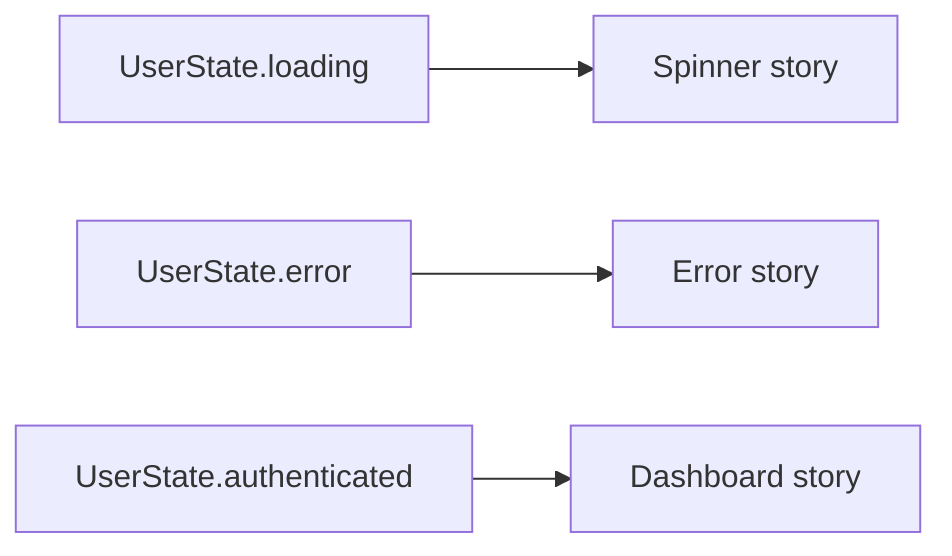

<Principle>Model your application state explicitly before writing a single component. The UI is a rendering function over your state. Treat it that way.</Principle>

## What React Taught You to Do Wrong

React gave you `useState`, `useEffect`, `useCallback`, `useMemo`, and fifteen other hooks to orchestrate behavior inside components. So that's where the behavior went.

Now you have components that fetch data, handle auth, read from localStorage, call two different APIs, and manage form state — all at once. The hooks call each other. The effects trigger other effects. You added a `useRef` to break a cycle you don't fully understand.

You call this "business logic". It isn't. It's spaghetti with a hook-shaped pasta.

The symptoms are predictable:

- **Flickering.** Something renders in state A, flashes through state B, settles on state C. Users see the flash. You can't reproduce it. You add a loading flag and the flash moves somewhere else.
- **Test hell.** You can't unit test this code. It lives inside React. So you write end-to-end tests. Cypress. Playwright. Your CI takes 40 minutes. Your laptop sounds like a jet engine. You're testing whether clicking a button correctly fetches something from an API — and it takes 40 minutes to find out.
- **Rerenders.** 40 rerenders for a simple page load. Something in localStorage triggers a context update which triggers a fetch which updates state which re-renders half the tree.
- **Unpredictable interactions.** You have a legacy GraphQL API and a newer tRPC layer, both touching related objects. They update state through different paths. The UI reflects whichever one finished last. Good luck predicting what the user sees.

I've watched this exact failure mode play out in two different companies. Different stacks, same outcome: nobody could tell you what the app would look like after a sequence of user actions without running it. Nobody could write a test that didn't require a browser. Nobody could fix a bug without breaking two others.

## The Problem Is Not React

React is fine. The problem is putting your application logic inside it.

React is a rendering library. It renders a tree of components. That is what it does well. When you put state machines, async flows, and business rules inside it, you're using a rendering library as an application framework. It fights you the whole way.

The fix isn't a new framework. It's a boundary.



Your state lives outside the UI. The UI reads it and emits events. The state machine decides what happens next. React is just the last mile.

## Explicit State

Stop using booleans and nullable fields to represent application state. Start using discriminated unions.

Here's what most codebases look like:

```typescript
const [user, setUser] = useState<User | null>(null);
const [loading, setLoading] = useState(false);
const [error, setError] = useState<string | null>(null);
```

Three independent variables. Eight possible combinations. Only three are valid. The other five are bugs waiting to happen: `loading: true` with a non-null `user`. `error` set while `loading` is still true. You can't represent these invariants. You can only hope.

Here's the same thing modeled correctly:

```typescript
type UserState =
  | { status: 'guest' }
  | { status: 'loading' }
  | { status: 'authenticated'; user: User }
  | { status: 'error'; message: string };
```

Four states. Zero invalid combinations. The compiler enforces what your comments only suggested.

The UI becomes a switch statement:

```typescript
function UserSection({ state }: { state: UserState }) {
  switch (state.status) {
    case 'guest':     return <LoginButton />;
    case 'loading':   return <Spinner />;
    case 'authenticated': return <Dashboard user={state.user} />;
    case 'error':     return <ErrorMessage message={state.message} />;
  }
}
```

No conditions. No null checks. No "what if user is null and loading is false and error is also null" edge case. The type system made that state impossible.

## Compose States

Real applications have multiple orthogonal state machines. Compose them.

```typescript
type AuthState =
  | { status: 'guest' }
  | { status: 'authenticated'; user: User; role: 'user' | 'admin' };

type DataState<T> =
  | { status: 'idle' }
  | { status: 'loading' }
  | { status: 'ready'; data: T }
  | { status: 'error'; error: Error };

type AppState = {
  auth: AuthState;
  dashboard: DataState<DashboardData>;
  notifications: DataState<Notification[]>;
};
```

Your entire application is describable as a single value. You can serialize it, log it, replay it. When a bug report comes in, you ask for the state snapshot. You reproduce it in a unit test. You fix it without opening a browser.



## The UI Is the Shell

Once your state is explicit, UI components become trivial. They take state as props, return JSX, emit events. No fetching, no side effects, no business logic.

```typescript
// This component has no opinions about the world.
// It just renders whatever you hand it.
function Dashboard({ state }: { state: AppState }) {
  if (state.auth.status !== 'authenticated') return null;

  return (
    <Layout user={state.auth.user}>
      <DataSection state={state.dashboard} />
      <NotificationBadge state={state.notifications} />
    </Layout>
  );
}
```

This component is testable without a browser. Pass a state object, assert on the output. Done. That's a unit test. It runs in 2ms.

It's also Storybook-friendly. Want to show the loading state? Pass `{ status: 'loading' }`. Want the error state? Pass `{ status: 'error', error: new Error('timeout') }`. No mocking, no network, no auth setup. Every visual variant is a value.



## The Implementation Doesn't Matter

Use Zustand. Use XState. Use signals. Use `useReducer`. Write your own with a class and event listeners. The mechanism is irrelevant. What matters is the discipline: state lives outside components, components are pure functions over state.

```typescript
// Zustand store — state lives here, not in components
const useAppStore = create<AppState & Actions>((set) => ({
  auth: { status: 'guest' },
  dashboard: { status: 'idle' },

  login: async (credentials) => {
    set({ auth: { status: 'loading' } });
    try {
      const user = await api.login(credentials);
      set({ auth: { status: 'authenticated', user, role: user.role } });
    } catch (e) {
      set({ auth: { status: 'error', message: e.message } });
    }
  },
}));
```

The component becomes:

```typescript
function LoginPage() {
  const auth = useAppStore((s) => s.auth);
  const login = useAppStore((s) => s.login);

  if (auth.status === 'authenticated') return <Redirect to="/dashboard" />;

  return <LoginForm onSubmit={login} loading={auth.status === 'loading'} />;
}
```

The component knows nothing about how login works. It reads state, calls an action. The store handles the transitions. You can test the store without React. You can test the component without the store.

## "My App Is Too Simple For This"

It isn't.

If your app has a login button, you have auth state. If you fetch data, you have loading state. If anything can fail, you have error state. If the user can trigger actions, you have transition logic. Every frontend app has state machines in it. You're already writing them — just badly, as boolean soup inside components.

The cost of doing this right is low. You write a few types, move some logic out of hooks, wire up a store. You do this in a day or two. The payoff compounds immediately: tests you can run without a browser, components you can develop in isolation, bugs you can reproduce from a log.

The cost of not doing it is 40-minute CI pipelines and a laptop that sounds like it's about to take off.

## When This Doesn't Apply

**Truly simple static pages.** If your page has no async operations, no auth, and no user-driven state transitions, a state machine is overkill. A blog post with a dark mode toggle doesn't need Zustand.

**Purely server-rendered apps.** If your server handles all state and the client is just displaying HTML, this is a non-problem. Lucky you.

## "Actually..."

<Objection>React Query / SWR already handles loading and error states for me.</Objection>

For server state, yes. These libraries are good. But server state is one slice. You still have UI state (modals, tabs, selections), auth state, and local interaction state. React Query doesn't model those. You end up with a mix: server state in React Query, everything else back in component hooks. The boundary problem remains.

<Objection>This is just re-inventing Elm or Redux.</Objection>

Elm got it right in 2012. Redux got the ceremony wrong but the architecture right. The point isn't novelty — it's that the pattern works and most React codebases ignore it entirely. If you're already doing this, great. This article isn't for you.

<Objection>What about forms? Forms have a lot of local state.</Objection>

Forms are the one place where local component state is genuinely appropriate. Field values, validation messages, focused field — this is transient UI state that has no business being in your application store. Use `react-hook-form` or `useState` freely for forms. Just don't let form submission logic, API calls, or outcome handling leak back into the component. Those belong in the store.
