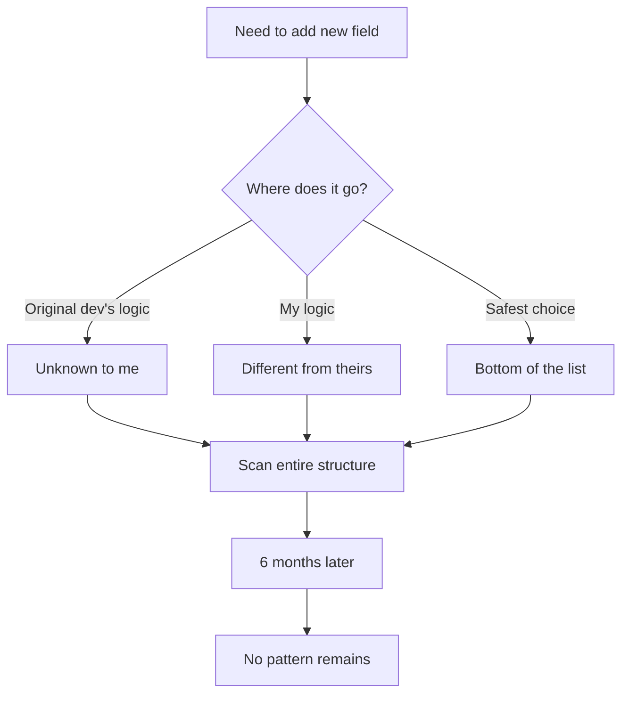
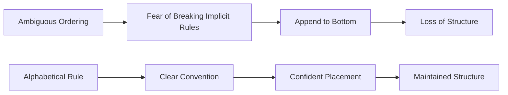
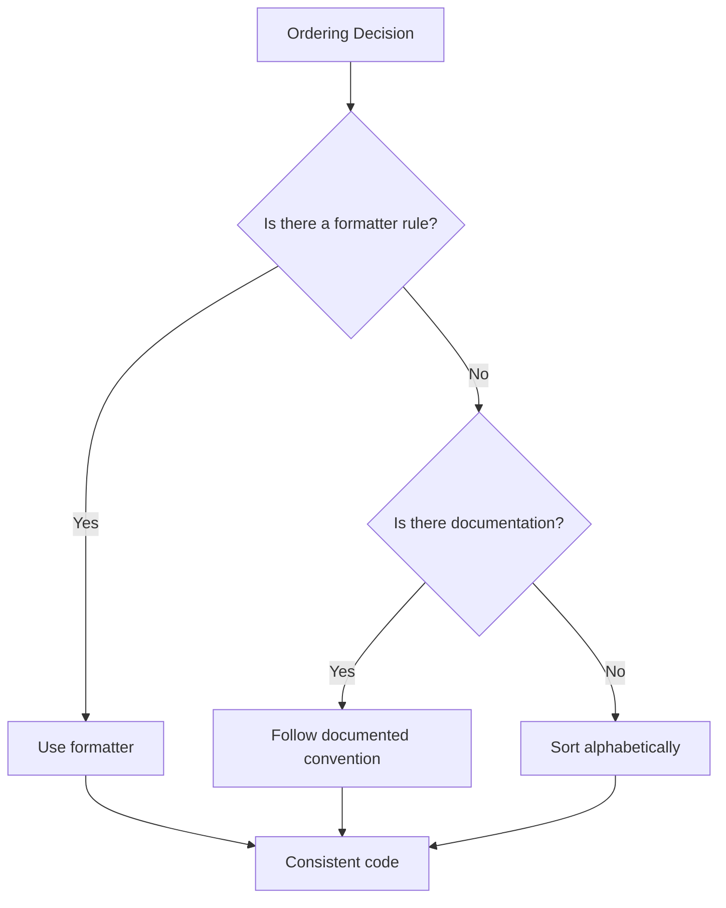

## The Principle

**Sort your code alphabetically unless you have a documented reason not to.**

This applies to:
- Object properties
- Table columns
- Function parameters
- Class methods
- React component props
- Import statements
- Enum values
- Everything else that forms a list

If you're staring at your code wondering "where should I put this?"—the answer is alphabetical order.

## Why This Works

### Everyone's Logic Is Different

You think your ordering is logical. It isn't. It's *your* logic, which is invisible to everyone else.

Watch this happen in real time:

<Tabs items={['TypeScript', 'Rust']}>
<Tab value="TypeScript">
```typescript
// Developer A's "logical" order
interface User {
  id: string;           // Primary key goes first, obviously
  email: string;        // Main identifier
  name: string;         // Important info
  role: UserRole;       // Important info
  createdAt: Date;      // Metadata at the end
  updatedAt: Date;      // Metadata at the end
  lastLoginAt?: Date;   // Optional metadata last
}
```
</Tab>
<Tab value="Rust">
```rust
// Developer A's "logical" order
struct User {
    id: String,           // Primary key goes first, obviously
    email: String,        // Main identifier
    name: String,         // Important info
    role: UserRole,       // Important info
    created_at: DateTime, // Metadata at the end
    updated_at: DateTime, // Metadata at the end
    last_login_at: Option<DateTime>, // Optional metadata last
}
```
</Tab>
</Tabs>

Developer A is proud of this structure. ID first (primary key!), timestamps last (metadata!), business fields in the middle. Makes perfect sense.

Then Developer B adds a field:

<Tabs items={['TypeScript', 'Rust']}>
<Tab value="TypeScript">
```typescript
// Developer B adds phone number
interface User {
  id: string;
  email: string;
  name: string;
  role: UserRole;
  createdAt: Date;
  updatedAt: Date;
  lastLoginAt?: Date;
  phoneNumber?: string;  // Where does this go? 🤷
}
```
</Tab>
<Tab value="Rust">
```rust
// Developer B adds phone number
struct User {
    id: String,
    email: String,
    name: String,
    role: UserRole,
    created_at: DateTime,
    updated_at: DateTime,
    last_login_at: Option<DateTime>,
    phone_number: Option<String>,  // Where does this go? 🤷
}
```
</Tab>
</Tabs>

Developer B doesn't know your system. Is `phoneNumber` important like `email`, or optional metadata like `lastLoginAt`? They put it at the bottom because **that's the safest social choice**—don't disturb the existing order, don't make enemies.

Six months later, you have this:

<Tabs items={['TypeScript', 'Rust']}>
<Tab value="TypeScript">
```typescript
// The inevitable chaos
interface User {
  id: string;
  email: string;
  name: string;
  role: UserRole;
  createdAt: Date;
  updatedAt: Date;
  lastLoginAt?: Date;
  phoneNumber?: string;
  department: string;
  isActive: boolean;
  preferences: UserPreferences;
  avatarUrl?: string;
  bio?: string;
}
```
</Tab>
<Tab value="Rust">
```rust
// The inevitable chaos
struct User {
    id: String,
    email: String,
    name: String,
    role: UserRole,
    created_at: DateTime,
    updated_at: DateTime,
    last_login_at: Option<DateTime>,
    phone_number: Option<String>,
    department: String,
    is_active: bool,
    preferences: UserPreferences,
    avatar_url: Option<String>,
    bio: Option<String>,
}
```
</Tab>
</Tabs>

Your original logic is dead. The structure is archaeological—layers of accretion with no guiding principle. Finding anything requires scanning the entire list.

### The Decision Tree of Chaos



Every developer makes microdecisions based on their mental model. These models never align. The result: entropy.

### Alphabetical Order Needs No Explanation

Now watch this:

<Tabs items={['TypeScript', 'Rust']}>
<Tab value="TypeScript">
```typescript
// Alphabetically sorted
interface User {
  avatarUrl?: string;
  bio?: string;
  createdAt: Date;
  department: string;
  email: string;
  id: string;
  isActive: boolean;
  lastLoginAt?: Date;
  name: string;
  phoneNumber?: string;
  preferences: UserPreferences;
  role: UserRole;
  updatedAt: Date;
}
```
</Tab>
<Tab value="Rust">
```rust
// Alphabetically sorted
struct User {
    avatar_url: Option<String>,
    bio: Option<String>,
    created_at: DateTime,
    department: String,
    email: String,
    id: String,
    is_active: bool,
    last_login_at: Option<DateTime>,
    name: String,
    phone_number: Option<String>,
    preferences: UserPreferences,
    role: UserRole,
    updated_at: DateTime,
}
```
</Tab>
</Tabs>

Developer A, B, C, and Z all know where to add fields. Developer A doesn't like that `id` isn't first? **Too bad**. Developer B thinks timestamps should be together? **Doesn't matter**. 

There's one rule. It requires zero documentation. It needs no explanation. It's culturally neutral.

When you need to find `phoneNumber`, you don't scan—you binary search mentally. "P comes after N, before R." Found it.

### The Social Dynamics

Here's what actually happens in teams:



Without a clear convention, developers play it safe. They append. They don't refactor. They preserve the chaos because changing it feels presumptuous.

With alphabetical ordering, placement is objective. You're not imposing your preference—you're following the alphabet. No politics, no ego, no archaeology required.

## Real-World Application

### Object Properties

<Tabs items={['TypeScript', 'Rust']}>
<Tab value="TypeScript">
```typescript
// ❌ Avoid: "Logical" grouping that only makes sense to you
const config = {
  apiUrl: "https://api.example.com",
  apiKey: "secret",
  timeout: 5000,
  retries: 3,
  enableLogging: true,
  logLevel: "info",
  maxConnections: 10,
};

// ✅ Prefer: Alphabetical
const config = {
  apiKey: "secret",
  apiUrl: "https://api.example.com",
  enableLogging: true,
  logLevel: "info",
  maxConnections: 10,
  retries: 3,
  timeout: 5000,
};
```
</Tab>
<Tab value="Rust">
```rust
// ❌ Avoid: "Logical" grouping that only makes sense to you
struct Config {
    api_url: String,
    api_key: String,
    timeout: u64,
    retries: u32,
    enable_logging: bool,
    log_level: String,
    max_connections: u32,
}

// ✅ Prefer: Alphabetical
struct Config {
    api_key: String,
    api_url: String,
    enable_logging: bool,
    log_level: String,
    max_connections: u32,
    retries: u32,
    timeout: u64,
}
```
</Tab>
</Tabs>

### React Component Props

<Tabs items={['TypeScript', 'Rust']}>
<Tab value="TypeScript">
```tsx
// ❌ Avoid: Random order from stream of consciousness
<UserProfile
  isActive={true}
  name="Alice"
  onUpdate={handleUpdate}
  email="alice@example.com"
  role="admin"
  avatar="/images/avatar.jpg"
/>

// ✅ Prefer: Alphabetical
<UserProfile
  avatar="/images/avatar.jpg"
  email="alice@example.com"
  isActive={true}
  name="Alice"
  onUpdate={handleUpdate}
  role="admin"
/>
```
</Tab>
<Tab value="Rust">
```rust
// In Rust, this applies to struct initialization and builder patterns
// ❌ Avoid: Random order
let profile = UserProfile {
    is_active: true,
    name: "Alice".to_string(),
    email: "alice@example.com".to_string(),
    role: Role::Admin,
    avatar: "/images/avatar.jpg".to_string(),
};

// ✅ Prefer: Alphabetical
let profile = UserProfile {
    avatar: "/images/avatar.jpg".to_string(),
    email: "alice@example.com".to_string(),
    is_active: true,
    name: "Alice".to_string(),
    role: Role::Admin,
};
```
</Tab>
</Tabs>

### Database Tables

```sql
-- ❌ Avoid: "Primary key first, timestamps last" logic
CREATE TABLE users (
  id UUID PRIMARY KEY,
  email VARCHAR(255) NOT NULL,
  name VARCHAR(100),
  role VARCHAR(50),
  phone_number VARCHAR(20),
  created_at TIMESTAMP DEFAULT NOW(),
  updated_at TIMESTAMP DEFAULT NOW()
);

-- ✅ Prefer: Alphabetical (with documented exceptions)
CREATE TABLE users (
  created_at TIMESTAMP DEFAULT NOW(),
  email VARCHAR(255) NOT NULL,
  id UUID PRIMARY KEY,  -- Exception: PK declared here for SQL constraints
  name VARCHAR(100),
  phone_number VARCHAR(20),
  role VARCHAR(50),
  updated_at TIMESTAMP DEFAULT NOW()
);
```

Actually, for SQL specifically, you might want a documented exception because constraints matter. Which brings us to...

## When Not To Sort Alphabetically

You can break this rule. But you must **document the exception**.

### Acceptable Exceptions (If Written Down)

**Class methods with visibility grouping:**

<Tabs items={['TypeScript', 'Rust']}>
<Tab value="TypeScript">
```typescript
/**
 * Method ordering convention:
 * 1. Constructor
 * 2. Public methods (alphabetical)
 * 3. Private methods (alphabetical)
 */
class UserRepository {
  constructor(private db: Database) {}
  
  // Public methods (alphabetical)
  async createUser(data: UserData): Promise<User> {}
  async deleteUser(id: string): Promise<void> {}
  async findUserById(id: string): Promise<User | null> {}
  async updateUser(id: string, data: Partial<UserData>): Promise<User> {}
  
  // Private methods (alphabetical)
  private async executeQuery(sql: string): Promise<any> {}
  private validateUserData(data: UserData): void {}
}
```
</Tab>
<Tab value="Rust">
```rust
/// Method ordering convention:
/// 1. Constructor/new
/// 2. Public methods (alphabetical)
/// 3. Private methods (alphabetical)
impl UserRepository {
    pub fn new(db: Database) -> Self {
        Self { db }
    }
    
    // Public methods (alphabetical)
    pub async fn create_user(&self, data: UserData) -> Result<User> {}
    pub async fn delete_user(&self, id: &str) -> Result<()> {}
    pub async fn find_user_by_id(&self, id: &str) -> Result<Option<User>> {}
    pub async fn update_user(&self, id: &str, data: UserData) -> Result<User> {}
    
    // Private methods (alphabetical)
    async fn execute_query(&self, sql: &str) -> Result<QueryResult> {}
    fn validate_user_data(&self, data: &UserData) -> Result<()> {}
}
```
</Tab>
</Tabs>

This exception is fine **because it's documented at the top of the class**. Within each section, still alphabetical.

### SQL Constraints Exception

```sql
/**
 * Column ordering convention:
 * 1. Columns alphabetical EXCEPT
 * 2. Primary key declared first for readability
 * 3. Foreign keys with their constraints grouped
 */
CREATE TABLE orders (
  id UUID PRIMARY KEY,  -- Exception: PK first
  
  -- Alphabetical columns
  created_at TIMESTAMP DEFAULT NOW(),
  customer_id UUID REFERENCES users(id),
  status VARCHAR(50),
  total_amount DECIMAL(10,2),
  updated_at TIMESTAMP DEFAULT NOW()
);
```

### Domain-Specific Ordering

If you're building a React component where prop order affects render performance (rare), or a database where column order affects storage (very rare), document it:

```typescript
/**
 * Props ordered by render frequency (hot path optimization):
 * - Frequently changing props first
 * - Static props last
 * See: docs/performance.md#prop-ordering
 */
interface ChartProps {
  data: number[];      // Updates every 100ms
  isLoading: boolean;  // Updates on fetch
  title: string;       // Static
  width: number;       // Static
}
```

The key: **The exception must be written somewhere**. Preferably as a comment in the code, or as an automated linting rule.

## The Implementation Hierarchy



The best solution is automation:

1. **Formatter/Linter rules** (best): Configure ESLint, Prettier, rustfmt, or your language's formatter to enforce alphabetical ordering
2. **Documented conventions** (good): Write it down in code comments or team docs
3. **Alphabetical by default** (minimum): When in doubt, alphabet

### Automate When Possible

<Tabs items={['TypeScript', 'Rust']}>
<Tab value="TypeScript">
```json
// .eslintrc.json
{
  "rules": {
    "sort-keys": ["error", "asc", { "natural": true }],
    "sort-imports": ["error", {
      "ignoreCase": true,
      "ignoreDeclarationSort": false
    }]
  }
}
```
</Tab>
<Tab value="Rust">
```toml
# rustfmt.toml
reorder_imports = true
reorder_modules = true
# Note: Rust doesn't have built-in struct field sorting in rustfmt
# Consider using cargo-machete or custom lints
```
</Tab>
</Tabs>

When the formatter handles it, you don't have to think. That's the goal.

## FAQ

**Q: Doesn't alphabetical ordering hide semantic relationships?**

A: If semantic relationships matter, make them explicit in your architecture, not in your field ordering. Use types, modules, and clear naming. Don't rely on spatial proximity to convey meaning.

<Tabs items={['TypeScript', 'Rust']}>
<Tab value="TypeScript">
```typescript
// ❌ Trying to show relationships through ordering
interface User {
  firstName: string;
  lastName: string;   // "These go together!"
  email: string;
  phone: string;      // "These go together!"
}

// ✅ Make relationships explicit through types
interface UserName {
  first: string;
  last: string;
}

interface UserContact {
  email: string;
  phone: string;
}

interface User {
  contact: UserContact;  // Alphabetical, relationship explicit
  name: UserName;
}
```
</Tab>
<Tab value="Rust">
```rust
// ❌ Trying to show relationships through ordering
struct User {
    first_name: String,
    last_name: String,   // "These go together!"
    email: String,
    phone: String,       // "These go together!"
}

// ✅ Make relationships explicit through types
struct UserName {
    first: String,
    last: String,
}

struct UserContact {
    email: String,
    phone: String,
}

struct User {
    contact: UserContact,  // Alphabetical, relationship explicit
    name: UserName,
}
```
</Tab>
</Tabs>

**Q: What about function parameters that have a natural order?**

A: Natural order for function parameters is fine because calling conventions matter:

<Tabs items={['TypeScript', 'Rust']}>
<Tab value="TypeScript">
```typescript
// ✅ Correct: Parameters follow usage logic
function createUser(name: string, email: string, role: string) {
  // name is required first, alphabetical would be weird here
}

// But the function itself in a class? Alphabetical with other functions.
```
</Tab>
<Tab value="Rust">
```rust
// ✅ Correct: Parameters follow usage logic
fn create_user(name: String, email: String, role: String) -> User {
    // name is required first, alphabetical would be weird here
}

// But the function itself in an impl block? Alphabetical with other functions.
```
</Tab>
</Tabs>

**Q: Our codebase is already inconsistent. Do we refactor everything?**

A: No. Apply alphabetical ordering:
- To all new code going forward
- To any file you're already modifying
- When it takes < 5 minutes to fix

Don't create churn. But establish the convention and migrate gradually.

**Q: What about imports? Sometimes I group by source (stdlib, external, internal).**

A: That's a documented exception. Many style guides do this:

<Tabs items={['TypeScript', 'Rust']}>
<Tab value="TypeScript">
```typescript
// Standard library (alphabetical)
import { readFile } from 'fs/promises';
import { join } from 'path';

// External packages (alphabetical)
import express from 'express';
import { z } from 'zod';

// Internal modules (alphabetical)
import { Database } from './database';
import { logger } from './logger';
```
</Tab>
<Tab value="Rust">
```rust
// Standard library (alphabetical)
use std::fs::File;
use std::path::Path;

// External crates (alphabetical)
use axum::Router;
use serde::{Deserialize, Serialize};

// Internal modules (alphabetical)
use crate::database::Database;
use crate::logger::Logger;
```
</Tab>
</Tabs>

Groups are fine. Within groups: alphabetical.

## The Bottom Line

Alphabetical ordering is not sexy. It's not clever. It will never win you architecture debates.

It's also the only ordering system that:
- Requires zero mental overhead
- Needs no documentation (unless you're breaking it)
- Works across cultures, teams, and time zones
- Scales from 5 fields to 500
- Enables instant lookup
- Eliminates bikeshedding

**When in doubt: A comes before B.**

Everything else is optional complexity that needs to justify its existence in writing.