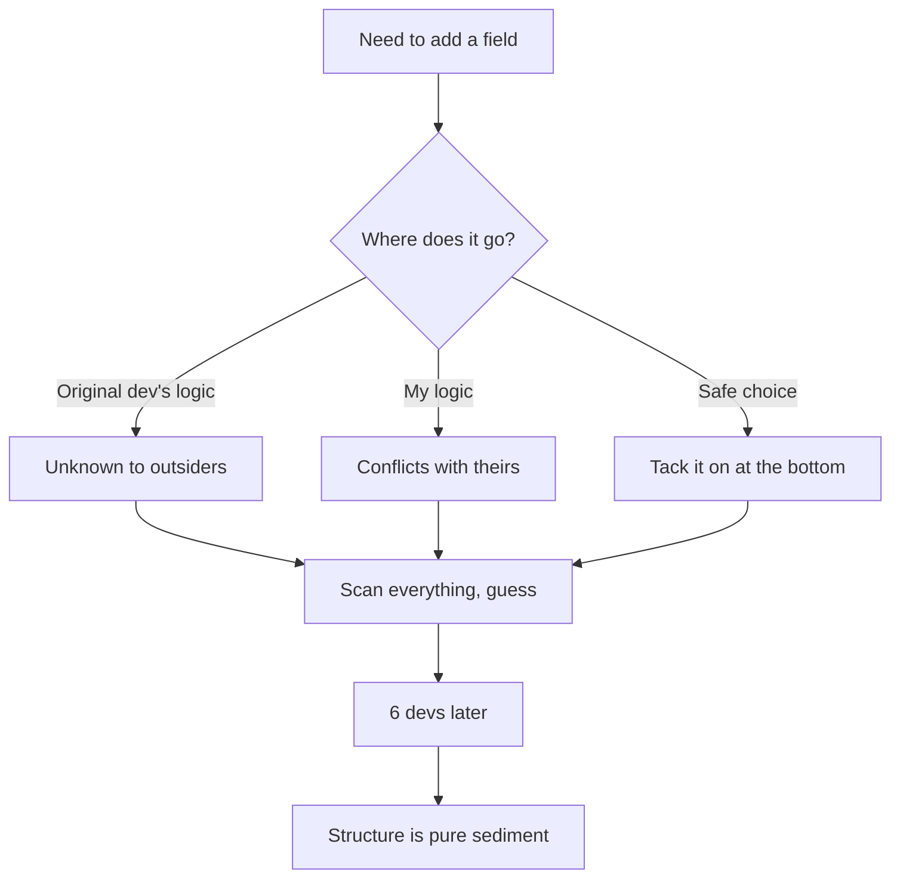
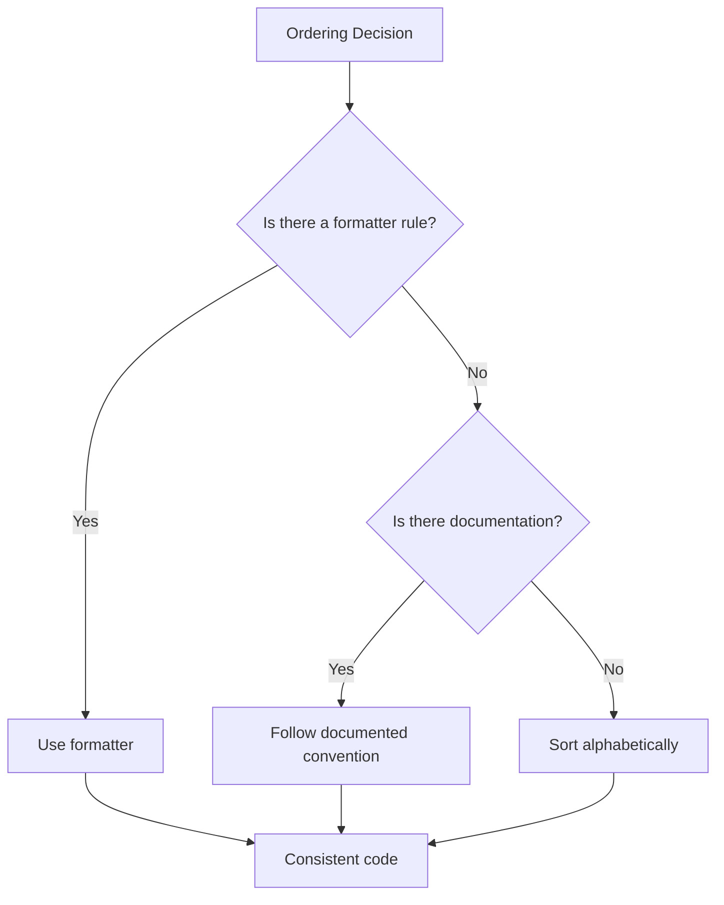

<Principle>Sort your code alphabetically unless you have a documented reason not to.</Principle>

Object properties, table columns, function parameters, class methods, React component props, import statements, enum values. Everything that forms a list.

If you're staring at your code wondering where to put this field, the answer is alphabetical order. Not "important stuff first". Not "related things together". Alphabetical. Every time.

## Why This Works

### Everyone's Logic Is Different

You think your ordering is logical. It isn't. It's *your* logic, which is invisible to everyone else, and will be invisible to you in four months.

Watch this happen in real time:

<Tabs items={['TypeScript', 'Rust']}>
<Tab value="TypeScript">
```typescript
// Developer A's "logical" order
interface User {
  id: string;           // Primary key goes first, obviously
  email: string;        // Main identifier
  name: string;         // Important info
  role: UserRole;       // Important info
  createdAt: Date;      // Metadata at the end
  updatedAt: Date;      // Metadata at the end
  lastLoginAt?: Date;   // Optional metadata last
}
```
</Tab>
<Tab value="Rust">
```rust
// Developer A's "logical" order
struct User {
    id: String,           // Primary key goes first, obviously
    email: String,        // Main identifier
    name: String,         // Important info
    role: UserRole,       // Important info
    created_at: DateTime, // Metadata at the end
    updated_at: DateTime, // Metadata at the end
    last_login_at: Option<DateTime>, // Optional metadata last
}
```
</Tab>
</Tabs>

Developer A is proud of this structure. ID first (primary key!), timestamps last (metadata!), business fields in the middle. It has a logic. A logic that exists only inside Developer A's head. Developer A will explain it at length in the code review. Nobody asked.

Then Developer B adds a field:

<Tabs items={['TypeScript', 'Rust']}>
<Tab value="TypeScript">
```typescript
// Developer B adds phone number
interface User {
  id: string;
  email: string;
  name: string;
  role: UserRole;
  createdAt: Date;
  updatedAt: Date;
  lastLoginAt?: Date;
  phoneNumber?: string;  // Where does this go? 🤷
}
```
</Tab>
<Tab value="Rust">
```rust
// Developer B adds phone number
struct User {
    id: String,
    email: String,
    name: String,
    role: UserRole,
    created_at: DateTime,
    updated_at: DateTime,
    last_login_at: Option<DateTime>,
    phone_number: Option<String>,  // Where does this go? 🤷
}
```
</Tab>
</Tabs>

Developer B doesn't know your system. Is `phoneNumber` important like `email`, or optional metadata like `lastLoginAt`? No idea. So they stick it at the bottom because that's the safest political move: don't disturb the existing order, don't own the decision, don't make enemies.

Six months later, you have this:

<Tabs items={['TypeScript', 'Rust']}>
<Tab value="TypeScript">
```typescript
// The inevitable chaos
interface User {
  id: string;
  email: string;
  name: string;
  role: UserRole;
  createdAt: Date;
  updatedAt: Date;
  lastLoginAt?: Date;
  phoneNumber?: string;
  department: string;
  isActive: boolean;
  preferences: UserPreferences;
  avatarUrl?: string;
  bio?: string;
}
```
</Tab>
<Tab value="Rust">
```rust
// The inevitable chaos
struct User {
    id: String,
    email: String,
    name: String,
    role: UserRole,
    created_at: DateTime,
    updated_at: DateTime,
    last_login_at: Option<DateTime>,
    phone_number: Option<String>,
    department: String,
    is_active: bool,
    preferences: UserPreferences,
    avatar_url: Option<String>,
    bio: Option<String>,
}
```
</Tab>
</Tabs>

Your original logic is dead. The structure is now archaeological: layers of sediment with no guiding principle. Finding anything requires scanning the whole thing top to bottom, every time. You built a list you have to read like a novel. Nobody asked for a novel.

### The Decision Tree of Chaos


```mermaid
graph TD
    A[Need to add a field] --> B{Where does it go?}
    B -->|Original dev's logic| C[Unknown to outsiders]
    B -->|My logic| D[Conflicts with theirs]
    B -->|Safe choice| E[Tack it on at the bottom]

    C --> F[Scan everything, guess]
    D --> F
    E --> F

    F --> G[6 devs later]
    G --> H[Structure is pure sediment]

    class H red
```

Every developer makes micro-decisions based on their mental model. Those models never align, and nobody documents them. The result: entropy baked into your data structures before a single business rule is written.

### Alphabetical Order Needs No Explanation

Now watch this:

<Tabs items={['TypeScript', 'Rust']}>
<Tab value="TypeScript">
```typescript
// Alphabetically sorted
interface User {
  avatarUrl?: string;
  bio?: string;
  createdAt: Date;
  department: string;
  email: string;
  id: string;
  isActive: boolean;
  lastLoginAt?: Date;
  name: string;
  phoneNumber?: string;
  preferences: UserPreferences;
  role: UserRole;
  updatedAt: Date;
}
```
</Tab>
<Tab value="Rust">
```rust
// Alphabetically sorted
struct User {
    avatar_url: Option<String>,
    bio: Option<String>,
    created_at: DateTime,
    department: String,
    email: String,
    id: String,
    is_active: bool,
    last_login_at: Option<DateTime>,
    name: String,
    phone_number: Option<String>,
    preferences: UserPreferences,
    role: UserRole,
    updated_at: DateTime,
}
```
</Tab>
</Tabs>

Developer A, B, C, and Z all know where to add fields. Developer A doesn't like that `id` isn't first? **Too bad**. Developer B thinks timestamps should be together? **Doesn't matter**.

There's one rule. It requires zero documentation. It needs no explanation. It's culturally neutral.

When you need to find `phoneNumber`, you don't scan: you binary search mentally. "P comes after N, before R." Found it.

Without a clear convention, developers play it safe. They append. They don't refactor. They preserve the chaos because touching it feels presumptuous. With alphabetical ordering, placement is objective. You're not imposing your taste. You're following the alphabet. No politics, no ego, no archaeology.

## When Not To Sort Alphabetically

You can break this rule. But you must **document the exception**.

### Acceptable Exceptions (If Written Down)

**Class methods with visibility grouping:**

<Tabs items={['TypeScript', 'Rust']}>
<Tab value="TypeScript">
```typescript
/**
 * Method ordering convention:
 * 1. Constructor
 * 2. Public methods (alphabetical)
 * 3. Private methods (alphabetical)
 */
class UserRepository {
  constructor(private db: Database) {}

  // Public methods (alphabetical)
  async createUser(data: UserData): Promise<User> {}
  async deleteUser(id: string): Promise<void> {}
  async findUserById(id: string): Promise<User | null> {}
  async updateUser(id: string, data: Partial<UserData>): Promise<User> {}

  // Private methods (alphabetical)
  private async executeQuery(sql: string): Promise<any> {}
  private validateUserData(data: UserData): void {}
}
```
</Tab>
<Tab value="Rust">
```rust
/// Method ordering convention:
/// 1. Constructor/new
/// 2. Public methods (alphabetical)
/// 3. Private methods (alphabetical)
impl UserRepository {
    pub fn new(db: Database) -> Self {
        Self { db }
    }

    // Public methods (alphabetical)
    pub async fn create_user(&self, data: UserData) -> Result<User> {}
    pub async fn delete_user(&self, id: &str) -> Result<()> {}
    pub async fn find_user_by_id(&self, id: &str) -> Result<Option<User>> {}
    pub async fn update_user(&self, id: &str, data: UserData) -> Result<User> {}

    // Private methods (alphabetical)
    async fn execute_query(&self, sql: &str) -> Result<QueryResult> {}
    fn validate_user_data(&self, data: &UserData) -> Result<()> {}
}
```
</Tab>
</Tabs>

This exception is fine **because it's documented at the top of the class**. Within each section, still alphabetical.

### SQL Constraints Exception

```sql
/**
 * Column ordering convention:
 * 1. Columns alphabetical EXCEPT
 * 2. Primary key declared first for readability
 * 3. Foreign keys with their constraints grouped
 */
CREATE TABLE orders (
  id UUID PRIMARY KEY,  -- Exception: PK first

  -- Alphabetical columns
  created_at TIMESTAMP DEFAULT NOW(),
  customer_id UUID REFERENCES users(id),
  status VARCHAR(50),
  total_amount DECIMAL(10,2),
  updated_at TIMESTAMP DEFAULT NOW()
);
```

### Domain-Specific Ordering

If you're building a React component where prop order affects render performance (rare), or a database where column order affects storage (very rare), document it:

```typescript
/**
 * Props ordered by render frequency (hot path optimization):
 * - Frequently changing props first
 * - Static props last
 * See: docs/performance.md#prop-ordering
 */
interface ChartProps {
  data: number[];      // Updates every 100ms
  isLoading: boolean;  // Updates on fetch
  title: string;       // Static
  width: number;       // Static
}
```

The key: **The exception must be written somewhere**. Preferably as a comment in the code, or as an automated linting rule.

## The Implementation Hierarchy


```mermaid
graph TD
    A[Ordering Decision] --> B{Is there a formatter rule?}
    B -->|Yes| C[Use formatter]
    B -->|No| D{Is there documentation?}

    D -->|Yes| E[Follow documented convention]
    D -->|No| F[Sort alphabetically]

    C --> G[Consistent code]
    E --> G
    F --> G

    class G green
```

The best solution is automation:

1. **Formatter/Linter rules** (best): Configure ESLint, Prettier, rustfmt, or your language's formatter to enforce alphabetical ordering
2. **Documented conventions** (good): Write it down in code comments or team docs
3. **Alphabetical by default** (minimum): When in doubt, alphabet

### Automate When Possible

<Tabs items={['TypeScript', 'Rust']}>
<Tab value="TypeScript">
```json
// .eslintrc.json
{
  "rules": {
    "sort-keys": ["error", "asc", { "natural": true }],
    "sort-imports": ["error", {
      "ignoreCase": true,
      "ignoreDeclarationSort": false
    }]
  }
}
```
</Tab>
<Tab value="Rust">
```toml
# rustfmt.toml
reorder_imports = true
reorder_modules = true
# Note: Rust doesn't have built-in struct field sorting in rustfmt
# Consider using cargo-machete or custom lints
```
</Tab>
</Tabs>

When the formatter handles it, you don't have to think. That's the goal.

## "Actually..."

<Objection>Doesn't alphabetical ordering hide semantic relationships?</Objection>

If semantic relationships matter, make them explicit in your architecture, not in your field ordering. Use types, modules, and clear naming. Don't rely on spatial proximity to carry meaning — proximity is invisible to the compiler and invisible to anyone who didn't write the code.

<Tabs items={['TypeScript', 'Rust']}>
<Tab value="TypeScript">
```typescript
// ❌ Trying to show relationships through ordering
interface User {
  firstName: string;
  lastName: string;   // "These go together!"
  email: string;
  phone: string;      // "These go together!"
}

// ✅ Make relationships explicit through types
interface UserName {
  first: string;
  last: string;
}

interface UserContact {
  email: string;
  phone: string;
}

interface User {
  contact: UserContact;  // Alphabetical, relationship explicit
  name: UserName;
}
```
</Tab>
<Tab value="Rust">
```rust
// ❌ Trying to show relationships through ordering
struct User {
    first_name: String,
    last_name: String,   // "These go together!"
    email: String,
    phone: String,       // "These go together!"
}

// ✅ Make relationships explicit through types
struct UserName {
    first: String,
    last: String,
}

struct UserContact {
    email: String,
    phone: String,
}

struct User {
    contact: UserContact,  // Alphabetical, relationship explicit
    name: UserName,
}
```
</Tab>
</Tabs>

<Objection>What about function parameters that have a natural order?</Objection>

Natural order for function parameters is fine because calling conventions matter:

<Tabs items={['TypeScript', 'Rust']}>
<Tab value="TypeScript">
```typescript
// ✅ Correct: Parameters follow usage logic
function createUser(name: string, email: string, role: string) {
  // name is required first, alphabetical would be weird here
}

// But the function itself in a class? Alphabetical with other functions.
```
</Tab>
<Tab value="Rust">
```rust
// ✅ Correct: Parameters follow usage logic
fn create_user(name: String, email: String, role: String) -> User {
    // name is required first, alphabetical would be weird here
}

// But the function itself in an impl block? Alphabetical with other functions.
```
</Tab>
</Tabs>

<Objection>Our codebase is already inconsistent. Do we refactor everything?</Objection>

No. Apply alphabetical ordering:
- To all new code going forward
- To any file you're already modifying
- When it takes < 5 minutes to fix

Don't create churn. Establish the convention and migrate gradually. The mess didn't accumulate in a day; don't expect to fix it in one either.

<Objection>What about imports? Sometimes I group by source (stdlib, external, internal).</Objection>

That's a documented exception, and it's in most style guides. Grouping by source is fine. Within each group: alphabetical. You're not breaking the rule, you're applying it one layer down.
