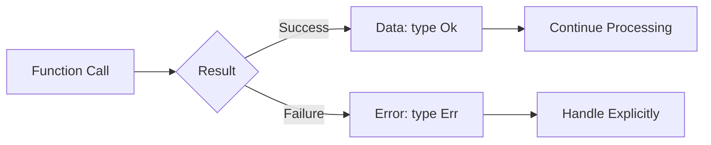
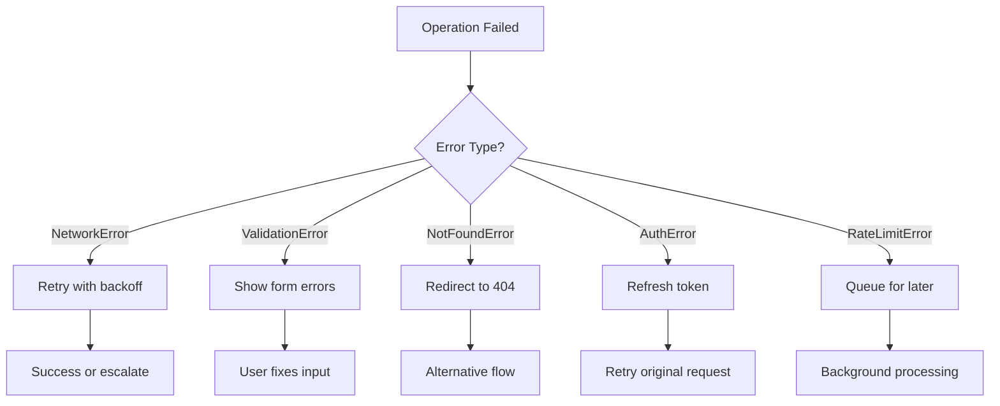
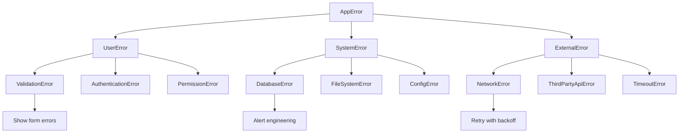
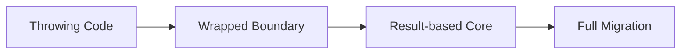

## The Principle

Handle errors like any other value in your program:



Every operation that can fail should return a discriminated union representing success or failure. No throws. No panics. Just honest return values that force you to confront reality.

## Why This Works

### Exception-based error handling lies to you

When you write `getUserById(id)`, what does the type signature promise? In most languages: "I return a User." But that's a lie. It might throw `NetworkError`, `ValidationError`, `NotFoundError`, or a dozen other exceptions. The type system doesn't track this. Your IDE can't help you. You're flying blind.

<Tabs items={['TypeScript', 'Rust']}>
<Tab value="TypeScript">
```typescript
// The Lie
function getUserById(id: string): User {
  // Could throw NetworkError
  // Could throw NotFoundError
  // Could throw ValidationError
  // Type signature reveals none of this
}

// The Truth
type Result<T, E> = 
  | { type: "Ok"; data: T }
  | { type: "Err"; err: E };

type UserError = 
  | { type: "NetworkError"; message: string; retryable: true }
  | { type: "NotFoundError"; userId: string; retryable: false }
  | { type: "ValidationError"; field: string; retryable: false };

function getUserById(id: string): Result<User, UserError> {
  // Now the signature tells the truth
  // Every error is documented
  // The compiler forces handling
}
```
</Tab>
<Tab value="Rust">
```rust
// Rust learned this lesson from the start
#[derive(Debug)]
enum UserError {
    NetworkError { message: String },
    NotFoundError { user_id: String },
    ValidationError { field: String },
}

fn get_user_by_id(id: &str) -> Result<User, UserError> {
    // The type system makes errors first-class
    // You literally cannot ignore them
}
```
</Tab>
</Tabs>

### Exceptions break composition

Try-catch blocks don't compose. You can't map over them. You can't chain them elegantly. You can't pass them through functional pipelines.

<Tabs items={['TypeScript', 'Rust']}>
<Tab value="TypeScript">
```typescript
// Exception Hell
try {
  const user = getUserById(id); // might throw
  try {
    const posts = getPostsByUser(user); // might throw
    try {
      const comments = getCommentsByPosts(posts); // might throw
      return processComments(comments);
    } catch (e) { /* what do I even do here? */ }
  } catch (e) { /* is this the same error? */ }
} catch (e) { /* pyramid of despair */ }

// Result Heaven
function getCommentsForUser(id: string): Result<Comment[], AppError> {
  return getUserById(id)
    .andThen(user => getPostsByUser(user))
    .andThen(posts => getCommentsByPosts(posts))
    .map(comments => processComments(comments));
}
```
</Tab>
<Tab value="Rust">
```rust
// Rust's ? operator makes this beautiful
fn get_comments_for_user(id: &str) -> Result<Vec<Comment>, AppError> {
    let user = get_user_by_id(id)?;
    let posts = get_posts_by_user(&user)?;
    let comments = get_comments_by_posts(&posts)?;
    Ok(process_comments(comments))
}
// Each ? says: "if error, return early; otherwise, unwrap"
```
</Tab>
</Tabs>

### Typed errors enable sophisticated recovery

When your errors are data, you can pattern match on them and implement precise recovery strategies:



<Tabs items={['TypeScript', 'Rust']}>
<Tab value="TypeScript">
```typescript
type ApiError = 
  | { type: "NetworkError"; retryable: true; delay: number }
  | { type: "ValidationError"; retryable: false; fields: Record<string, string> }
  | { type: "AuthError"; retryable: true; refreshToken: string }
  | { type: "RateLimitError"; retryable: true; retryAfter: number };

async function fetchWithRecovery<T>(
  fn: () => Promise<Result<T, ApiError>>,
  maxRetries = 3
): Promise<Result<T, ApiError>> {
  let attempt = 0;
  
  while (attempt < maxRetries) {
    const result = await fn();
    
    if (result.type === "Ok") return result;
    
    // Pattern match on error type
    switch (result.err.type) {
      case "NetworkError":
        await sleep(result.err.delay * Math.pow(2, attempt));
        attempt++;
        continue;
        
      case "AuthError":
        const refreshed = await refreshAuth(result.err.refreshToken);
        if (refreshed.type === "Ok") {
          attempt++; // Try again with new token
          continue;
        }
        return refreshed; // Can't recover
        
      case "RateLimitError":
        await sleep(result.err.retryAfter * 1000);
        attempt++;
        continue;
        
      case "ValidationError":
        return result; // User needs to fix input
    }
  }
  
  return { type: "Err", err: { type: "NetworkError", retryable: false, delay: 0 } };
}
```
</Tab>
<Tab value="Rust">
```rust
async fn fetch_with_recovery<T>(
    f: impl Fn() -> BoxFuture<'static, Result<T, ApiError>>,
    max_retries: u32,
) -> Result<T, ApiError> {
    let mut attempt = 0;
    
    loop {
        match f().await {
            Ok(data) => return Ok(data),
            Err(err) => match err {
                ApiError::NetworkError { delay, .. } if attempt < max_retries => {
                    sleep(Duration::from_millis(delay * 2_u64.pow(attempt))).await;
                    attempt += 1;
                }
                ApiError::AuthError { refresh_token } if attempt < max_retries => {
                    refresh_auth(&refresh_token).await?;
                    attempt += 1;
                }
                ApiError::RateLimitError { retry_after } if attempt < max_retries => {
                    sleep(Duration::from_secs(retry_after)).await;
                    attempt += 1;
                }
                _ => return Err(err),
            }
        }
    }
}
```
</Tab>
</Tabs>

### Build error taxonomies

Not all errors are equal. Create a hierarchy:



<Tabs items={['TypeScript', 'Rust']}>
<Tab value="TypeScript">
```typescript
// Each category has different handling strategies
type UserError = {
  category: "user";
  display: string; // Show to user
  recoverable: boolean;
};

type SystemError = {
  category: "system";
  display: "Something went wrong"; // Generic message
  alert: string; // Alert engineering team
  context: Record<string, unknown>;
};

type ExternalError = {
  category: "external";
  service: string;
  retryable: boolean;
  retryAfter?: number;
};

type AppError = UserError | SystemError | ExternalError;

function handleError(error: AppError): void {
  switch (error.category) {
    case "user":
      // Show specific message to user
      showToast(error.display, "error");
      if (error.recoverable) {
        enableRetry();
      }
      break;
      
    case "system":
      // Generic message to user, detailed alert to team
      showToast(error.display, "error");
      alertEngineering(error.alert, error.context);
      break;
      
    case "external":
      // Retry logic for external services
      if (error.retryable) {
        scheduleRetry(error.service, error.retryAfter);
      } else {
        showServiceUnavailable(error.service);
      }
      break;
  }
}
```
</Tab>
<Tab value="Rust">
```rust
#[derive(Debug)]
enum AppError {
    User(UserError),
    System(SystemError),
    External(ExternalError),
}

#[derive(Debug)]
struct UserError {
    display: String,
    recoverable: bool,
}

#[derive(Debug)]
struct SystemError {
    alert: String,
    context: HashMap<String, String>,
}

#[derive(Debug)]
struct ExternalError {
    service: String,
    retryable: bool,
    retry_after: Option<Duration>,
}

fn handle_error(error: AppError) {
    match error {
        AppError::User(e) => {
            show_toast(&e.display, ToastLevel::Error);
            if e.recoverable {
                enable_retry();
            }
        }
        AppError::System(e) => {
            show_toast("Something went wrong", ToastLevel::Error);
            alert_engineering(&e.alert, &e.context);
        }
        AppError::External(e) => {
            if e.retryable {
                schedule_retry(&e.service, e.retry_after);
            } else {
                show_service_unavailable(&e.service);
            }
        }
    }
}
```
</Tab>
</Tabs>

## When to Actually Panic

There's a 0.01% exception to this rule. Panic when:

1. **Invariant violations that indicate programmer error**
   - An index is out of bounds after you just checked the length
   - A lock is poisoned when it should never be contested
   - A config file is missing that's required for the program to exist

2. **Setup/initialization failures**
   - Can't connect to database on startup (what would the program even do?)
   - Required environment variables are missing
   - Critical files can't be opened

<Tabs items={['TypeScript', 'Rust']}>
<Tab value="TypeScript">
```typescript
// OK to throw
const config = loadConfig(); // Throw if missing - can't run without it
const db = await connectDatabase(config.dbUrl); // Throw if can't connect

// NOT OK to throw
function getUser(id: string): User {
  const user = db.query("SELECT * FROM users WHERE id = ?", id);
  if (!user) throw new Error("User not found"); // NO! Return Result
}

// Correct
function getUser(id: string): Result<User, NotFoundError> {
  const user = db.query("SELECT * FROM users WHERE id = ?", id);
  if (!user) {
    return { type: "Err", err: { type: "NotFoundError", userId: id } };
  }
  return { type: "Ok", data: user };
}
```
</Tab>
<Tab value="Rust">
```rust
// OK to panic
let config = load_config().expect("Config file required for startup");
let db = connect_database(&config.db_url).expect("Cannot run without database");

// NOT OK to panic
fn get_user(id: &str) -> User {
    db.query("SELECT * FROM users WHERE id = ?", id)
        .expect("User not found") // NO! Return Result
}

// Correct
fn get_user(id: &str) -> Result<User, NotFoundError> {
    db.query("SELECT * FROM users WHERE id = ?", id)
        .ok_or(NotFoundError { user_id: id.to_string() })
}
```
</Tab>
</Tabs>

If you're reaching for `throw` or `panic!()` and it's not program initialization, you're probably wrong.

## When This Doesn't Apply

### Third-party libraries

If you're using a library that throws exceptions, you have two choices:

1. **Wrap it immediately** at the boundary
2. **Let it propagate** to a top-level error boundary

Never let thrown exceptions leak into your business logic.

<Tabs items={['TypeScript', 'Rust']}>
<Tab value="TypeScript">
```typescript
// Wrap throwing libraries
function safeFetch<T>(url: string): Result<T, NetworkError> {
  try {
    const response = await fetch(url); // Might throw
    const data = await response.json(); // Might throw
    return { type: "Ok", data };
  } catch (e) {
    return {
      type: "Err",
      err: {
        type: "NetworkError",
        message: e instanceof Error ? e.message : "Unknown error",
        retryable: true,
        delay: 1000,
      },
    };
  }
}
```
</Tab>
<Tab value="Rust">
```rust
// Rust libraries rarely panic, but if they do:
fn safe_parse(s: &str) -> Result<Value, ParseError> {
    std::panic::catch_unwind(|| {
        some_panicking_parser(s)
    })
    .map_err(|_| ParseError::ParserPanicked)
}
```
</Tab>
</Tabs>

### Performance-critical paths

If you're writing a tight inner loop and error checking adds measurable overhead, consider:

1. Validate once at the boundary
2. Use unsafe/unchecked operations inside
3. Return to safe Result types at the exit

But measure first. Modern compilers optimize Result-based code very well.

## FAQ

**Q: Doesn't this make the code more verbose?**

Yes, by about 15%. But that verbosity is **honest**. Every error case is visible. Every recovery strategy is explicit. You can't accidentally ignore a failure. The verbosity is the point.

**Q: What about helper methods like `.unwrap()` or `!`?**

Use them in examples and tests. Never in production code. If you find yourself writing `.unwrap()`, ask: "What if this actually fails?" Then handle it.

**Q: How do I convert legacy throwing code?**

Incrementally:



Start at the edges. Wrap third-party libraries. Convert new code to Results. Gradually refactor inward. You don't need to boil the ocean.

**Q: What about async/await with Results?**

Works perfectly. Async functions can return `Promise<Result<T, E>>`:

<Tabs items={['TypeScript', 'Rust']}>
<Tab value="TypeScript">
```typescript
async function fetchUser(id: string): Promise<Result<User, ApiError>> {
  const response = await safeFetch<User>(`/api/users/${id}`);
  if (response.type === "Err") return response;
  
  const validated = validateUser(response.data);
  return validated;
}

// Chain them
const result = await fetchUser("123")
  .then(result => result.type === "Ok" 
    ? fetchUserPosts(result.data.id) 
    : Promise.resolve(result)
  );
```
</Tab>
<Tab value="Rust">
```rust
async fn fetch_user(id: &str) -> Result<User, ApiError> {
    let response = safe_fetch(&format!("/api/users/{}", id)).await?;
    let validated = validate_user(response)?;
    Ok(validated)
}

// The ? operator works seamlessly with async
```
</Tab>
</Tabs>

**Q: How granular should error types be?**

Granular enough to make different decisions. If two errors require identical handling, they can be the same type. If they require different recovery strategies, split them.

---

**The bottom line**: Errors are not exceptional. They're expected. Treat them like the first-class citizens they are. Your future self—debugging a production incident at 2 AM—will thank you for making every failure case explicit and recoverable.