## The Principle

Every function and class should declare exactly what it needs:

```mermaid
graph TD
    A[Your Code] --> B{Dependency Type?}
    B -->|Global/Infrastructure| C[Static/Module-level]
    B -->|Instance Lifecycle| D[Constructor Parameter]
    B -->|Operation-specific| E[Method Parameter]
    
    C --> C1[Logger, Config]
    D --> D1[Database, WebSocket]
    E --> E1[Store, Context]
    
    F[❌ Singleton] -.->|Avoid| G[Hidden Dependencies]
    H[❌ DI Framework] -.->|Avoid| I[Magic Injection]
    
    class C green
    class D green
    class E green
    class F red
    class G red
    class H red
    class I red
```



If you can't tell what a class depends on by looking at its constructor, your architecture is lying to you.

## Why Singletons Are Poison

### They hide dependencies

<Tabs items={['TypeScript', 'Rust']}>
<Tab value="TypeScript">
```typescript
// The Lie: Looks like this class has no dependencies
class UserService {
  async getUser(id: string) {
    // Where did this come from?
    const user = await Database.instance.query("...");
    // And this?
    Logger.instance.info("Fetched user", { id });
    return user;
  }
}

// The Truth: Actually depends on Database and Logger
class UserService {
  constructor(
    private db: Database,
    private logger: Logger
  ) {}
  
  async getUser(id: string) {
    // Dependencies are explicit
    const user = await this.db.query("...");
    this.logger.info("Fetched user", { id });
    return user;
  }
}
```
</Tab>
<Tab value="Rust">
```rust
// The Lie: Global static state
static DATABASE: OnceCell<Database> = OnceCell::new();
static LOGGER: OnceCell<Logger> = OnceCell::new();

struct UserService;

impl UserService {
    async fn get_user(&self, id: &str) -> Result<User, Error> {
        // Invisible dependencies
        let db = DATABASE.get().unwrap();
        let logger = LOGGER.get().unwrap();
        
        let user = db.query("...").await?;
        logger.info(&format!("Fetched user: {}", id));
        Ok(user)
    }
}

// The Truth: Explicit dependencies
struct UserService {
    db: Database,
    logger: Logger,
}

impl UserService {
    fn new(db: Database, logger: Logger) -> Self {
        Self { db, logger }
    }
    
    async fn get_user(&self, id: &str) -> Result<User, Error> {
        let user = self.db.query("...").await?;
        self.logger.info(&format!("Fetched user: {}", id));
        Ok(user)
    }
}
```
</Tab>
</Tabs>

### They make testing a nightmare

Two tests running in parallel both mutate the same singleton. Race condition. Flaky tests. Debugging hell.

<Tabs items={['TypeScript', 'Rust']}>
<Tab value="TypeScript">
```typescript
// Test 1
test("creates user", async () => {
  Database.instance.setMode("test");
  await userService.create({ name: "Alice" });
  // Test 2 just changed the mode to "prod" 💥
});

// Test 2 (running in parallel)
test("validates admin", async () => {
  Database.instance.setMode("prod");
  await adminService.validate();
  // Test 1 just changed the mode to "test" 💥
});

// With explicit dependencies - tests are isolated
test("creates user", async () => {
  const db = new TestDatabase();
  const service = new UserService(db, new NullLogger());
  await service.create({ name: "Alice" });
  // Each test has its own instance
});
```
</Tab>
<Tab value="Rust">
```rust
// Singleton hell
#[tokio::test]
async fn test_creates_user() {
    let db = DATABASE.get().unwrap();
    db.set_mode(Mode::Test); // Other tests see this!
    user_service.create(User { name: "Alice" }).await.unwrap();
}

// Isolated tests
#[tokio::test]
async fn test_creates_user() {
    let db = TestDatabase::new();
    let service = UserService::new(db, NullLogger::new());
    service.create(User { name: "Alice" }).await.unwrap();
    // Completely isolated
}
```
</Tab>
</Tabs>

### They create coupling you don't see


Change the singleton's interface? Now you're grep-ing the entire codebase to find who's using it. The compiler can't help you because the dependency is invisible.

## Why Dependency Injection Frameworks Are Worse

### They trade compile-time safety for runtime magic

<Tabs items={['TypeScript', 'Rust']}>
<Tab value="TypeScript">
```typescript
// DI Framework - errors at runtime
@Injectable()
class UserService {
  constructor(
    @Inject("DATABASE") private db: any, // ← Type safety lost
    @Inject("LOGGER") private logger: any,
  ) {}
}

// Somewhere in main.ts
container.register("DATABASE", Database); // Typo? Runtime error
container.register("LOGER", Logger); // ← Typo! Won't know until runtime

// Explicit dependencies - errors at compile time
class UserService {
  constructor(
    private db: Database, // ← Fully typed
    private logger: Logger,
  ) {}
}

// In main.ts
const db = new Database(config.dbUrl);
const logger = new Logger(config.logLevel);
const userService = new UserService(db, logger);
// ↑ Typo here? Compiler catches it immediately
```
</Tab>
<Tab value="Rust">
```rust
// Rust doesn't really have DI frameworks because...
// the type system makes them unnecessary

struct UserService {
    db: Database,
    logger: Logger,
}

impl UserService {
    fn new(db: Database, logger: Logger) -> Self {
        Self { db, logger }
    }
}

// Main.rs
let db = Database::new(&config.db_url)?;
let logger = Logger::new(config.log_level);
let user_service = UserService::new(db, logger);
// All checked at compile time
```
</Tab>
</Tabs>

### They obscure the dependency graph

With DI frameworks, you can't see what depends on what. You have to run the program and hope the container resolves correctly.


With explicit dependencies, the graph is in the code:

<Tabs items={['TypeScript', 'Rust']}>
<Tab value="TypeScript">
```typescript
// I can see the entire dependency graph by reading constructors
class App {
  constructor(
    private config: Config,
    private logger: Logger,
  ) {}
}

class UserService {
  constructor(
    private db: Database,
    private logger: Logger,
  ) {}
}

class Database {
  constructor(
    private config: Config,
    private logger: Logger,
  ) {}
}

// Graph: App → Config, Logger
//        UserService → Database, Logger
//        Database → Config, Logger
// No surprises. No runtime resolution. Just types.
```
</Tab>
<Tab value="Rust">
```rust
struct App {
    config: Config,
    logger: Logger,
}

struct UserService {
    db: Database,
    logger: Logger,
}

struct Database {
    config: Config,
    logger: Logger,
}

// The dependency graph is literally in the struct definitions
// cargo build tells you if something's wrong
```
</Tab>
</Tabs>

## The Three Kinds of Dependencies

Not all dependencies are equal. Treat them differently:


### Global/Infrastructure: Static or Module-level

These are genuinely global. Everyone needs them. They never change behavior between tests.

<Tabs items={['TypeScript', 'Rust']}>
<Tab value="TypeScript">
```typescript
// logger.ts
export const logger = new Logger({
  level: process.env.LOG_LEVEL,
  destination: process.env.LOG_DEST,
});

// config.ts
export const config = loadConfig();

// user-service.ts
import { logger } from "./logger";
import { config } from "./config";

class UserService {
  constructor(private db: Database) {
    // Logger and config are imported, not injected
    // They're infrastructure, not business dependencies
  }
  
  async getUser(id: string) {
    logger.info("Fetching user", { id });
    const timeout = config.dbTimeout;
    return this.db.query("...", { timeout });
  }
}

// test
test("gets user", async () => {
  const db = new TestDatabase();
  const service = new UserService(db);
  // Logger still works, still logs to test output
  // No need to mock it
});
```
</Tab>
<Tab value="Rust">
```rust
// logger.rs
use std::sync::OnceLock;

static LOGGER: OnceLock<Logger> = OnceLock::new();

pub fn logger() -> &'static Logger {
    LOGGER.get_or_init(|| Logger::new())
}

// user_service.rs
use crate::logger::logger;

struct UserService {
    db: Database,
}

impl UserService {
    async fn get_user(&self, id: &str) -> Result<User, Error> {
        logger().info(&format!("Fetching user: {}", id));
        self.db.query("...").await
    }
}

// Tests don't mock the logger - it's infrastructure
```
</Tab>
</Tabs>

**Key insight**: If you're never mocking it in tests, it doesn't need to be injected.

### Instance Lifecycle: Constructor Parameters

These dependencies live as long as the instance lives. They define the instance's capabilities.

<Tabs items={['TypeScript', 'Rust']}>
<Tab value="TypeScript">
```typescript
// A ChatClient needs a WebSocket for its entire lifetime
class ChatClient {
  constructor(
    private ws: WebSocket,
    private userId: string,
  ) {
    this.ws.on("message", this.handleMessage);
  }
  
  async sendMessage(text: string) {
    await this.ws.send({ userId: this.userId, text });
  }
  
  private handleMessage(msg: Message) {
    // ...
  }
}

// The WebSocket is fundamental to this instance's identity
const ws = new WebSocket(chatUrl);
const client = new ChatClient(ws, currentUser.id);
```
</Tab>
<Tab value="Rust">
```rust
struct ChatClient {
    ws: WebSocket,
    user_id: String,
}

impl ChatClient {
    fn new(ws: WebSocket, user_id: String) -> Self {
        let mut client = Self { ws, user_id };
        client.ws.on_message(Self::handle_message);
        client
    }
    
    async fn send_message(&self, text: &str) -> Result<(), Error> {
        self.ws.send(&Message {
            user_id: &self.user_id,
            text,
        }).await
    }
}
```
</Tab>
</Tabs>

### Operation-specific: Method Parameters

These dependencies are only needed for specific operations. Pass them when you need them.

<Tabs items={['TypeScript', 'Rust']}>
<Tab value="TypeScript">
```typescript
class User {
  constructor(
    public id: string,
    public name: string,
    public email: string,
  ) {}
  
  // Store is only needed for saving, not for existing
  async save(store: Store): Promise<Result<void, SaveError>> {
    return store.saveUser(this);
  }
  
  // Transaction is only needed for this operation
  async updateEmail(
    newEmail: string,
    store: Store,
    tx: Transaction,
  ): Promise<Result<void, UpdateError>> {
    const validation = validateEmail(newEmail);
    if (validation.type === "Err") return validation;
    
    this.email = newEmail;
    return store.saveUser(this, tx);
  }
}

// Usage
const user = new User("1", "Alice", "alice@example.com");
user.updateEmail("newalice@example.com", store, transaction);
// ↑ Clear that this operation needs a store and transaction
```
</Tab>
<Tab value="Rust">
```rust
struct User {
    id: String,
    name: String,
    email: String,
}

impl User {
    // Store is passed per operation
    async fn save(&self, store: &Store) -> Result<(), SaveError> {
        store.save_user(self).await
    }
    
    async fn update_email(
        &mut self,
        new_email: String,
        store: &Store,
        tx: &Transaction,
    ) -> Result<(), UpdateError> {
        validate_email(&new_email)?;
        self.email = new_email;
        store.save_user_tx(self, tx).await
    }
}
```
</Tab>
</Tabs>

## Methods Belong to Domain Objects, Not Dependencies

This is crucial. Your domain logic should live in domain objects, not in infrastructure.

```mermaid
graph LR
    A[❌ Bad: Store owns logic] --> B[store.saveUser]
    A --> C[store.saveOrder]
    A --> D[store.savePayment]
    
    E[✅ Good: Domain owns logic] --> F[user.save store]
    E --> G[order.save store]
    E --> H[payment.save store]
    
    style A red
    style E green
```



<Tabs items={['TypeScript', 'Rust']}>
<Tab value="TypeScript">
```typescript
// ❌ Bad: Logic in the Store
class Store {
  async saveUser(user: User): Promise<Result<void, SaveError>> {
    // Validate user
    if (!user.email.includes("@")) {
      return { type: "Err", err: { type: "InvalidEmail" } };
    }
    
    // Check duplicates
    const existing = await this.db.query("SELECT * FROM users WHERE email = ?", user.email);
    if (existing) {
      return { type: "Err", err: { type: "DuplicateEmail" } };
    }
    
    // Save
    await this.db.query("INSERT INTO users ...", user);
    return { type: "Ok", data: undefined };
  }
  
  async saveOrder(order: Order): Promise<Result<void, SaveError>> {
    // Different validation logic
    // Different duplicate checking
    // The Store is becoming a God object
  }
}

// ✅ Good: Logic in the Domain Object
class User {
  constructor(
    public id: string,
    public name: string,
    public email: string,
  ) {}
  
  validate(): Result<void, ValidationError> {
    if (!this.email.includes("@")) {
      return { type: "Err", err: { type: "InvalidEmail", field: "email" } };
    }
    return { type: "Ok", data: undefined };
  }
  
  async save(store: Store): Promise<Result<void, SaveError>> {
    // User knows how to validate itself
    const validation = this.validate();
    if (validation.type === "Err") {
      return { type: "Err", err: { type: "ValidationFailed", inner: validation.err } };
    }
    
    // User knows its duplicate constraints
    const duplicate = await store.findUserByEmail(this.email);
    if (duplicate.type === "Ok") {
      return { type: "Err", err: { type: "DuplicateEmail", email: this.email } };
    }
    
    // Store only handles the mechanics of storage
    return store.persistUser(this);
  }
}

class Store {
  // Store is just mechanical persistence
  async findUserByEmail(email: string): Promise<Result<User, NotFoundError>> {
    // Simple query, no business logic
  }
  
  async persistUser(user: User): Promise<Result<void, SaveError>> {
    // Simple insert, no business logic
  }
}
```
</Tab>
<Tab value="Rust">
```rust
// ❌ Bad: Logic in the Store
impl Store {
    async fn save_user(&self, user: &User) -> Result<(), SaveError> {
        // Validation
        if !user.email.contains("@") {
            return Err(SaveError::InvalidEmail);
        }
        
        // Duplicate checking
        if self.db.find_by_email(&user.email).await.is_ok() {
            return Err(SaveError::DuplicateEmail);
        }
        
        // Persistence
        self.db.insert_user(user).await
    }
}

// ✅ Good: Logic in the Domain Object
impl User {
    fn validate(&self) -> Result<(), ValidationError> {
        if !self.email.contains("@") {
            return Err(ValidationError::InvalidEmail);
        }
        Ok(())
    }
    
    async fn save(&self, store: &Store) -> Result<(), SaveError> {
        // User validates itself
        self.validate()
            .map_err(SaveError::ValidationFailed)?;
        
        // User checks its constraints
        if store.find_user_by_email(&self.email).await.is_ok() {
            return Err(SaveError::DuplicateEmail(self.email.clone()));
        }
        
        // Store handles persistence mechanics
        store.persist_user(self).await
    }
}

impl Store {
    async fn find_user_by_email(&self, email: &str) -> Result<User, NotFoundError> {
        // Simple query
    }
    
    async fn persist_user(&self, user: &User) -> Result<(), SaveError> {
        // Simple insert
    }
}
```
</Tab>
</Tabs>

This pattern keeps your domain logic centralized and your infrastructure dumb. The `Store` doesn't need to know about `Order` vs `User` validation rules. Each domain object knows its own invariants.

## Practical Wiring

How do you actually construct all these dependencies?


<Tabs items={['TypeScript', 'Rust']}>
<Tab value="TypeScript">
```typescript
// main.ts - The only place where wiring happens
async function main() {
  // Infrastructure (global)
  const config = loadConfig();
  // Logger is imported statically, already initialized
  
  // Persistence layer
  const db = new Database(config.dbUrl);
  await db.connect();
  
  const cache = new Cache(config.redisUrl);
  await cache.connect();
  
  // Services (explicit dependency graph)
  const userService = new UserService(db, cache);
  const orderService = new OrderService(db);
  const paymentService = new PaymentService(db, config.stripeKey);
  
  // Application
  const app = new App(userService, orderService, paymentService);
  
  // Start
  await app.listen(config.port);
}

main().catch(err => {
  logger.error("Failed to start", { error: err });
  process.exit(1);
});
```
</Tab>
<Tab value="Rust">
```rust
// main.rs
#[tokio::main]
async fn main() -> Result<(), Box<dyn Error>> {
    // Infrastructure
    let config = load_config()?;
    // Logger is in a static, already initialized
    
    // Persistence
    let db = Database::connect(&config.db_url).await?;
    let cache = Cache::connect(&config.redis_url).await?;
    
    // Services
    let user_service = UserService::new(db.clone(), cache.clone());
    let order_service = OrderService::new(db.clone());
    let payment_service = PaymentService::new(db.clone(), config.stripe_key);
    
    // Application
    let app = App::new(user_service, order_service, payment_service);
    
    // Start
    app.listen(config.port).await?;
    Ok(())
}
```
</Tab>
</Tabs>

All wiring in one place. The dependency graph is explicit. No magic. No runtime resolution. Just construction.

## When This Doesn't Apply

### Frameworks with their own lifecycle

If you're using a framework like NestJS, Next.js, or Axum, they have opinions about dependency management. Work within their constraints, but keep dependencies explicit where you can.

### Plugins and extensions

If you're building a plugin system where users provide implementations at runtime, you might need dynamic resolution. But this is the exception, not the rule.

### Truly circular dependencies

If you have A depends on B depends on A, you have an architecture problem, not a dependency injection problem. Break the cycle by introducing an interface or event bus.

## FAQ

**Q: Doesn't passing everything through constructors get unwieldy?**

If a constructor needs 10+ parameters, that's a code smell. Your class is doing too much. Split it.

**Q: What about interface-based dependency injection?**

Useful in statically-typed languages for testing:

<Tabs items={['TypeScript', 'Rust']}>
<Tab value="TypeScript">
```typescript
interface Database {
  query(sql: string): Promise<Result<Row[], QueryError>>;
}

class UserService {
  constructor(private db: Database) {}
  // Can pass real Database or TestDatabase
}
```
</Tab>
<Tab value="Rust">
```rust
trait Database {
    async fn query(&self, sql: &str) -> Result<Vec<Row>, QueryError>;
}

struct UserService<D: Database> {
    db: D,
}

// Can use real Database or TestDatabase
```
</Tab>
</Tabs>

But you don't need a framework for this. Just use interfaces/traits directly.

**Q: How do I handle optional dependencies?**

<Tabs items={['TypeScript', 'Rust']}>
<Tab value="TypeScript">
```typescript
class UserService {
  constructor(
    private db: Database,
    private cache?: Cache, // Optional
  ) {}
  
  async getUser(id: string): Promise<Result<User, GetUserError>> {
    // Try cache first if available
    if (this.cache) {
      const cached = await this.cache.get(id);
      if (cached.type === "Ok") return cached;
    }
    
    // Fall back to database
    return this.db.findUser(id);
  }
}
```
</Tab>
<Tab value="Rust">
```rust
struct UserService {
    db: Database,
    cache: Option<Cache>,
}

impl UserService {
    async fn get_user(&self, id: &str) -> Result<User, GetUserError> {
        // Try cache if available
        if let Some(cache) = &self.cache {
            if let Ok(user) = cache.get(id).await {
                return Ok(user);
            }
        }
        
        // Fall back to database
        self.db.find_user(id).await
    }
}
```
</Tab>
</Tabs>

**Q: What about factory patterns?**

Factories are fine for creating complex objects. But the factory itself should be injected:

<Tabs items={['TypeScript', 'Rust']}>
<Tab value="TypeScript">
```typescript
class ConnectionFactory {
  constructor(private config: Config) {}
  
  createConnection(): WebSocket {
    return new WebSocket(this.config.wsUrl, {
      timeout: this.config.timeout,
      retry: this.config.retryStrategy,
    });
  }
}

class ChatClient {
  constructor(private connectionFactory: ConnectionFactory) {}
  
  async connect(): Promise<Result<void, ConnectError>> {
    const ws = this.connectionFactory.createConnection();
    // ...
  }
}
```
</Tab>
<Tab value="Rust">
```rust
struct ConnectionFactory {
    config: Config,
}

impl ConnectionFactory {
    fn create_connection(&self) -> WebSocket {
        WebSocket::new(&self.config.ws_url)
            .with_timeout(self.config.timeout)
            .with_retry(self.config.retry_strategy)
    }
}
```
</Tab>
</Tabs>

---

**The bottom line**: Dependencies should be as visible as everything else in your code. If you can't see it in the type signature, it's hiding from you. And hidden dependencies are where bugs live.