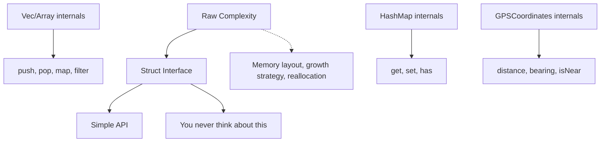
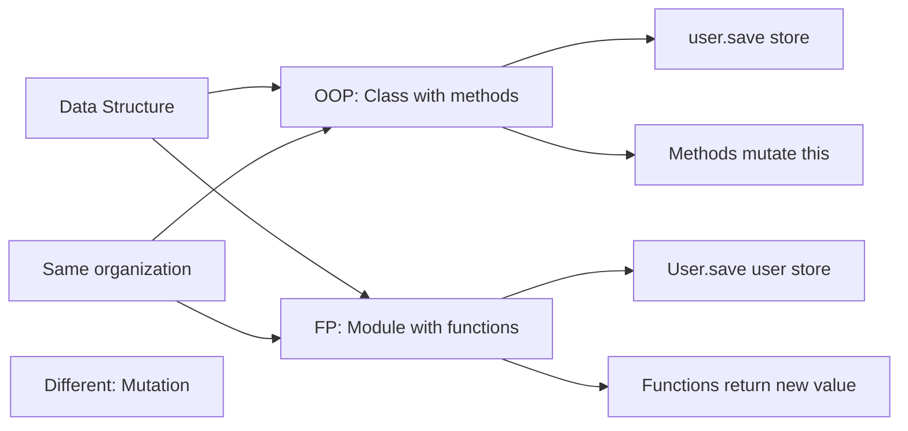
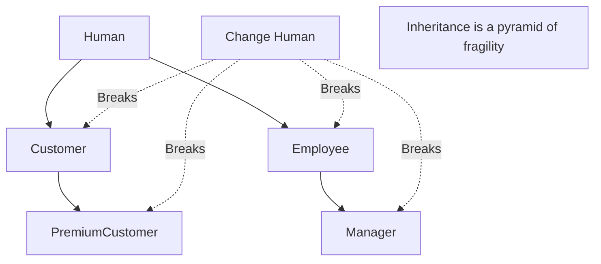
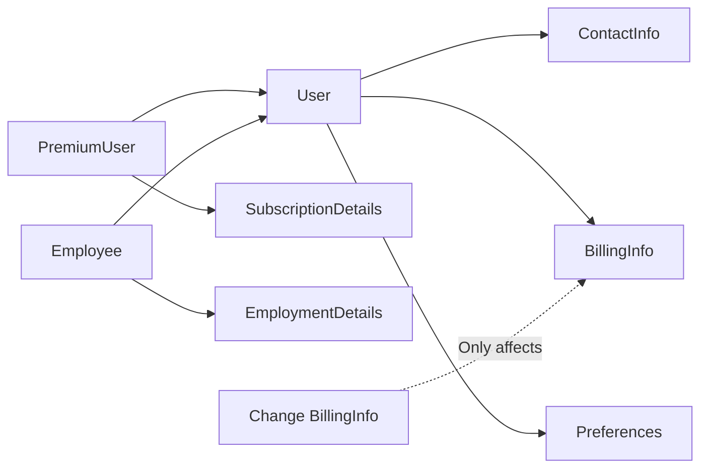
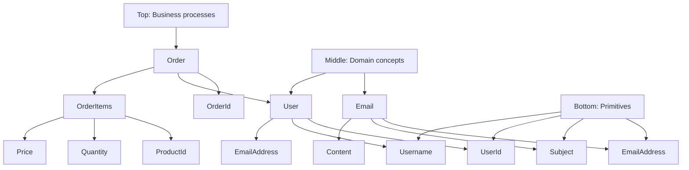
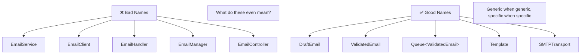
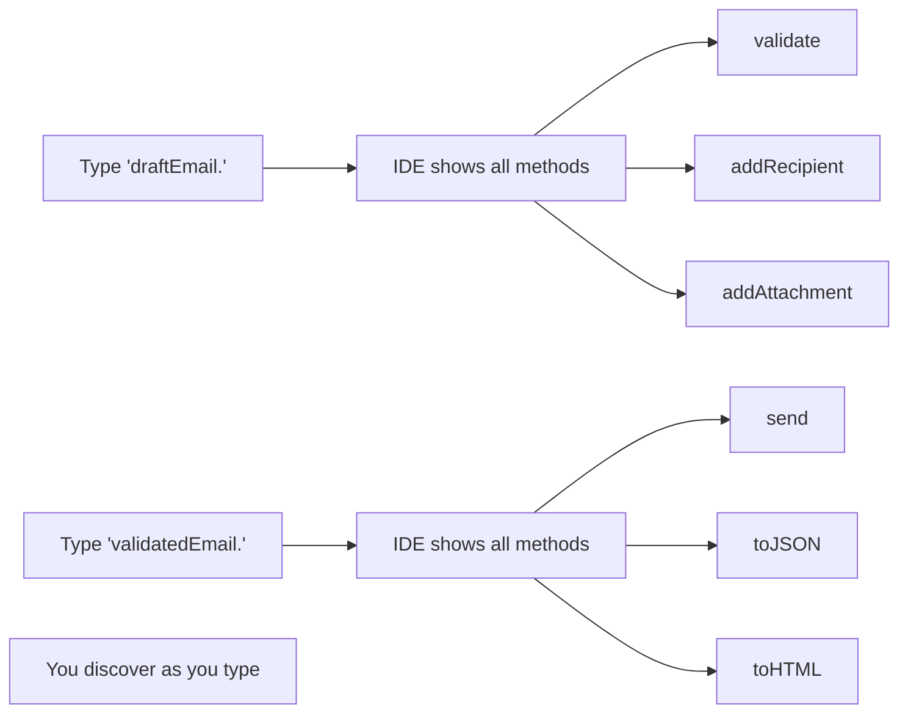

## The Principle

You should obsess over your data structures, not your algorithms. Structs (classes, modules, types, whatever you call them) are the load-bearing walls of your program. Get them right and everything else falls into place. Get them wrong and you're debugging forever.

Data structures hide complexity. Everyone uses arrays without thinking about memory allocation. Everyone uses hash maps without understanding collision resolution. That's the point:



Your job is to build these abstractions for your domain. Not everything needs to be as battle-tested as `Vec`, but everything should be as *intentional*.

## Why Structs Are Everything

### We already know this for collections

<Tabs items={['TypeScript', 'Rust']}>
<Tab value="TypeScript">
```typescript
// Nobody writes this
const items: any = { /* manual tree balancing */ };

// Everyone writes this
const items = new Set<string>();
items.add("hello");
items.has("hello"); // true

// Why? Because Set hides the complexity
// You don't care about hash functions or bucket allocation
// You care about "is this item in the collection?"
```
</Tab>
<Tab value="Rust">
```rust
// Nobody writes this
let mut items = ManuallyBalancedTree::new();

// Everyone writes this
let mut items = HashSet::new();
items.insert("hello");
items.contains("hello"); // true

// HashSet hides all the complexity
// You just think "set of things"
```
</Tab>
</Tabs>

Now apply this thinking to *your* domain:

<Tabs items={['TypeScript', 'Rust']}>
<Tab value="TypeScript">
```typescript
// ❌ Exposing complexity
function calculateDistance(
  lat1: number,
  lon1: number,
  lat2: number,
  lon2: number,
): number {
  // Haversine formula exposed everywhere
  const R = 6371;
  const dLat = toRad(lat2 - lat1);
  const dLon = toRad(lon2 - lon1);
  // ... 10 more lines
}

// Every call site has to remember the order
calculateDistance(userLat, userLon, storeLat, storeLon);
// Wait, was it user first or store first?

// ✅ Hiding complexity
class GPSCoordinates {
  constructor(
    private latitude: number,
    private longitude: number,
  ) {}
  
  distanceTo(other: GPSCoordinates): Distance {
    // Haversine in one place
    const R = 6371;
    const dLat = toRad(other.latitude - this.latitude);
    // ...
    return Distance.fromKilometers(d);
  }
  
  isNear(other: GPSCoordinates, radius: Distance): boolean {
    return this.distanceTo(other).lessThan(radius);
  }
}

// Call sites are obvious
const userLocation = new GPSCoordinates(37.7749, -122.4194);
const storeLocation = new GPSCoordinates(37.7849, -122.4094);
const distance = userLocation.distanceTo(storeLocation);
```
</Tab>
<Tab value="Rust">
```rust
// ❌ Exposing complexity
fn calculate_distance(
    lat1: f64, lon1: f64,
    lat2: f64, lon2: f64,
) -> f64 {
    // Haversine everywhere
}

// Every call is error-prone
calculate_distance(user_lat, user_lon, store_lat, store_lon);

// ✅ Hiding complexity
struct GPSCoordinates {
    latitude: f64,
    longitude: f64,
}

impl GPSCoordinates {
    fn distance_to(&self, other: &GPSCoordinates) -> Distance {
        // Haversine in one place
        Distance::from_kilometers(d)
    }
    
    fn is_near(&self, other: &GPSCoordinates, radius: Distance) -> bool {
        self.distance_to(other) < radius
    }
}

// Call sites are clear
let user_location = GPSCoordinates { latitude: 37.7749, longitude: -122.4194 };
let store_location = GPSCoordinates { latitude: 37.7849, longitude: -122.4094 };
let distance = user_location.distance_to(&store_location);
```
</Tab>
</Tabs>

The complexity doesn't disappear. It's just contained.

## Not OOP vs FP: It's About Organization

This isn't object-oriented programming vs functional programming. Both organize data the same way:



<Tabs items={['TypeScript', 'Rust']}>
<Tab value="TypeScript">
```typescript
// OOP style: methods mutate
class User {
  constructor(
    public id: UserId,
    public name: string,
    public email: Email,
  ) {}
  
  updateEmail(newEmail: Email): void {
    this.email = newEmail; // Mutation
  }
  
  async save(store: Store): Promise<Result<void, SaveError>> {
    return store.persistUser(this);
  }
}

// FP style: functions return new values
type User = {
  id: UserId;
  name: string;
  email: Email;
};

namespace User {
  export function updateEmail(user: User, newEmail: Email): User {
    return { ...user, email: newEmail }; // New object
  }
  
  export async function save(
    user: User,
    store: Store,
  ): Promise<Result<void, SaveError>> {
    return store.persistUser(user);
  }
}

// Both organize the same way: "User" groups User-related logic
// The difference is mutation vs immutability, not organization
```
</Tab>
<Tab value="Rust">
```rust
// OOP style: methods on self
struct User {
    id: UserId,
    name: String,
    email: Email,
}

impl User {
    fn update_email(&mut self, new_email: Email) {
        self.email = new_email; // Mutation
    }
    
    async fn save(&self, store: &Store) -> Result<(), SaveError> {
        store.persist_user(self).await
    }
}

// FP style: functions that return new values
#[derive(Clone)]
struct User {
    id: UserId,
    name: String,
    email: Email,
}

impl User {
    fn update_email(&self, new_email: Email) -> User {
        User {
            email: new_email,
            ..self.clone() // New struct
        }
    }
    
    async fn save(&self, store: &Store) -> Result<(), SaveError> {
        store.persist_user(self).await
    }
}

// Same organization. Different mutation semantics.
```
</Tab>
</Tabs>

**This article isn't about mutation**. It's about organization. Group related data and operations together. Call it a class, a module, a namespace, or a struct with an `impl` block. The name doesn't matter. The organization does.

## Composition Over Inheritance

Inheritance creates dependency hell:



Composition builds independently:



<Tabs items={['TypeScript', 'Rust']}>
<Tab value="TypeScript">
```typescript
// ❌ Inheritance hell
class Human {
  constructor(public name: string, public dateOfBirth: Date) {}
  getAge(): number { /* ... */ }
}

class Customer extends Human {
  constructor(
    name: string,
    dateOfBirth: Date,
    public customerId: CustomerId,
  ) {
    super(name, dateOfBirth);
  }
}

class Employee extends Human {
  constructor(
    name: string,
    dateOfBirth: Date,
    public employeeId: EmployeeId,
  ) {
    super(name, dateOfBirth);
  }
}

// What if someone is both? Now you need multiple inheritance...
// And if you change Human, everything breaks

// ✅ Composition
type PersonalInfo = {
  name: string;
  dateOfBirth: Date;
};

type CustomerDetails = {
  customerId: CustomerId;
  accountCreated: Date;
  loyaltyPoints: number;
};

type EmployeeDetails = {
  employeeId: EmployeeId;
  hireDate: Date;
  department: string;
};

type Customer = {
  personal: PersonalInfo;
  customer: CustomerDetails;
};

type Employee = {
  personal: PersonalInfo;
  employee: EmployeeDetails;
};

type CustomerAndEmployee = {
  personal: PersonalInfo;
  customer: CustomerDetails;
  employee: EmployeeDetails;
};

// No inheritance. Just composition. Each piece is independent.
```
</Tab>
<Tab value="Rust">
```rust
// ❌ Inheritance (not really possible in Rust, which is good!)

// ✅ Composition
struct PersonalInfo {
    name: String,
    date_of_birth: Date,
}

struct CustomerDetails {
    customer_id: CustomerId,
    account_created: Date,
    loyalty_points: u32,
}

struct EmployeeDetails {
    employee_id: EmployeeId,
    hire_date: Date,
    department: String,
}

struct Customer {
    personal: PersonalInfo,
    customer: CustomerDetails,
}

struct Employee {
    personal: PersonalInfo,
    employee: EmployeeDetails,
}

struct CustomerAndEmployee {
    personal: PersonalInfo,
    customer: CustomerDetails,
    employee: EmployeeDetails,
}

// Rust forces composition. This is good.
```
</Tab>
</Tabs>

Each piece stands alone. Change one, nothing else breaks. Combine them as needed.

## Understand Your Dependency Graph

Your structs form a dependency graph. You should know this graph:



Dependencies should flow in one direction. If `Email` depends on `User` and `User` depends on `Email`, you have a cycle. Break it.

<Tabs items={['TypeScript', 'Rust']}>
<Tab value="TypeScript">
```typescript
// Track dependencies explicitly
// email.ts
import { EmailAddress } from "./email-address";
import { Content } from "./content";
import { Subject } from "./subject";

class Email {
  constructor(
    private from: EmailAddress,
    private to: EmailAddress[],
    private subject: Subject,
    private content: Content,
  ) {}
  
  // Email depends on: EmailAddress, Content, Subject
  // Email does NOT depend on: User, Order, Store
}

// user.ts
import { UserId } from "./user-id";
import { Username } from "./username";
import { EmailAddress } from "./email-address";

class User {
  constructor(
    public id: UserId,
    public username: Username,
    public email: EmailAddress,
  ) {}
  
  // User depends on: UserId, Username, EmailAddress
  // User does NOT depend on: Email (the full email struct)
  // This prevents cycles
}
```
</Tab>
<Tab value="Rust">
```rust
// email.rs
use crate::email_address::EmailAddress;
use crate::content::Content;
use crate::subject::Subject;

struct Email {
    from: EmailAddress,
    to: Vec<EmailAddress>,
    subject: Subject,
    content: Content,
}

// user.rs
use crate::user_id::UserId;
use crate::username::Username;
use crate::email_address::EmailAddress;

struct User {
    id: UserId,
    username: Username,
    email: EmailAddress,
}

// Rust's module system makes dependencies explicit
// Circular dependencies won't compile
```
</Tab>
</Tabs>

**Pro tip**: Use a tool to visualize your dependency graph. `madge` for TypeScript, `cargo-modules` for Rust. If the graph looks like spaghetti, your architecture is spaghetti.

## Naming Matters More Than You Think

Avoid generic suffixes that mean nothing:



<Tabs items={['TypeScript', 'Rust']}>
<Tab value="TypeScript">
```typescript
// ❌ Generic suffixes tell you nothing
class EmailService {
  send() { /* what does this do? */ }
}

class EmailClient {
  send() { /* is this different from EmailService? */ }
}

class EmailHandler {
  handle() { /* handle what? */ }
}

// All these names are interchangeable meaningless soup

// ✅ Specific names - use types to enforce validation
class DraftEmail {
  constructor(
    private from: EmailAddress,
    private to: EmailAddress[],
    private subject: Subject,
    private content: Content,
  ) {}
  
  // Validate returns a ValidatedEmail or an error
  validate(): Result<ValidatedEmail, ValidationError> {
    // Validation logic here
    if (this.to.length === 0) {
      return Result.err(new ValidationError("No recipients"));
    }
    // ... more validation
    return Result.ok(new ValidatedEmail(this.from, this.to, this.subject, this.content));
  }
}

class ValidatedEmail {
  constructor(
    private from: EmailAddress,
    private to: EmailAddress[],
    private subject: Subject,
    private content: Content,
  ) {}
  
  // ValidatedEmail can be sent, serialized, etc.
  toJSON(): object { /* ... */ }
}

// Queue is generic - it can queue anything
class Queue<T> {
  enqueue(item: T): Promise<Result<void, QueueError>> { /* ... */ }
  dequeue(): Promise<Result<T, QueueError>> { /* ... */ }
}

// Use it for emails: Queue<ValidatedEmail>
// Use it for orders: Queue<Order>
// Don't create EmailQueue, OrderQueue, etc.

// Template is generic - it can template anything
class Template {
  render(context: Record<string, unknown>): string { /* ... */ }
}

// If you need email-specific template logic, compose or extend
class EmailTemplate extends Template {
  renderEmail(email: ValidatedEmail): string {
    return this.render({
      from: email.from,
      to: email.to,
      subject: email.subject,
    });
  }
}

// Transport is specific to the protocol, not the domain
class SMTPTransport {
  // SMTPTransport handles SMTP protocol
  // Only accepts ValidatedEmail - type system enforces this
  send(email: ValidatedEmail): Promise<Result<void, TransportError>> { /* ... */ }
}

// Not EmailTransport - that's as vague as EmailController
// Be specific: SMTPTransport, HTTPTransport, etc.

class WebServer {
  // WebServer handles HTTP
  start(port: number): Promise<void> { /* ... */ }
}

// ValidatedEmail can convert to formats that other systems need
namespace ValidatedEmail {
  export function intoWebServerResponse(email: ValidatedEmail): Response {
    return new Response(JSON.stringify(email.toJSON()), {
      headers: { "Content-Type": "application/json" },
    });
  }
}
```
</Tab>
<Tab value="Rust">
```rust
use std::collections::HashMap;

// ❌ Generic suffixes
struct EmailService;
struct EmailClient;
struct EmailHandler;

// ✅ Specific names - use types to enforce validation
struct DraftEmail {
    from: EmailAddress,
    to: Vec<EmailAddress>,
    subject: Subject,
    content: Content,
}

impl DraftEmail {
    // Validate returns a ValidatedEmail or an error
    fn validate(self) -> Result<ValidatedEmail, ValidationError> {
        if self.to.is_empty() {
            return Err(ValidationError::new("No recipients"));
        }
        // ... more validation
        Ok(ValidatedEmail {
            from: self.from,
            to: self.to,
            subject: self.subject,
            content: self.content,
        })
    }
}

struct ValidatedEmail {
    from: EmailAddress,
    to: Vec<EmailAddress>,
    subject: Subject,
    content: Content,
}

impl ValidatedEmail {
    // ValidatedEmail can be sent, serialized, etc.
    fn to_json(&self) -> serde_json::Value { /* ... */ }
}

// Queue is generic - it can queue anything
struct Queue<T> {
    items: Vec<T>,
}

impl<T> Queue<T> {
    async fn enqueue(&mut self, item: T) -> Result<(), QueueError> { /* ... */ }
    async fn dequeue(&mut self) -> Result<T, QueueError> { /* ... */ }
}

// Use it for emails: Queue<ValidatedEmail>
// Use it for orders: Queue<Order>
// Don't create EmailQueue, OrderQueue, etc.

// Template is generic - it can template anything
struct Template {
    pattern: String,
}

impl Template {
    fn render(&self, context: &HashMap<String, String>) -> String { /* ... */ }
}

// If you need email-specific template logic, add methods or compose
impl Template {
    fn render_email(&self, email: &ValidatedEmail) -> String {
        let mut context = HashMap::new();
        context.insert("from".to_string(), email.from.to_string());
        context.insert("to".to_string(), email.to.iter().map(|e| e.to_string()).collect::<Vec<_>>().join(", "));
        context.insert("subject".to_string(), email.subject.to_string());
        self.render(&context)
    }
}

// Transport is specific to the protocol, not the domain
struct SMTPTransport {
    host: String,
    port: u16,
}

impl SMTPTransport {
    // SMTPTransport handles SMTP protocol
    // Only accepts ValidatedEmail - type system enforces this
    async fn send(&self, email: &ValidatedEmail) -> Result<(), TransportError> { /* ... */ }
}

// Not EmailTransport - that's as vague as EmailController
// Be specific: SMTPTransport, HTTPTransport, etc.

struct WebServer {
    // HTTP layer
}

impl WebServer {
    async fn start(&self, port: u16) -> Result<(), ServerError> { /* ... */ }
}

// Conversion methods
impl Email {
    fn into_web_response(self) -> Response {
        Response::new(Body::from(self.to_json().to_string()))
    }
}
```
</Tab>
</Tabs>

Each name tells you exactly what it does. No ambiguity. No overlap.

**The rule**: If it's generic (Queue, Template, List), make it generic. If it's specific to a protocol or mechanism (SMTP, HTTP), name it after that. Don't prefix domain types (Email, Order) onto infrastructure types (Queue, Transport, Controller) unless the infrastructure is truly domain-specific.

## Split Files, Not Responsibilities

If a struct gets large, split its implementation across files. Don't split the struct:

<Tabs items={['TypeScript', 'Rust']}>
<Tab value="TypeScript">
```typescript
// user.ts - Core definition
export class User {
  constructor(
    public id: UserId,
    public username: Username,
    public email: EmailAddress,
  ) {}
}

// user.persistence.ts - Persistence methods
export namespace UserPersistence {
  export async function save(
    user: User,
    store: Store,
  ): Promise<Result<void, SaveError>> {
    // Save logic
  }
  
  export async function load(
    id: UserId,
    store: Store,
  ): Promise<Result<User, LoadError>> {
    // Load logic
  }
}

// user.validation.ts - Validation methods
export namespace UserValidation {
  export function validateEmail(user: User): Result<void, ValidationError> {
    // Validation
  }
  
  export function validateUsername(user: User): Result<void, ValidationError> {
    // Validation
  }
}

// One struct, multiple files, organized by concern
```
</Tab>
<Tab value="Rust">
```rust
// user.rs - Core definition
pub struct User {
    pub id: UserId,
    pub username: Username,
    pub email: EmailAddress,
}

// user/persistence.rs
impl User {
    pub async fn save(&self, store: &Store) -> Result<(), SaveError> {
        // Save logic
    }
    
    pub async fn load(id: UserId, store: &Store) -> Result<User, LoadError> {
        // Load logic
    }
}

// user/validation.rs
impl User {
    pub fn validate_email(&self) -> Result<(), ValidationError> {
        // Validation
    }
    
    pub fn validate_username(&self) -> Result<(), ValidationError> {
        // Validation
    }
}

// One struct, multiple impl blocks, split across files
```
</Tab>
</Tabs>

The struct stays coherent. The implementation scales.

## Fluent API: Discoverable Design

The best API is one you can discover by typing:



<Tabs items={['TypeScript', 'Rust']}>
<Tab value="TypeScript">
```typescript
// ✅ Discoverable API - type system enforces validation
class DraftEmail {
  // Type "draftEmail." and see:
  validate(): Result<ValidatedEmail, ValidationError> { /* ... */ }
  addAttachment(file: File): DraftEmail { /* ... */ }
  addRecipient(address: EmailAddress): DraftEmail { /* ... */ }
}

class ValidatedEmail {
  // Type "validatedEmail." and see:
  send(transport: SMTPTransport): Promise<Result<void, SendError>> { /* ... */ }
  toJSON(): object { /* ... */ }
  toHTML(): string { /* ... */ }
}

// vs scattered functions
function validateEmail(email: Email) { /* ... */ }
function sendEmail(email: Email, transport: SMTPTransport) { /* ... */ }
function emailToJSON(email: Email) { /* ... */ }
// ↑ How do you discover these exist?

// Fluent chaining with type safety
const draftEmail = new DraftEmail(from, to, subject, content)
  .addRecipient(cc)
  .addAttachment(file)
  .addAttachment(anotherFile);

// validate() returns ValidatedEmail - can't send without validation
const validatedEmail = draftEmail.validate().unwrap();
const result = await validatedEmail.send(transport);
```
</Tab>
<Tab value="Rust">
```rust
// ✅ Discoverable API - type system enforces validation
impl DraftEmail {
    // Type "draft_email." and rust-analyzer shows all methods
    pub fn validate(self) -> Result<ValidatedEmail, ValidationError> { /* ... */ }
    pub fn add_attachment(mut self, file: File) -> Self { 
        self.attachments.push(file);
        self
    }
    pub fn add_recipient(mut self, address: EmailAddress) -> Self {
        self.to.push(address);
        self
    }
}

impl ValidatedEmail {
    // Type "validated_email." and rust-analyzer shows all methods
    pub async fn send(&self, transport: &SMTPTransport) -> Result<(), SendError> { /* ... */ }
    pub fn to_json(&self) -> serde_json::Value { /* ... */ }
    pub fn to_html(&self) -> String { /* ... */ }
}

// Fluent chaining with type safety
let draft_email = DraftEmail::new(from, to, subject, content)
    .add_recipient(cc)
    .add_attachment(file)
    .add_attachment(another_file);

// validate() returns ValidatedEmail - can't send without validation
let validated_email = draft_email.validate()?;
validated_email.send(&transport).await?;
```
</Tab>
</Tabs>

Autocomplete is your documentation. If users can discover your API by typing, you've succeeded.

### Import patterns that enable discovery

<Tabs items={['TypeScript', 'Rust']}>
<Tab value="TypeScript">
```typescript
// ✅ Namespace imports for discoverability
import * as User from "./user";

// Type "User." and see all functions
User.create(data);
User.validate(user);
User.save(user, store);

// or

// Class/module pattern
import { User } from "./user";

const user = new User(id, name, email);
// Type "user." and see all methods
user.validate();
user.save(store);
```
</Tab>
<Tab value="Rust">
```rust
// ✅ Use declarations for discoverability
use crate::user::User;

// Type "User::" and see all associated functions
let user = User::create(data)?;
User::validate(&user)?;

// or

let mut user = User::new(id, name, email);
// Type "user." and see all methods
user.validate()?;
user.save(&store).await?;
```
</Tab>
</Tabs>

Organization that supports IDE autocomplete is organization that supports humans.

## When This Doesn't Apply

### Truly stateless utilities

Pure mathematical functions don't need structs:

<Tabs items={['TypeScript', 'Rust']}>
<Tab value="TypeScript">
```typescript
// This is fine
export function clamp(value: number, min: number, max: number): number {
  return Math.max(min, Math.min(max, value));
}

// No need for
class MathUtils {
  static clamp(value: number, min: number, max: number): number { /* ... */ }
}
```
</Tab>
<Tab value="Rust">
```rust
// This is fine
pub fn clamp(value: f64, min: f64, max: f64) -> f64 {
    value.max(min).min(max)
}

// No need for
struct MathUtils;
impl MathUtils {
    fn clamp(value: f64, min: f64, max: f64) -> f64 { /* ... */ }
}
```
</Tab>
</Tabs>

But if you find yourself passing the same context to many functions, that context should probably be a struct.

### Scripts and prototypes

If you're writing a one-off script or exploring a problem space, structs might be premature. But once you understand the domain, structure it.

## FAQ

**Q: Is this just object-oriented programming?**

No. Functional languages use modules the same way. The organization principle is universal. The mutation semantics differ.

**Q: How do I know if my struct is well-designed?**

Ask: "If I come back in 6 months, will I understand what this does?" If yes, good. If no, rename or restructure.

**Q: What if my struct has 20+ methods?**

That's fine if they're all related. But consider: could this be multiple structs composed together?

**Q: Should everything be a struct?**

No. But most things that represent concepts in your domain should be. User. Email. Order. GPSCoordinates. Invoice. These deserve structs.

**Q: What about generic "helpers" or "utils"?**

Those are code smells. They usually mean you haven't found the right struct to attach the logic to. Keep looking.

---

**The bottom line**: Your structs are your architecture. The way you name them, organize them, and compose them determines whether your codebase is comprehensible or chaos. We don't think about how `Vec` works internally. Build your domain types the same way. Hide complexity. Expose clarity.