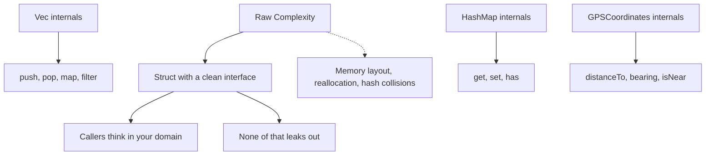
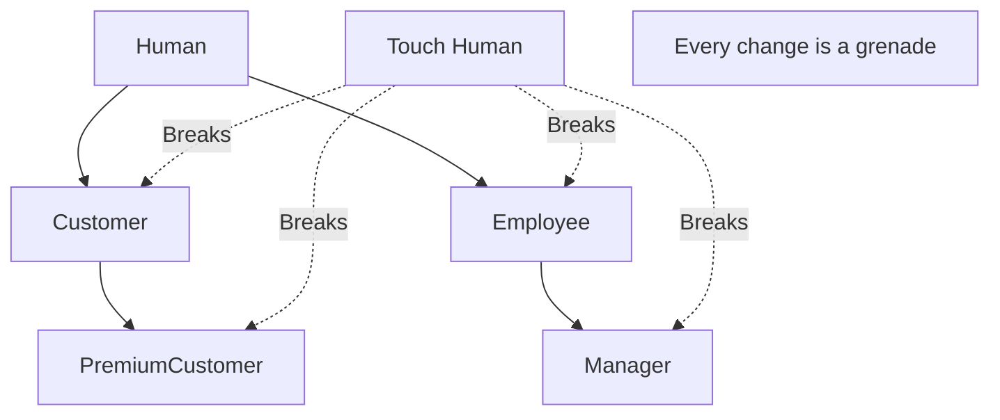
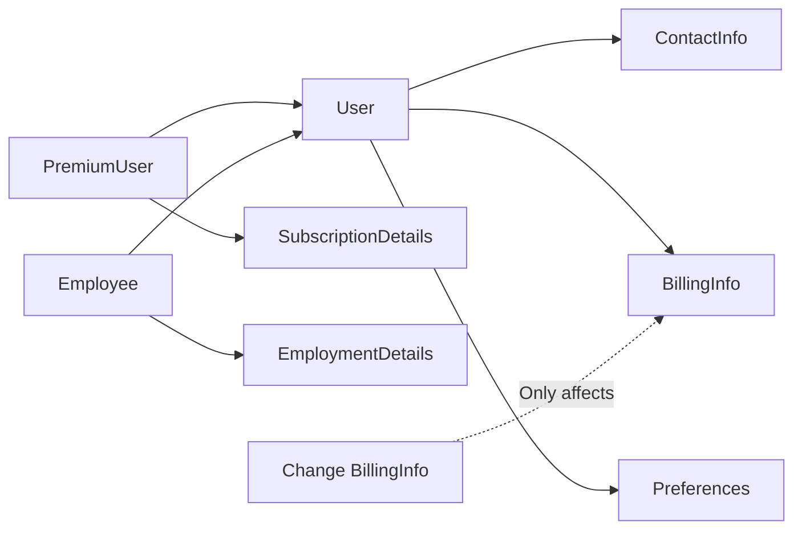

<Principle>Obsess over your data structures, not your algorithms. Structs are the load-bearing walls of your program. Get them right and everything else falls into place. Get them wrong and you're debugging forever.</Principle>

Data structures hide complexity. Everyone uses arrays without thinking about memory allocation. Everyone uses hash maps without caring about collision resolution. Nobody writes a `Vec` from scratch before using one. That's the point of abstraction, and it's what you should be doing for your own domain:


```mermaid
graph TD
    A[Raw Complexity] --> B[Struct with a clean interface]
    B --> C[Callers think in your domain]

    D[Vec internals] --> E[push, pop, map, filter]
    F[HashMap internals] --> G[get, set, has]
    H[GPSCoordinates internals] --> I[distanceTo, bearing, isNear]

    A -.-> J[Memory layout, reallocation, hash collisions]
    B --> K[None of that leaks out]

    style B green
    style C green
    style K green
    style J red
```

Your job is to build these abstractions for your domain. Not everything needs to be as battle-tested as `Vec`, but everything should be as *intentional*.

## You Already Know How to Do This

### You do it for collections

<Tabs items={['TypeScript', 'Rust']}>
<Tab value="TypeScript">
```typescript
// Nobody writes this
const items: any = { /* manual tree balancing */ };

// Everyone writes this
const items = new Set<string>();
items.add("hello");
items.has("hello"); // true

// Why? Because Set hides the complexity
// You don't care about hash functions or bucket allocation
// You care about "is this item in the collection?"
```
</Tab>
<Tab value="Rust">
```rust
// Nobody writes this
let mut items = ManuallyBalancedTree::new();

// Everyone writes this
let mut items = HashSet::new();
items.insert("hello");
items.contains("hello"); // true

// HashSet hides all the complexity
// You just think "set of things"
```
</Tab>
</Tabs>

Now apply this thinking to *your* domain:

<Tabs items={['TypeScript', 'Rust']}>
<Tab value="TypeScript">
```typescript
// ❌ Exposing complexity
function calculateDistance(
  lat1: number,
  lon1: number,
  lat2: number,
  lon2: number,
): number {
  // Haversine formula exposed everywhere
  const R = 6371;
  const dLat = toRad(lat2 - lat1);
  const dLon = toRad(lon2 - lon1);
  // ... 10 more lines
}

// Every call site has to remember the order
calculateDistance(userLat, userLon, storeLat, storeLon);
// Wait, was it user first or store first?

// ✅ Hiding complexity
class GPSCoordinates {
  constructor(
    private latitude: number,
    private longitude: number,
  ) {}
  
  distanceTo(other: GPSCoordinates): Distance {
    // Haversine in one place
    const R = 6371;
    const dLat = toRad(other.latitude - this.latitude);
    // ...
    return Distance.fromKilometers(d);
  }
  
  isNear(other: GPSCoordinates, radius: Distance): boolean {
    return this.distanceTo(other).lessThan(radius);
  }
}

// Call sites are obvious
const userLocation = new GPSCoordinates(37.7749, -122.4194);
const storeLocation = new GPSCoordinates(37.7849, -122.4094);
const distance = userLocation.distanceTo(storeLocation);
```
</Tab>
<Tab value="Rust">
```rust
// ❌ Exposing complexity
fn calculate_distance(
    lat1: f64, lon1: f64,
    lat2: f64, lon2: f64,
) -> f64 {
    // Haversine everywhere
}

// Every call is error-prone
calculate_distance(user_lat, user_lon, store_lat, store_lon);

// ✅ Hiding complexity
struct GPSCoordinates {
    latitude: f64,
    longitude: f64,
}

impl GPSCoordinates {
    fn distance_to(&self, other: &GPSCoordinates) -> Distance {
        // Haversine in one place
        Distance::from_kilometers(d)
    }
    
    fn is_near(&self, other: &GPSCoordinates, radius: Distance) -> bool {
        self.distance_to(other) < radius
    }
}

// Call sites are clear
let user_location = GPSCoordinates { latitude: 37.7749, longitude: -122.4194 };
let store_location = GPSCoordinates { latitude: 37.7849, longitude: -122.4094 };
let distance = user_location.distance_to(&store_location);
```
</Tab>
</Tabs>

The complexity doesn't disappear. It's just contained.

## Composition Over Inheritance

Inheritance sounds like reuse. It's actually coupling wearing a trench coat:


```mermaid
graph TD
    A[Human] --> B[Customer]
    A --> C[Employee]
    B --> D[PremiumCustomer]
    C --> E[Manager]

    F[Touch Human] -.->|Breaks| B
    F -.->|Breaks| C
    F -.->|Breaks| D
    F -.->|Breaks| E

    G[Every change is a grenade]

    style F red
    style G red
```

Composition builds independently:


```mermaid
graph LR
    A[User] --> B[ContactInfo]
    A --> C[BillingInfo]
    A --> D[Preferences]
    
    E[PremiumUser] --> A
    E --> F[SubscriptionDetails]
    
    G[Employee] --> A
    G --> H[EmploymentDetails]
    
    I[Change BillingInfo] -.->|Only affects| C
    
    style I green
```

<Tabs items={['TypeScript', 'Rust']}>
<Tab value="TypeScript">
```typescript
// ❌ Inheritance hell
class Human {
  constructor(public name: string, public dateOfBirth: Date) {}
  getAge(): number { /* ... */ }
}

class Customer extends Human {
  constructor(
    name: string,
    dateOfBirth: Date,
    public customerId: CustomerId,
  ) {
    super(name, dateOfBirth);
  }
}

class Employee extends Human {
  constructor(
    name: string,
    dateOfBirth: Date,
    public employeeId: EmployeeId,
  ) {
    super(name, dateOfBirth);
  }
}

// What if someone is both? Now you need multiple inheritance...
// And if you change Human, everything breaks

// ✅ Composition
type PersonalInfo = {
  name: string;
  dateOfBirth: Date;
};

type CustomerDetails = {
  customerId: CustomerId;
  accountCreated: Date;
  loyaltyPoints: number;
};

type EmployeeDetails = {
  employeeId: EmployeeId;
  hireDate: Date;
  department: string;
};

type Customer = {
  personal: PersonalInfo;
  customer: CustomerDetails;
};

type Employee = {
  personal: PersonalInfo;
  employee: EmployeeDetails;
};

type CustomerAndEmployee = {
  personal: PersonalInfo;
  customer: CustomerDetails;
  employee: EmployeeDetails;
};

// No inheritance. Just composition. Each piece is independent.
```
</Tab>
<Tab value="Rust">
```rust
// ❌ Inheritance (not really possible in Rust, which is good!)

// ✅ Composition
struct PersonalInfo {
    name: String,
    date_of_birth: Date,
}

struct CustomerDetails {
    customer_id: CustomerId,
    account_created: Date,
    loyalty_points: u32,
}

struct EmployeeDetails {
    employee_id: EmployeeId,
    hire_date: Date,
    department: String,
}

struct Customer {
    personal: PersonalInfo,
    customer: CustomerDetails,
}

struct Employee {
    personal: PersonalInfo,
    employee: EmployeeDetails,
}

struct CustomerAndEmployee {
    personal: PersonalInfo,
    customer: CustomerDetails,
    employee: EmployeeDetails,
}

// Rust forces composition. This is good.
```
</Tab>
</Tabs>

Each piece stands alone. Change one, nothing else breaks. Combine them as needed.

## When This Doesn't Apply

### Truly stateless utilities

Pure mathematical functions don't need structs:

<Tabs items={['TypeScript', 'Rust']}>
<Tab value="TypeScript">
```typescript
// This is fine
export function clamp(value: number, min: number, max: number): number {
  return Math.max(min, Math.min(max, value));
}

// No need for
class MathUtils {
  static clamp(value: number, min: number, max: number): number { /* ... */ }
}
```
</Tab>
<Tab value="Rust">
```rust
// This is fine
pub fn clamp(value: f64, min: f64, max: f64) -> f64 {
    value.max(min).min(max)
}

// No need for
struct MathUtils;
impl MathUtils {
    fn clamp(value: f64, min: f64, max: f64) -> f64 { /* ... */ }
}
```
</Tab>
</Tabs>

But if you find yourself passing the same context to many functions, that context should probably be a struct.

### Scripts and prototypes

If you're writing a one-off script or exploring a problem space, structs might be premature. But once you understand the domain, structure it.

## "Actually..."

<Objection>Is this just object-oriented programming?</Objection>

No. OOP has specific baggage: class hierarchies, inheritance chains, polymorphism for its own sake, the `extends` keyword everyone regrets. None of that is what I'm describing.

I'm describing organization: data and the operations that belong with it, living together. Rust does this with structs and impl blocks. No classes. No inheritance. No OOP nonsense. It's one of the most disciplined languages for this exact pattern. Haskell does it with modules and type classes.

What I'm arguing against is scattering `GPSCoordinates` data through four separate functions with four-parameter signatures, not advocating for any paradigm. Call it a class, a module, a namespace, a struct with an impl block. The name doesn't matter. The organization does.

<Objection>How do I know if my struct is well-designed?</Objection>

Ask: "If I come back in 6 months, will I understand what this does?" If yes, good. If no, rename or restructure.

<Objection>What if my struct has 20+ methods?</Objection>

That's fine if they're all related. But consider: could this be multiple structs composed together?

<Objection>Should everything be a struct?</Objection>

No. But most things that represent concepts in your domain should be. User. Email. Order. GPSCoordinates. Invoice. These deserve structs.

<Objection>What about generic "helpers" or "utils"?</Objection>

`utils.ts` is where orphaned logic goes to die. It means you have functions that belong to a struct you haven't named yet. Name it. The struct is there; you just haven't looked hard enough.

You don't think about how `Vec` works internally. You just push and pop. Build your domain types so callers can do the same: think in domain concepts, not implementation mechanics.