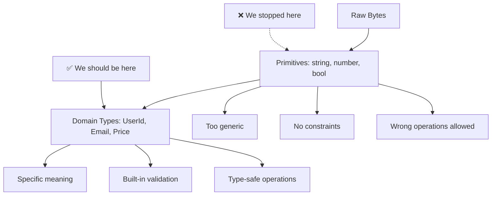
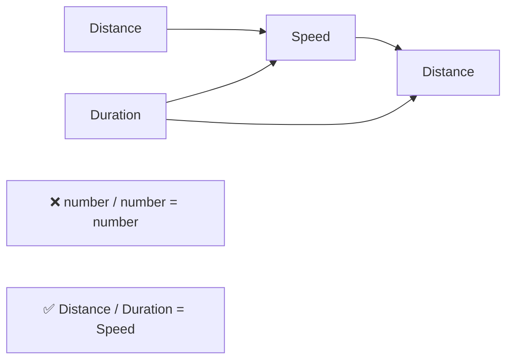
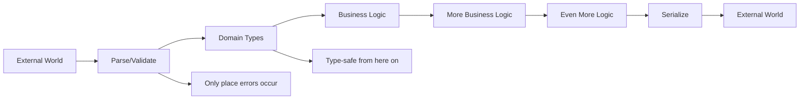
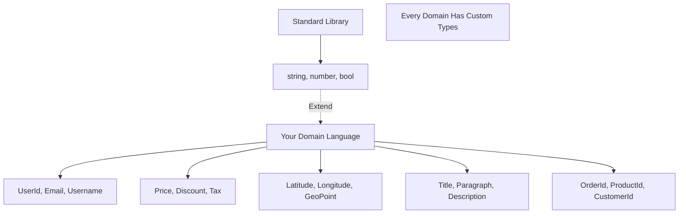

## The Principle

We evolved past programming in raw bytes because bytes are too primitive. Now finish the job:



Nobody writes `sendEmail(buffer: Buffer)`. We all write `sendEmail(address: string)`. But we should write `sendEmail(address: EmailAddress)`. The abstraction ladder doesn't stop at primitives.

## Why Primitives Are Too Primitive

### All strings are not equal

<Tabs items={['TypeScript', 'Rust']}>
<Tab value="TypeScript">
```typescript
// ❌ Primitive Soup
function sendInvoice(
  userId: string,
  email: string,
  invoiceId: string,
  url: string,
  amount: number,
) {
  // Can you spot the bugs?
  sendEmail(userId, invoiceId); // Swapped parameters ← Bug!
  logAccess(email, url); // Wrong order ← Bug!
  processPayment(amount, userId); // amount * userId ← Bug!
  
  // All type-check perfectly because everything is string/number
}

// ✅ Domain Types
type UserId = { readonly _tag: "UserId"; value: string };
type Email = { readonly _tag: "Email"; value: string };
type InvoiceId = { readonly _tag: "InvoiceId"; value: string };
type Url = { readonly _tag: "Url"; value: string };
type PositiveNumber = { readonly _tag: "PositiveNumber"; value: number };

function sendInvoice(
  userId: UserId,
  email: Email,
  invoiceId: InvoiceId,
  url: Url,
  amount: PositiveNumber,
) {
  sendEmail(userId, invoiceId); // ← Compile error! Type mismatch
  logAccess(email, url); // ← Compile error! Type mismatch
  processPayment(amount, userId); // ← Compile error! Type mismatch
  
  // Can't swap parameters. Compiler catches all bugs.
}
```
</Tab>
<Tab value="Rust">
```rust
// ❌ Primitive Soup
fn send_invoice(
    user_id: String,
    email: String,
    invoice_id: String,
    url: String,
    amount: f64,
) {
    send_email(&user_id, &invoice_id); // Swapped ← Bug!
    log_access(&email, &url); // Wrong order ← Bug!
    process_payment(amount, &user_id); // Nonsense ← Bug!
}

// ✅ Domain Types
struct UserId(String);
struct Email(String);
struct InvoiceId(String);
struct Url(String);
struct PositiveNumber(f64);

fn send_invoice(
    user_id: UserId,
    email: Email,
    invoice_id: InvoiceId,
    url: Url,
    amount: PositiveNumber,
) {
    send_email(&user_id, &invoice_id); // ← Compile error!
    log_access(&email, &url); // ← Compile error!
    process_payment(amount, &user_id); // ← Compile error!
    
    // Type system prevents all bugs at compile time
}
```
</Tab>
</Tabs>

The compiler becomes your pair programmer. It won't let you accidentally use a `UserId` where an `Email` belongs.

### Newtypes enforce invariants

Not all numbers are valid for all domains:

<Tabs items={['TypeScript', 'Rust']}>
<Tab value="TypeScript">
```typescript
// ❌ Runtime validation everywhere
function calculateDiscount(price: number, percentage: number): number {
  if (price < 0) throw new Error("Price must be positive");
  if (percentage < 0 || percentage > 100) {
    throw new Error("Percentage must be 0-100");
  }
  return price * (percentage / 100);
}

// Have to validate EVERY TIME you use these numbers
const discount1 = calculateDiscount(100, 20);
const discount2 = calculateDiscount(-50, 20); // Runtime error
const discount3 = calculateDiscount(100, 150); // Runtime error

// ✅ Validation at construction, never again
class PositiveNumber {
  private constructor(private readonly value: number) {}
  
  static create(n: number): Result<PositiveNumber, ValidationError> {
    if (n < 0) {
      return { type: "Err", err: { type: "Negative", value: n } };
    }
    return { type: "Ok", data: new PositiveNumber(n) };
  }
  
  getValue(): number { return this.value; }
}

class Percentage {
  private constructor(private readonly value: number) {}
  
  static create(n: number): Result<Percentage, ValidationError> {
    if (n < 0 || n > 100) {
      return { type: "Err", err: { type: "OutOfRange", value: n } };
    }
    return { type: "Ok", data: new Percentage(n) };
  }
  
  getValue(): number { return this.value; }
}

function calculateDiscount(
  price: PositiveNumber,
  percentage: Percentage,
): PositiveNumber {
  // No validation needed! Types guarantee invariants
  const result = price.getValue() * (percentage.getValue() / 100);
  // We know result is positive because inputs are valid
  return PositiveNumber.create(result).unwrap();
}

// Validate once at the boundary
const price = PositiveNumber.create(100).unwrap();
const pct = Percentage.create(20).unwrap();
const discount = calculateDiscount(price, pct); // No validation!
```
</Tab>
<Tab value="Rust">
```rust
// ❌ Runtime validation everywhere
fn calculate_discount(price: f64, percentage: f64) -> f64 {
    assert!(price >= 0.0, "Price must be positive");
    assert!(percentage >= 0.0 && percentage <= 100.0, "Invalid percentage");
    price * (percentage / 100.0)
}

// ✅ Validation at construction
#[derive(Debug, Clone, Copy)]
struct PositiveNumber(f64);

impl PositiveNumber {
    fn new(n: f64) -> Result<Self, ValidationError> {
        if n < 0.0 {
            return Err(ValidationError::Negative(n));
        }
        Ok(PositiveNumber(n))
    }
    
    fn get(&self) -> f64 { self.0 }
}

#[derive(Debug, Clone, Copy)]
struct Percentage(f64);

impl Percentage {
    fn new(n: f64) -> Result<Self, ValidationError> {
        if n < 0.0 || n > 100.0 {
            return Err(ValidationError::OutOfRange(n));
        }
        Ok(Percentage(n))
    }
    
    fn get(&self) -> f64 { self.0 }
}

fn calculate_discount(price: PositiveNumber, percentage: Percentage) -> PositiveNumber {
    // No validation! Types guarantee correctness
    let result = price.get() * (percentage.get() / 100.0);
    // Safe unwrap: positive * (0-100)/100 = positive
    PositiveNumber::new(result).unwrap()
}

// Validate once at the boundary
let price = PositiveNumber::new(100.0)?;
let pct = Percentage::new(20.0)?;
let discount = calculate_discount(price, pct);
```
</Tab>
</Tabs>

Validate at the boundary. Never validate again. The type system enforces it.

## Newtypes Enable Domain Operations

Physical quantities compose in specific ways. Your types should reflect this:



<Tabs items={['TypeScript', 'Rust']}>
<Tab value="TypeScript">
```typescript
// ❌ Meaningless operations allowed
function calculate(distance: number, time: number): number {
  return distance / time; // What unit is this?
}

const x = calculate(100, 50); // 100 what? 50 what?
const y = x + 42; // Adding 42 what to what?
const z = x * time; // Multiplying speed by... time? distance?

// ✅ Type-safe physics
class Distance {
  private constructor(private meters: number) {}
  
  static fromMeters(m: number): Distance {
    return new Distance(m);
  }
  
  static fromKilometers(km: number): Distance {
    return new Distance(km * 1000);
  }
  
  getMeters(): number { return this.meters; }
  getKilometers(): number { return this.meters / 1000; }
}

class Duration {
  private constructor(private seconds: number) {}
  
  static fromSeconds(s: number): Duration {
    return new Duration(s);
  }
  
  static fromMinutes(m: number): Duration {
    return new Duration(m * 60);
  }
  
  getSeconds(): number { return this.seconds; }
  getMinutes(): number { return this.seconds / 60; }
}

class Speed {
  private constructor(private metersPerSecond: number) {}
  
  static fromMetersPerSecond(mps: number): Speed {
    return new Speed(mps);
  }
  
  static fromKilometersPerHour(kph: number): Speed {
    return new Speed(kph / 3.6);
  }
  
  getMetersPerSecond(): number { return this.metersPerSecond; }
  getKilometersPerHour(): number { return this.metersPerSecond * 3.6; }
  
  // Speed * Duration = Distance
  multiply(duration: Duration): Distance {
    return Distance.fromMeters(
      this.metersPerSecond * duration.getSeconds()
    );
  }
}

// Now divide makes physical sense
function calculateSpeed(distance: Distance, time: Duration): Speed {
  return Speed.fromMetersPerSecond(
    distance.getMeters() / time.getSeconds()
  );
}

const distance = Distance.fromKilometers(100);
const time = Duration.fromMinutes(60);
const speed = calculateSpeed(distance, time);
console.log(speed.getKilometersPerHour()); // 100 km/h

// This compiles
const newDistance = speed.multiply(Duration.fromMinutes(30));

// This doesn't compile
const nonsense = speed.multiply(distance); // ← Type error!
```
</Tab>
<Tab value="Rust">
```rust
#[derive(Debug, Clone, Copy)]
struct Distance(f64); // meters

#[derive(Debug, Clone, Copy)]
struct Duration(f64); // seconds

#[derive(Debug, Clone, Copy)]
struct Speed(f64); // meters per second

impl Distance {
    fn from_meters(m: f64) -> Self { Distance(m) }
    fn from_kilometers(km: f64) -> Self { Distance(km * 1000.0) }
    fn meters(&self) -> f64 { self.0 }
    fn kilometers(&self) -> f64 { self.0 / 1000.0 }
}

impl Duration {
    fn from_seconds(s: f64) -> Self { Duration(s) }
    fn from_minutes(m: f64) -> Self { Duration(m * 60.0) }
    fn seconds(&self) -> f64 { self.0 }
    fn minutes(&self) -> f64 { self.0 / 60.0 }
}

impl Speed {
    fn from_meters_per_second(mps: f64) -> Self { Speed(mps) }
    fn from_kilometers_per_hour(kph: f64) -> Self { Speed(kph / 3.6) }
    fn meters_per_second(&self) -> f64 { self.0 }
    fn kilometers_per_hour(&self) -> f64 { self.0 * 3.6 }
}

// Implement physics: Distance / Duration = Speed
impl std::ops::Div<Duration> for Distance {
    type Output = Speed;
    
    fn div(self, duration: Duration) -> Speed {
        Speed::from_meters_per_second(self.0 / duration.0)
    }
}

// Speed * Duration = Distance
impl std::ops::Mul<Duration> for Speed {
    type Output = Distance;
    
    fn mul(self, duration: Duration) -> Distance {
        Distance::from_meters(self.0 * duration.0)
    }
}

// Usage
let distance = Distance::from_kilometers(100.0);
let time = Duration::from_minutes(60.0);
let speed = distance / time; // Type: Speed
println!("{} km/h", speed.kilometers_per_hour()); // 100 km/h

let new_distance = speed * Duration::from_minutes(30.0); // Compiles!
// let nonsense = speed * distance; // ← Compile error!
```
</Tab>
</Tabs>

The type system encodes physical laws. You can't accidentally multiply incompatible units.

## Parse at the Boundary, Never Inside

Validation should happen once: when data enters your system.



<Tabs items={['TypeScript', 'Rust']}>
<Tab value="TypeScript">
```typescript
// API boundary: parse once
app.post("/users", async (req, res) => {
  // Parse from external format (JSON)
  const emailResult = Email.parse(req.body.email);
  if (emailResult.type === "Err") {
    return res.status(400).json({ error: emailResult.err });
  }
  
  const nameResult = Name.parse(req.body.name);
  if (nameResult.type === "Err") {
    return res.status(400).json({ error: nameResult.err });
  }
  
  // From here on: type-safe domain types
  const user = new User(
    UserId.generate(),
    nameResult.data,
    emailResult.data,
  );
  
  // No more validation needed anywhere
  await user.save(store);
  await user.sendWelcomeEmail(emailService);
  await user.createDefaultSettings(settingsService);
  
  // Serialize on the way out
  res.json(user.toJSON());
});

class Email {
  private constructor(private readonly value: string) {}
  
  static parse(s: string): Result<Email, ValidationError> {
    if (!s.includes("@")) {
      return { type: "Err", err: { type: "InvalidEmail", value: s } };
    }
    return { type: "Ok", data: new Email(s.toLowerCase()) };
  }
  
  getValue(): string { return this.value; }
  
  // Serialize back to primitive
  toJSON(): string { return this.value; }
}
```
</Tab>
<Tab value="Rust">
```rust
// API boundary: parse once
async fn create_user(
    Json(body): Json<CreateUserRequest>,
    State(store): State<Store>,
) -> Result<Json<User>, ApiError> {
    // Parse from external format
    let email = Email::parse(&body.email)
        .map_err(ApiError::ValidationError)?;
    
    let name = Name::parse(&body.name)
        .map_err(ApiError::ValidationError)?;
    
    // From here on: type-safe domain types
    let user = User::new(UserId::generate(), name, email);
    
    // No more validation anywhere
    user.save(&store).await?;
    user.send_welcome_email(&email_service).await?;
    user.create_default_settings(&settings_service).await?;
    
    Ok(Json(user))
}

struct Email(String);

impl Email {
    fn parse(s: &str) -> Result<Self, ValidationError> {
        if !s.contains('@') {
            return Err(ValidationError::InvalidEmail(s.to_string()));
        }
        Ok(Email(s.to_lowercase()))
    }
    
    fn as_str(&self) -> &str { &self.0 }
}

// Serialize back to primitive
impl serde::Serialize for Email {
    fn serialize<S>(&self, serializer: S) -> Result<S::Ok, S::Error>
    where S: serde::Serializer {
        serializer.serialize_str(&self.0)
    }
}
```
</Tab>
</Tabs>

Parse once. Type-safe forever. No validation inside business logic.

## Type Conversions: Compile-Time Safety

Sometimes you need to convert between related types. Make conversions explicit and type-safe:

<Tabs items={['TypeScript', 'Rust']}>
<Tab value="TypeScript">
```typescript
// User input: Paragraph (50-200 chars)
class Paragraph {
  private constructor(private readonly value: string) {}
  
  static parse(s: string): Result<Paragraph, ValidationError> {
    if (s.length < 50) {
      return { type: "Err", err: { type: "TooShort", min: 50 } };
    }
    if (s.length > 200) {
      return { type: "Err", err: { type: "TooLong", max: 200 } };
    }
    return { type: "Ok", data: new Paragraph(s) };
  }
  
  getValue(): string { return this.value; }
}

// Later usage: Description (3+ chars)
class Description {
  private constructor(private readonly value: string) {}
  
  static parse(s: string): Result<Description, ValidationError> {
    if (s.length < 3) {
      return { type: "Err", err: { type: "TooShort", min: 3 } };
    }
    return { type: "Ok", data: new Description(s) };
  }
  
  // Type-safe conversion: Paragraph → Description
  // If you have a Paragraph, it's ALWAYS valid as a Description
  static fromParagraph(p: Paragraph): Description {
    // No validation needed! 50-200 chars satisfies 3+ chars
    return new Description(p.getValue());
  }
  
  getValue(): string { return this.value; }
}

// Usage
const paragraph = Paragraph.parse(userInput); // Might fail
if (paragraph.type === "Err") {
  return showError(paragraph.err);
}

// This conversion cannot fail - type system guarantees it
const description = Description.fromParagraph(paragraph.data);

// If you tried to go the other way:
// Paragraph.fromDescription(description) ← Would need to return Result
// because not all Descriptions are valid Paragraphs
```
</Tab>
<Tab value="Rust">
```rust
struct Paragraph(String);

impl Paragraph {
    fn parse(s: String) -> Result<Self, ValidationError> {
        if s.len() < 50 {
            return Err(ValidationError::TooShort { min: 50 });
        }
        if s.len() > 200 {
            return Err(ValidationError::TooLong { max: 200 });
        }
        Ok(Paragraph(s))
    }
    
    fn as_str(&self) -> &str { &self.0 }
}

struct Description(String);

impl Description {
    fn parse(s: String) -> Result<Self, ValidationError> {
        if s.len() < 3 {
            return Err(ValidationError::TooShort { min: 3 });
        }
        Ok(Description(s))
    }
    
    fn as_str(&self) -> &str { &self.0 }
}

// Infallible conversion: Paragraph → Description
impl From<Paragraph> for Description {
    fn from(p: Paragraph) -> Self {
        // No validation! 50-200 always satisfies 3+
        Description(p.0)
    }
}

// Fallible conversion: Description → Paragraph
impl TryFrom<Description> for Paragraph {
    type Error = ValidationError;
    
    fn try_from(d: Description) -> Result<Self, Self::Error> {
        // Might fail: not all Descriptions are Paragraphs
        Paragraph::parse(d.0)
    }
}

// Usage
let paragraph = Paragraph::parse(user_input)?;

// Infallible - uses From trait
let description: Description = paragraph.into();

// Fallible - uses TryFrom trait
let maybe_paragraph: Result<Paragraph, _> = description.try_into();
```
</Tab>
</Tabs>

The type system tracks which conversions can fail and which can't. `From` trait means "always succeeds". `TryFrom` means "might fail".

## Use Battle-Tested Libraries

Don't reinvent time, dates, or durations. Use proven libraries:

<Tabs items={['TypeScript', 'Rust']}>
<Tab value="TypeScript">
```typescript
// ❌ Don't do this
class MyCustomDate {
  constructor(private timestamp: number) {}
  // Hundreds of edge cases you'll get wrong
}

// ✅ Use Temporal (modern) or date-fns
import { Temporal } from "@js-temporal/polyfill";

type Timestamp = Temporal.Instant;
type Date = Temporal.PlainDate;
type DateTime = Temporal.ZonedDateTime;
type Duration = Temporal.Duration;

class Appointment {
  constructor(
    private id: AppointmentId,
    private scheduledFor: DateTime,
    private duration: Duration,
  ) {}
  
  getEndTime(): DateTime {
    return this.scheduledFor.add(this.duration);
  }
  
  isUpcoming(now: Timestamp): boolean {
    return Temporal.Instant.compare(
      this.scheduledFor.toInstant(),
      now
    ) > 0;
  }
}
```
</Tab>
<Tab value="Rust">
```rust
// ❌ Don't do this
struct MyCustomDate {
    timestamp: i64,
}

// ✅ Use chrono
use chrono::{DateTime, Duration, Utc};

type Timestamp = DateTime<Utc>;

struct Appointment {
    id: AppointmentId,
    scheduled_for: Timestamp,
    duration: Duration,
}

impl Appointment {
    fn get_end_time(&self) -> Timestamp {
        self.scheduled_for + self.duration
    }
    
    fn is_upcoming(&self, now: Timestamp) -> bool {
        self.scheduled_for > now
    }
}
```
</Tab>
</Tabs>

Time is hard. Dates are hard. Use libraries that have already solved the edge cases.

## Building Your Domain Language

Newtypes are how you extend the language to fit your domain:



**This should be your first step in any project**: Define your domain types before you write business logic.

<Tabs items={['TypeScript', 'Rust']}>
<Tab value="TypeScript">
```typescript
// types/domain.ts - Define your language first

// Identity types
export class UserId {
  private constructor(private readonly value: string) {}
  static generate(): UserId { /* UUID v4 */ }
  static parse(s: string): Result<UserId, ValidationError> { /* ... */ }
  getValue(): string { return this.value; }
}

export class OrderId { /* ... */ }
export class ProductId { /* ... */ }

// Contact types
export class Email { /* ... */ }
export class PhoneNumber { /* ... */ }
export class Address { /* ... */ }

// Money types
export class Price {
  private constructor(
    private readonly amount: PositiveNumber,
    private readonly currency: Currency,
  ) {}
  
  add(other: Price): Result<Price, CurrencyMismatchError> {
    // Can only add prices in same currency
  }
  
  multiply(factor: number): Price {
    // Scale price
  }
}

export class Discount {
  private constructor(private readonly percentage: Percentage) {}
  
  apply(price: Price): Price {
    return price.multiply(1 - this.percentage.getValue() / 100);
  }
}

// Text types
export class Title { /* 1-100 chars */ }
export class Paragraph { /* 50-200 chars */ }
export class Description { /* 3+ chars */ }

// Now write business logic using your language
class Order {
  constructor(
    private id: OrderId,
    private customerId: UserId,
    private items: OrderItem[],
    private discount?: Discount,
  ) {}
  
  calculateTotal(): Price {
    const subtotal = this.items
      .map(item => item.getPrice())
      .reduce((a, b) => a.add(b).unwrap());
    
    return this.discount 
      ? this.discount.apply(subtotal)
      : subtotal;
  }
}
```
</Tab>
<Tab value="Rust">
```rust
// domain/types.rs - Define your language first

// Identity types
#[derive(Debug, Clone, PartialEq, Eq, Hash)]
pub struct UserId(Uuid);

impl UserId {
    pub fn generate() -> Self { /* UUID v4 */ }
    pub fn parse(s: &str) -> Result<Self, ValidationError> { /* ... */ }
    pub fn as_str(&self) -> &str { self.0.as_str() }
}

pub struct OrderId(Uuid);
pub struct ProductId(Uuid);

// Contact types
pub struct Email(String);
pub struct PhoneNumber(String);
pub struct Address { /* ... */ }

// Money types
pub struct Price {
    amount: PositiveNumber,
    currency: Currency,
}

impl Price {
    pub fn add(&self, other: &Price) -> Result<Price, CurrencyMismatchError> {
        // Can only add same currency
    }
    
    pub fn multiply(&self, factor: f64) -> Price {
        // Scale price
    }
}

pub struct Discount(Percentage);

impl Discount {
    pub fn apply(&self, price: &Price) -> Price {
        price.multiply(1.0 - self.0.get() / 100.0)
    }
}

// Text types
pub struct Title(String); // 1-100 chars
pub struct Paragraph(String); // 50-200 chars
pub struct Description(String); // 3+ chars

// Business logic uses your language
struct Order {
    id: OrderId,
    customer_id: UserId,
    items: Vec<OrderItem>,
    discount: Option<Discount>,
}

impl Order {
    fn calculate_total(&self) -> Price {
        let subtotal = self.items
            .iter()
            .map(|item| item.get_price())
            .fold(Price::zero(), |a, b| a.add(&b).unwrap());
        
        match &self.discount {
            Some(d) => d.apply(&subtotal),
            None => subtotal,
        }
    }
}
```
</Tab>
</Tabs>

## When This Doesn't Apply

### Prototyping and exploration

When you're still figuring out the domain, primitives are fine. But once you understand the domain, refactor to newtypes.

### Performance-critical inner loops

If profiling shows that newtype wrappers/unwrappers are a bottleneck (rare), you can use primitives in hot paths. But keep the boundary types strong.

### Interop with external systems

When you must match an external API's shape exactly, you might need primitives. But wrap them immediately:

<Tabs items={['TypeScript', 'Rust']}>
<Tab value="TypeScript">
```typescript
// External API returns primitives
interface ExternalApiResponse {
  user_id: string;
  email: string;
  created_at: number;
}

// Parse at the boundary
function parseApiResponse(
  response: ExternalApiResponse
): Result<User, ParseError> {
  const userId = UserId.parse(response.user_id)?;
  const email = Email.parse(response.email)?;
  const createdAt = Timestamp.fromUnixSeconds(response.created_at)?;
  
  return Ok(new User(userId, email, createdAt));
}
```
</Tab>
<Tab value="Rust">
```rust
// External API uses primitives
#[derive(Deserialize)]
struct ExternalApiResponse {
    user_id: String,
    email: String,
    created_at: i64,
}

// Parse at the boundary
fn parse_api_response(
    response: ExternalApiResponse
) -> Result<User, ParseError> {
    let user_id = UserId::parse(&response.user_id)?;
    let email = Email::parse(&response.email)?;
    let created_at = Timestamp::from_unix_seconds(response.created_at)?;
    
    Ok(User::new(user_id, email, created_at))
}
```
</Tab>
</Tabs>

## FAQ

**Q: Isn't this verbose?**

Initially, yes. But you write the newtype once. Then you use it everywhere, catching bugs at compile time instead of runtime. The verbosity pays for itself immediately.

**Q: What about primitive obsession?**

This *is* the cure for primitive obsession. The refactoring is: find `string`/`number` → ask "what does this represent?" → create a newtype.

**Q: How granular should I go?**

If two values have different meanings or constraints, they should be different types. If they're interchangeable, they can be the same type.

**Q: What about performance?**

Zero-cost in Rust (newtype pattern compiles to the same as the underlying type). Near-zero in TypeScript (JavaScript runtime doesn't care about types). Measure if you're concerned, but premature optimization loses.

**Q: Do I really need a type for *everything*?**

Not everything. Use newtypes for:
- Values with constraints (positive numbers, valid emails)
- Values with specific meaning (user ID vs order ID)
- Values with domain operations (distance / duration = speed)

Don't wrap booleans or enums unless they have domain-specific meaning.

---

**The bottom line**: Primitives are the assembly language of your domain. Newtypes are the high-level language. We stopped programming in assembly for a reason. Now stop programming in primitives.