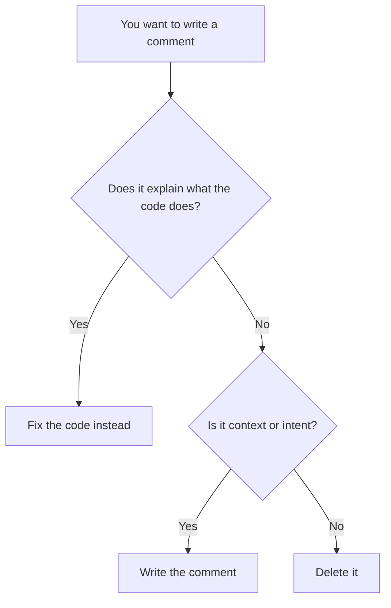

<Principle>Delete the comment. Fix the code.</Principle>

A comment that explains what code does is not documentation. It's a confession. The code had something to say and couldn't say it. So you wrote a second layer of meaning on top of the first. Now you're maintaining two representations of the same thing, and they will drift.

The code is already a language. Use it.

## The Comment Is Lying

Not maliciously. It just doesn't have to be true.

```typescript
// Get active users from the database
function getUsers(db: Database): User[] {
  return db.query('SELECT * FROM users WHERE deleted_at IS NULL');
}
```

The comment says "active users". The code says "not deleted". Those aren't the same thing. Someone added `banned_at` last quarter and forgot to update the comment. The function now returns banned users, the comment still says active, and you've been filtering on `deleted_at` for six months wondering why banned accounts keep showing up.

Code that's wrong breaks. A comment that's wrong just misleads, quietly, until something explodes in production.

Fix the function name:

<Tabs items={['TypeScript', 'Rust']}>
  <Tab value="TypeScript">
  ```typescript
  function getNonDeletedUsers(db: Database): User[] {
    return db.query('SELECT * FROM users WHERE deleted_at IS NULL');
  }
  ```
  </Tab>
  <Tab value="Rust">
  ```rust
  fn get_non_deleted_users(db: &Database) -> Vec<User> {
      db.query("SELECT * FROM users WHERE deleted_at IS NULL")
  }
  ```
  </Tab>
</Tabs>

Now the name and the implementation agree by definition. No second layer to maintain.

## Comments as a Smell

Every comment that explains code is pointing at a problem. The problem is the code.

**"// convert price from cents to dollars"**

You have a `number` where you need a `Money` type. The comment is papering over a missing abstraction. Create the type, add a `toDollars()` method, delete the comment.

**"// only admins can call this"**

Your function accepts `User` when it should accept `Admin`. The comment is documenting an unchecked precondition. Make it a type error instead.

**"// step 1: validate, step 2: transform, step 3: persist"**

You have three functions trapped inside one. Extract them. The comment is an informal table of contents for code that should be split.

The pattern is always the same: the comment describes something the type system, the function structure, or the naming could express directly. The comment is a workaround for code that hasn't been finished.



## What "Fix the Code" Looks Like

Most explanatory comments dissolve when you apply techniques from the rest of this guide.

**Rename the thing.** If you need a comment to explain what a variable or function does, the name is wrong.

**Extract a function.** If a block of code needs a comment header, it's a function waiting to be born. The function name becomes the comment.

**Use a newtype.** If you're commenting what a primitive represents, wrap it. `// user ID, not product ID` disappears when you have `UserId` and `ProductId`.

**Use an enum.** If you're commenting valid values for a field, those values belong in a type. The comment `// status: 'pending' | 'approved' | 'rejected'` is a `Status` enum that hasn't been written yet.

<Tabs items={['TypeScript', 'Rust']}>
  <Tab value="TypeScript">
  ```typescript
  // Before: comment explains the code
  function process(order: Order) {
    // Can only process if payment is confirmed and stock is reserved
    if (order.paymentStatus === 'confirmed' && order.stockStatus === 'reserved') {
      // Mark as processing
      order.status = 'processing';
      // Send to fulfillment
      fulfillment.dispatch(order);
    }
  }

  // After: code explains itself
  type ReadyOrder = Order & {
    paymentStatus: 'confirmed';
    stockStatus: 'reserved';
  };

  function dispatchToFulfillment(order: ReadyOrder) {
    order.status = 'processing';
    fulfillment.dispatch(order);
  }
  ```
  </Tab>
  <Tab value="Rust">
  ```rust
  // Before: comment explains the code
  fn process(order: &mut Order) {
      // Can only process if payment is confirmed and stock is reserved
      if order.payment_status == PaymentStatus::Confirmed
          && order.stock_status == StockStatus::Reserved
      {
          // Mark as processing
          order.status = OrderStatus::Processing;
          // Send to fulfillment
          fulfillment::dispatch(order);
      }
  }

  // After: code explains itself
  struct ReadyOrder {
      id: OrderId,
      // only constructible after payment + stock checks pass
  }

  fn dispatch_to_fulfillment(order: ReadyOrder) {
      // No guards needed — the type guarantees readiness
      fulfillment::dispatch(order);
  }
  ```
  </Tab>
</Tabs>

The after version has no comments. It also has no ambiguity.

## The Two Legitimate Comments

Not all comments are confessions. Two kinds are genuinely useful.

**Context you can't put in the code.** A link to the ticket that explains why this workaround exists. A reference to the RFC that defined this behavior. The JIRA number for the bug this test covers.

```typescript
// Regression test for AUTH-4521: admin tokens were not invalidated
// on password reset. Fixed in commit a3f9b2c.
it('invalidates admin tokens on password reset', async () => {
  ...
});
```

This comment adds information the code cannot express. The bug number, the fix reference — these live outside the codebase. The comment is a bridge.

**Intent for the future.** A note that this is V1 and should be replaced. A TODO with actual substance: what needs to change, and why it wasn't done now.

```typescript
// TODO: this linear scan works at current scale (~500 users) but will
// need an index once we hit the enterprise tier. See PERF-112.
function findUserByEmail(users: User[], email: Email): User | undefined {
  return users.find(u => u.email === email);
}
```

The comment isn't explaining the code. It's documenting a known tradeoff and pointing at the follow-up. That's useful. That's not something the code can say.

What's not useful: `// TODO: refactor this`. Refactor what? Why? When? A TODO without context is noise with a timestamp.

## When This Doesn't Apply

**Public API documentation.** Doc comments (`/** */`, `///`) for exported functions and types are a different thing. They document the contract, not the implementation. If you publish a library, document your public surface. That's not what this article is about.

**Intentionally non-obvious algorithms.** If you're implementing a Bloom filter or a specific cryptographic primitive and the implementation follows a published paper, cite the paper. The code can't link to an arXiv URL. The comment can.

## "Actually..."

<Objection>My code is complex. Comments help junior developers understand it.</Objection>

Complex code is the problem. If the code needs a guide to be navigated, simplify the code. Comments help junior developers survive complex code; they don't help them understand it. And they definitely don't help them change it safely.

<Objection>What about explaining WHY, not WHAT?</Objection>

Yes. Why is exactly what the "context" and "intent" comments cover. The rule is against comments that explain what the code does — because the code already does that. Comments explaining why a decision was made, why a tradeoff was accepted, or why a ticket exists: those are valuable. Keep them.

<Objection>Commented-out code is fine as a temporary thing.</Objection>

You have git. There is no temporary. Commented-out code is code that wasn't deleted. It creates noise, confuses readers, and never gets cleaned up. Delete it. If you need it back, `git log` exists.
