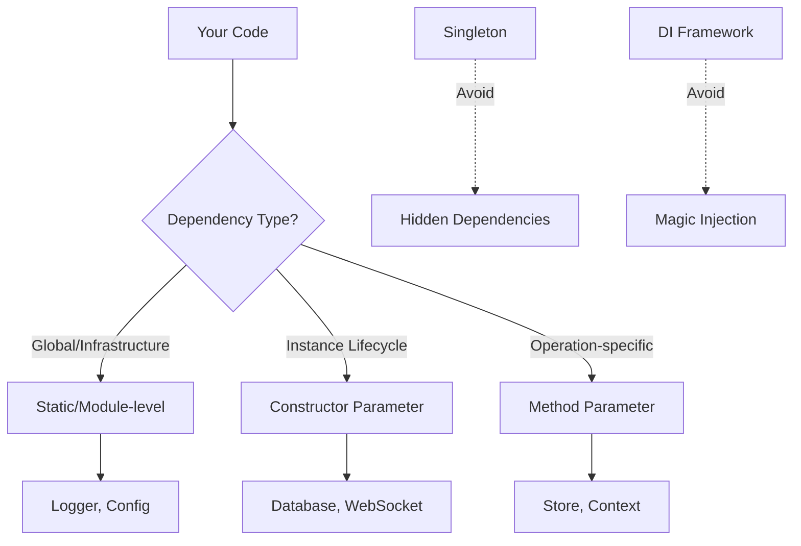
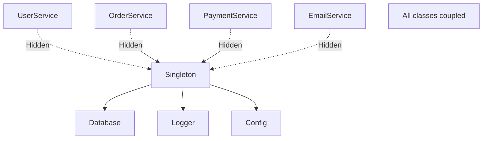
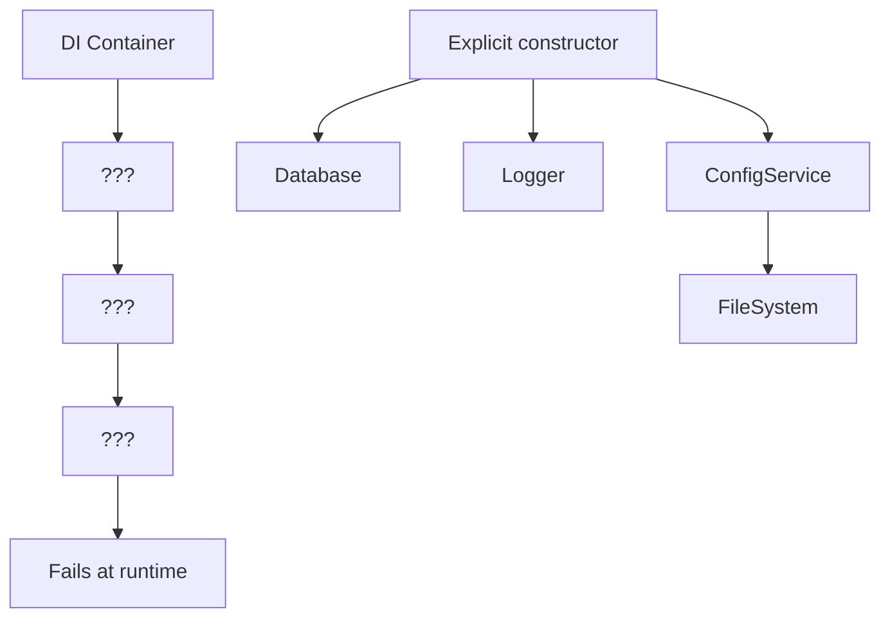
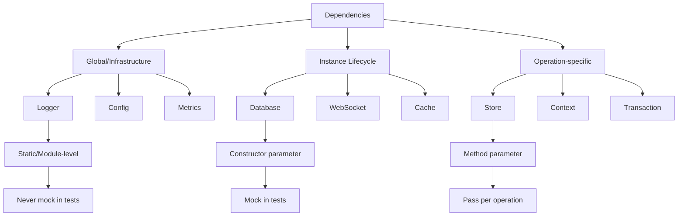
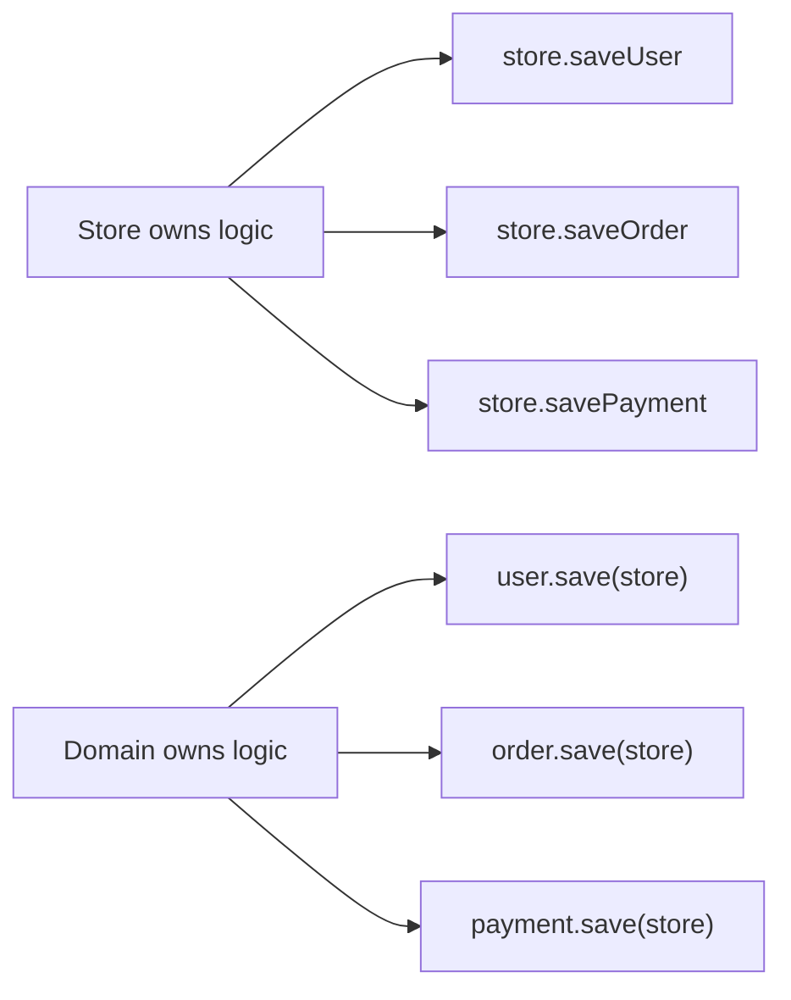
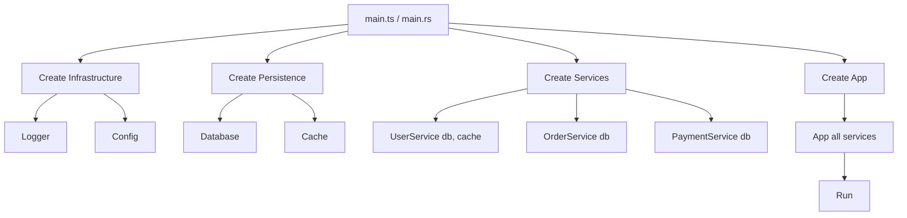

<Principle>Every function and class should declare exactly what it needs. No singletons. No magic injection. If it's not in the signature, it shouldn't exist.</Principle>

## Friday at 4pm

You deployed at noon. Everything was fine. Then at 4pm your phone starts going off.

The error is "failed to resolve dependency for UserService." Stack trace points into the DI container. Nothing useful. You dig through registration files. You stare at the decorator. Then you find it:

```typescript
container.register("LOGER", Logger); // ← one letter off
```

Not `"LOGGER"`. `"LOGER"`. The container accepted it without complaint on startup. It always does. It resolves dependencies at runtime, when someone actually calls the service, so there was no error at boot. The error waited until a specific code path triggered it. On a Friday. In production. Four hours after you deployed and stopped watching the dashboards.

The fix took thirty seconds. The search took two hours.

This is the DI framework tax. Not hypothetical. Documented. Filed as a post-mortem with a "mitigations: linting rules" section that nobody followed up on.

The alternative is boring: put your dependencies in the type signature. The compiler catches `LOGER` in zero milliseconds.

<Excalidraw>

</Excalidraw>

## Singletons Are Poison

### They hide dependencies

Look at this class and tell me what it needs to run:

<Tabs items={['TypeScript', 'Rust']}>
<Tab value="TypeScript">
```typescript
// The Lie: Looks like this class has no dependencies
class UserService {
  async getUser(id: string) {
    // Where did this come from?
    const user = await Database.instance.query("...");
    // And this?
    Logger.instance.info("Fetched user", { id });
    return user;
  }
}

// The Truth: Actually depends on Database and Logger
class UserService {
  constructor(
    private db: Database,
    private logger: Logger
  ) {}

  async getUser(id: string) {
    const user = await this.db.query("...");
    this.logger.info("Fetched user", { id });
    return user;
  }
}
```
</Tab>
<Tab value="Rust">
```rust
// The Lie: Global static state
static DATABASE: OnceCell<Database> = OnceCell::new();
static LOGGER: OnceCell<Logger> = OnceCell::new();

struct UserService;

impl UserService {
    async fn get_user(&self, id: &str) -> Result<User, Error> {
        // Invisible dependencies
        let db = DATABASE.get().unwrap();
        let logger = LOGGER.get().unwrap();

        let user = db.query("...").await?;
        logger.info(&format!("Fetched user: {}", id));
        Ok(user)
    }
}

// The Truth: Explicit dependencies
struct UserService {
    db: Database,
    logger: Logger,
}

impl UserService {
    fn new(db: Database, logger: Logger) -> Self {
        Self { db, logger }
    }

    async fn get_user(&self, id: &str) -> Result<User, Error> {
        let user = self.db.query("...").await?;
        self.logger.info(&format!("Fetched user: {}", id));
        Ok(user)
    }
}
```
</Tab>
</Tabs>

The first version looks simple. Zero constructor parameters. You can spin it up anywhere with `new UserService()` and it just works. Until you need to test it, or move it, or change what database it talks to. Then you find out it secretly depends on two global singletons you can't swap without touching every test in the suite.

The second version has two constructor parameters. Exactly as complex as it actually is.

### They make testing a nightmare

Two tests running in parallel both mutate the same singleton. Race condition. Flaky tests. Passes locally, fails in CI, passes again when you re-run it. You spend an hour in Slack writing "works on my machine" while your colleagues add you to their mental list of people whose PRs need extra scrutiny. This is the singleton tax: paid in debugging time, paid in CI flakiness, paid every sprint.

<Tabs items={['TypeScript', 'Rust']}>
<Tab value="TypeScript">
```typescript
// Test 1
test("creates user", async () => {
  Database.instance.setMode("test");
  await userService.create({ name: "Alice" });
  // Test 2 just changed the mode to "prod" 💥
});

// Test 2 (running in parallel)
test("validates admin", async () => {
  Database.instance.setMode("prod");
  await adminService.validate();
  // Test 1 just changed the mode to "test" 💥
});

// With explicit dependencies - tests are isolated
test("creates user", async () => {
  const db = new TestDatabase();
  const service = new UserService(db, new NullLogger());
  await service.create({ name: "Alice" });
  // Each test has its own instance
});
```
</Tab>
<Tab value="Rust">
```rust
// Singleton hell
#[tokio::test]
async fn test_creates_user() {
    let db = DATABASE.get().unwrap();
    db.set_mode(Mode::Test); // Other tests see this!
    user_service.create(User { name: "Alice" }).await.unwrap();
}

// Isolated tests
#[tokio::test]
async fn test_creates_user() {
    let db = TestDatabase::new();
    let service = UserService::new(db, NullLogger::new());
    service.create(User { name: "Alice" }).await.unwrap();
    // Completely isolated
}
```
</Tab>
</Tabs>

The sin is specific. Mutable state. Shared between tests. Invisible from the type signatures that depend on it.

`export const logger = new Logger(...)` is not this. The import is at the top of the file. It doesn't change between tests. You never mock it because there's nothing to swap. [The Three Kinds of Dependencies](#the-three-kinds-of-dependencies) covers those.

### They create coupling you can't see

<Excalidraw>

</Excalidraw>

Change the singleton's interface and you're grepping the entire codebase hoping you got them all. The compiler can't help because the dependency is invisible. Invisible dependencies are the cockroaches of software architecture: everywhere, impossible to count, surviving every refactor.

## Why DI Frameworks Are Worse

At least singletons are honest. They're in the code. You can grep for them.

DI frameworks give you runtime magic: string-keyed registrations, decorator-based injection, containers resolving graphs at startup. The framework accepted `"LOGER"` silently. The framework always accepts typos silently. That's the design. Everything is checked at runtime, when users are using the thing, not at compile time, when you could actually do something about it.

<Excalidraw>

</Excalidraw>

<Tabs items={['TypeScript', 'Rust']}>
<Tab value="TypeScript">
```typescript
// DI Framework - errors at runtime
@Injectable()
class UserService {
  constructor(
    @Inject("DATABASE") private db: any, // ← Type safety lost
    @Inject("LOGGER") private logger: any,
  ) {}
}

// Somewhere in main.ts
container.register("DATABASE", Database);
container.register("LOGER", Logger); // ← Typo! Fails at runtime. On a Friday.

// Explicit dependencies - errors at compile time
class UserService {
  constructor(
    private db: Database, // ← Fully typed
    private logger: Logger,
  ) {}
}

// In main.ts
const db = new Database(config.dbUrl);
const logger = new Logger(config.logLevel);
const userService = new UserService(db, logger);
// ↑ Typo here? Compiler catches it immediately
```
</Tab>
<Tab value="Rust">
```rust
// Rust doesn't really have DI frameworks because
// the type system makes them unnecessary

struct UserService {
    db: Database,
    logger: Logger,
}

impl UserService {
    fn new(db: Database, logger: Logger) -> Self {
        Self { db, logger }
    }
}

// main.rs
let db = Database::new(&config.db_url)?;
let logger = Logger::new(config.log_level);
let user_service = UserService::new(db, logger);
// All checked at compile time
```
</Tab>
</Tabs>

With explicit dependencies the graph is in the code. You can read it. You can trace it. You can break it and get a compiler error instead of a Friday incident.

## The Three Kinds of Dependencies

Not all dependencies are the same. Treat them differently.

<Excalidraw>

</Excalidraw>

### Global/Infrastructure: Static or Module-level

These are genuinely global. Everyone needs them. They don't change behavior between tests. If you're never mocking it, you don't need to inject it.

<Tabs items={['TypeScript', 'Rust']}>
<Tab value="TypeScript">
```typescript
// logger.ts
export const logger = new Logger({
  level: process.env.LOG_LEVEL,
  destination: process.env.LOG_DEST,
});

// config.ts
export const config = loadConfig();

// user-service.ts
import { logger } from "./logger";
import { config } from "./config";

class UserService {
  constructor(private db: Database) {}

  async getUser(id: string) {
    logger.info("Fetching user", { id });
    const timeout = config.dbTimeout;
    return this.db.query("...", { timeout });
  }
}

// test
test("gets user", async () => {
  const db = new TestDatabase();
  const service = new UserService(db);
  // Logger still works, still logs to test output
  // No need to mock it
});
```
</Tab>
<Tab value="Rust">
```rust
// logger.rs
use std::sync::OnceLock;

static LOGGER: OnceLock<Logger> = OnceLock::new();

pub fn logger() -> &'static Logger {
    LOGGER.get_or_init(|| Logger::new())
}

// user_service.rs
use crate::logger::logger;

struct UserService {
    db: Database,
}

impl UserService {
    async fn get_user(&self, id: &str) -> Result<User, Error> {
        logger().info(&format!("Fetching user: {}", id));
        self.db.query("...").await
    }
}

// Tests don't mock the logger - it's infrastructure
```
</Tab>
</Tabs>

If you're never mocking it in tests, it doesn't need to be injected.

### Instance Lifecycle: Constructor Parameters

These dependencies live as long as the instance lives. They define what the instance can do. Put them in the constructor.

<Tabs items={['TypeScript', 'Rust']}>
<Tab value="TypeScript">
```typescript
// A ChatClient needs a WebSocket for its entire lifetime
class ChatClient {
  constructor(
    private ws: WebSocket,
    private userId: string,
  ) {
    this.ws.on("message", this.handleMessage);
  }

  async sendMessage(text: string) {
    await this.ws.send({ userId: this.userId, text });
  }

  private handleMessage(msg: Message) {
    // ...
  }
}

const ws = new WebSocket(chatUrl);
const client = new ChatClient(ws, currentUser.id);
```
</Tab>
<Tab value="Rust">
```rust
struct ChatClient {
    ws: WebSocket,
    user_id: String,
}

impl ChatClient {
    fn new(ws: WebSocket, user_id: String) -> Self {
        let mut client = Self { ws, user_id };
        client.ws.on_message(Self::handle_message);
        client
    }

    async fn send_message(&self, text: &str) -> Result<(), Error> {
        self.ws.send(&Message {
            user_id: &self.user_id,
            text,
        }).await
    }
}
```
</Tab>
</Tabs>

### Operation-specific: Method Parameters

These are only needed for a specific operation. Pass them when you call the method. Don't store them on the instance.

<Tabs items={['TypeScript', 'Rust']}>
<Tab value="TypeScript">
```typescript
class User {
  constructor(
    public id: string,
    public name: string,
    public email: string,
  ) {}

  async save(store: Store): Promise<Result<void, SaveError>> {
    return store.saveUser(this);
  }

  async updateEmail(
    newEmail: string,
    store: Store,
    tx: Transaction,
  ): Promise<Result<void, UpdateError>> {
    const validation = validateEmail(newEmail);
    if (validation.type === "Err") return validation;

    this.email = newEmail;
    return store.saveUser(this, tx);
  }
}

const user = new User("1", "Alice", "alice@example.com");
user.updateEmail("newalice@example.com", store, transaction);
// ↑ Clear that this operation needs a store and transaction
```
</Tab>
<Tab value="Rust">
```rust
struct User {
    id: String,
    name: String,
    email: String,
}

impl User {
    async fn save(&self, store: &Store) -> Result<(), SaveError> {
        store.save_user(self).await
    }

    async fn update_email(
        &mut self,
        new_email: String,
        store: &Store,
        tx: &Transaction,
    ) -> Result<(), UpdateError> {
        validate_email(&new_email)?;
        self.email = new_email;
        store.save_user_tx(self, tx).await
    }
}
```
</Tab>
</Tabs>

## Domain Logic Belongs in Domain Objects

The Store is not a brain. It's a filing cabinet.

This gets violated constantly. Someone needs to save a user, so validation goes in `store.saveUser`. Then someone needs to save an order, so different validation goes in `store.saveOrder`. Six months later the Store has more business logic than your actual domain objects and you're adding a `banned_at` check in three different places because nobody knows where the canonical rule lives.

<Excalidraw>

</Excalidraw>

<Tabs items={['TypeScript', 'Rust']}>
<Tab value="TypeScript">
```typescript
// ❌ Bad: Logic in the Store
class Store {
  async saveUser(user: User): Promise<Result<void, SaveError>> {
    if (!user.email.includes("@")) {
      return { type: "Err", err: { type: "InvalidEmail" } };
    }

    const existing = await this.db.query("SELECT * FROM users WHERE email = ?", user.email);
    if (existing) {
      return { type: "Err", err: { type: "DuplicateEmail" } };
    }

    await this.db.query("INSERT INTO users ...", user);
    return { type: "Ok", data: undefined };
  }

  async saveOrder(order: Order): Promise<Result<void, SaveError>> {
    // Different validation logic
    // Different duplicate checking
    // The Store is becoming a God object
  }
}

// ✅ Good: Logic in the Domain Object
class User {
  constructor(
    public id: string,
    public name: string,
    public email: string,
  ) {}

  validate(): Result<void, ValidationError> {
    if (!this.email.includes("@")) {
      return { type: "Err", err: { type: "InvalidEmail", field: "email" } };
    }
    return { type: "Ok", data: undefined };
  }

  async save(store: Store): Promise<Result<void, SaveError>> {
    const validation = this.validate();
    if (validation.type === "Err") {
      return { type: "Err", err: { type: "ValidationFailed", inner: validation.err } };
    }

    const duplicate = await store.findUserByEmail(this.email);
    if (duplicate.type === "Ok") {
      return { type: "Err", err: { type: "DuplicateEmail", email: this.email } };
    }

    return store.persistUser(this);
  }
}

class Store {
  async findUserByEmail(email: string): Promise<Result<User, NotFoundError>> {
    // Simple query, no business logic
  }

  async persistUser(user: User): Promise<Result<void, SaveError>> {
    // Simple insert, no business logic
  }
}
```
</Tab>
<Tab value="Rust">
```rust
// ❌ Bad: Logic in the Store
impl Store {
    async fn save_user(&self, user: &User) -> Result<(), SaveError> {
        if !user.email.contains("@") {
            return Err(SaveError::InvalidEmail);
        }

        if self.db.find_by_email(&user.email).await.is_ok() {
            return Err(SaveError::DuplicateEmail);
        }

        self.db.insert_user(user).await
    }
}

// ✅ Good: Logic in the Domain Object
impl User {
    fn validate(&self) -> Result<(), ValidationError> {
        if !self.email.contains("@") {
            return Err(ValidationError::InvalidEmail);
        }
        Ok(())
    }

    async fn save(&self, store: &Store) -> Result<(), SaveError> {
        self.validate()
            .map_err(SaveError::ValidationFailed)?;

        if store.find_user_by_email(&self.email).await.is_ok() {
            return Err(SaveError::DuplicateEmail(self.email.clone()));
        }

        store.persist_user(self).await
    }
}

impl Store {
    async fn find_user_by_email(&self, email: &str) -> Result<User, NotFoundError> {
        // Simple query
    }

    async fn persist_user(&self, user: &User) -> Result<(), SaveError> {
        // Simple insert
    }
}
```
</Tab>
</Tabs>

The Store reads and writes. It doesn't know what makes a User valid any more than a filing cabinet knows what makes a contract legal. Business rules live in business objects.

This means the object's own invariants. Not every rule that touches it. If `User` ends up with twenty methods, that's not a dependency problem. That's a [struct problem](/docs/fundamentals/3-structs).

## Practical Wiring

All dependencies get constructed in one place. One file. That's it.

<Excalidraw>

</Excalidraw>

<Tabs items={['TypeScript', 'Rust']}>
<Tab value="TypeScript">
```typescript
// main.ts - The only place where wiring happens
async function main() {
  const config = loadConfig();

  const db = new Database(config.dbUrl);
  await db.connect();

  const cache = new Cache(config.redisUrl);
  await cache.connect();

  const userService = new UserService(db, cache);
  const orderService = new OrderService(db);
  const paymentService = new PaymentService(db, config.stripeKey);

  const app = new App(userService, orderService, paymentService);

  await app.listen(config.port);
}

main().catch(err => {
  logger.error("Failed to start", { error: err });
  process.exit(1);
});
```
</Tab>
<Tab value="Rust">
```rust
// main.rs
#[tokio::main]
async fn main() -> Result<(), Box<dyn Error>> {
    let config = load_config()?;

    let db = Database::connect(&config.db_url).await?;
    let cache = Cache::connect(&config.redis_url).await?;

    let user_service = UserService::new(db.clone(), cache.clone());
    let order_service = OrderService::new(db.clone());
    let payment_service = PaymentService::new(db.clone(), config.stripe_key);

    let app = App::new(user_service, order_service, payment_service);

    app.listen(config.port).await?;
    Ok(())
}
```
</Tab>
</Tabs>

No magic. No runtime resolution. If it doesn't compile, you fix it before deploying.

## When This Doesn't Apply

**Frameworks with their own lifecycle.** NestJS, Next.js, Axum — they have opinions about wiring. Work within their constraints. Keep individual classes explicit even if the framework handles top-level construction.

**Plugin systems.** If you're building an extension point where third parties provide implementations at runtime, dynamic resolution is the point. That's the exception, not a reason to DI-framework your whole app.

**Circular dependencies.** If A depends on B depends on A, you have an architecture problem. The answer is introducing an interface or an event bus, not a DI container that resolves cycles through magic. The cycle is telling you something.

## "Actually..."

<Objection>Doesn't passing everything through constructors get unwieldy?</Objection>

Ten constructor parameters means you have a class that hasn't been split yet. That's the smell. Not the explicit dependencies — the fact that one class is doing ten things. Split it. The constructor then tells you exactly what each piece needs, which is the point.

<Objection>What about interface-based dependency injection?</Objection>

Yes. Use it. No framework required.

<Tabs items={['TypeScript', 'Rust']}>
<Tab value="TypeScript">
```typescript
interface Database {
  query(sql: string): Promise<Result<Row[], QueryError>>;
}

class UserService {
  constructor(private db: Database) {}
  // Can pass real Database or TestDatabase
}
```
</Tab>
<Tab value="Rust">
```rust
trait Database {
    async fn query(&self, sql: &str) -> Result<Vec<Row>, QueryError>;
}

struct UserService<D: Database> {
    db: D,
}

// Can use real Database or TestDatabase
```
</Tab>
</Tabs>

Interfaces for swappability. Explicit constructors for wiring. No container, no string keys, no decorators needed.

<Objection>How do I handle optional dependencies?</Objection>

Put them in the type.

<Tabs items={['TypeScript', 'Rust']}>
<Tab value="TypeScript">
```typescript
class UserService {
  constructor(
    private db: Database,
    private cache?: Cache,
  ) {}

  async getUser(id: string): Promise<Result<User, GetUserError>> {
    if (this.cache) {
      const cached = await this.cache.get(id);
      if (cached.type === "Ok") return cached;
    }

    return this.db.findUser(id);
  }
}
```
</Tab>
<Tab value="Rust">
```rust
struct UserService {
    db: Database,
    cache: Option<Cache>,
}

impl UserService {
    async fn get_user(&self, id: &str) -> Result<User, GetUserError> {
        if let Some(cache) = &self.cache {
            if let Ok(user) = cache.get(id).await {
                return Ok(user);
            }
        }

        self.db.find_user(id).await
    }
}
```
</Tab>
</Tabs>

The type says it's optional. The compiler enforces that you handle both cases. No magic needed.

---

You didn't follow this and got a DI framework. Here's what you bought:

Runtime errors where you should have compile-time errors. The `"LOGER"` incident is not bad luck. It's the expected behavior of a system that defers checking until someone runs the code. That someone is eventually a user, on a Friday, when you're not watching.

Flaky tests from singleton state leaking between parallel runs. Not always. Just sometimes. Just enough that you spend the first twenty minutes of every debugging session wondering if it's real or a test artifact.

A dependency graph that lives in the container's memory, not in your codebase. You can't grep it. You can't read it. You find out what depends on what by breaking something and watching what fails.

Put dependencies in the type signature. Wire everything in main. The graph is then right there in the code, checked at compile time, readable by anyone who joins the project in six months and has never seen your container configuration.

If it's not in the type signature, it's hiding from you. And things that hide from you bite you in production.
