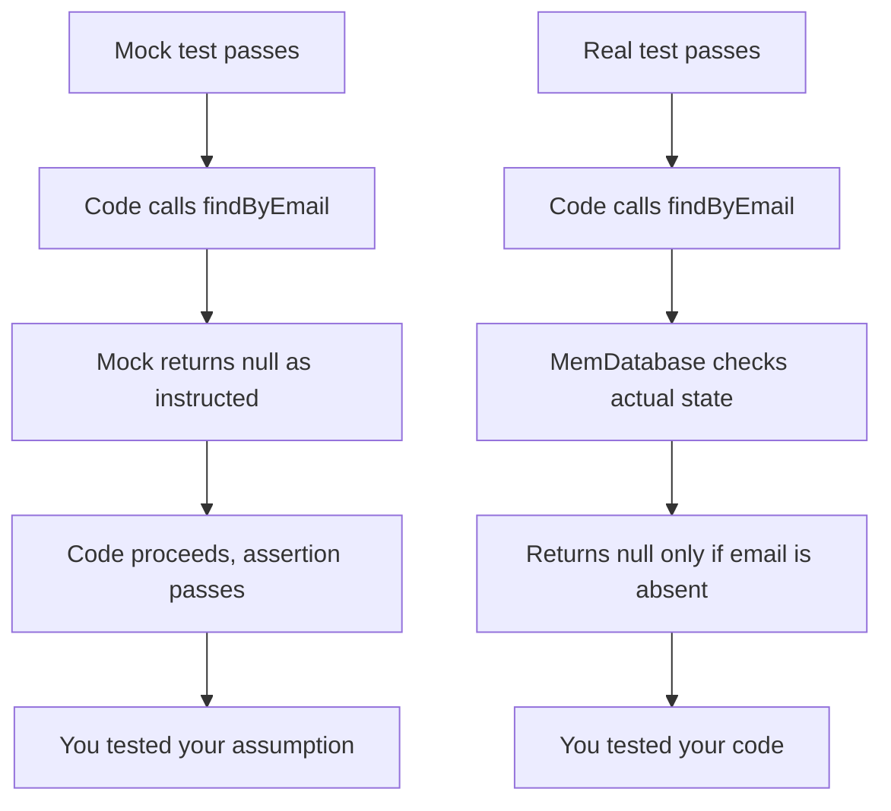
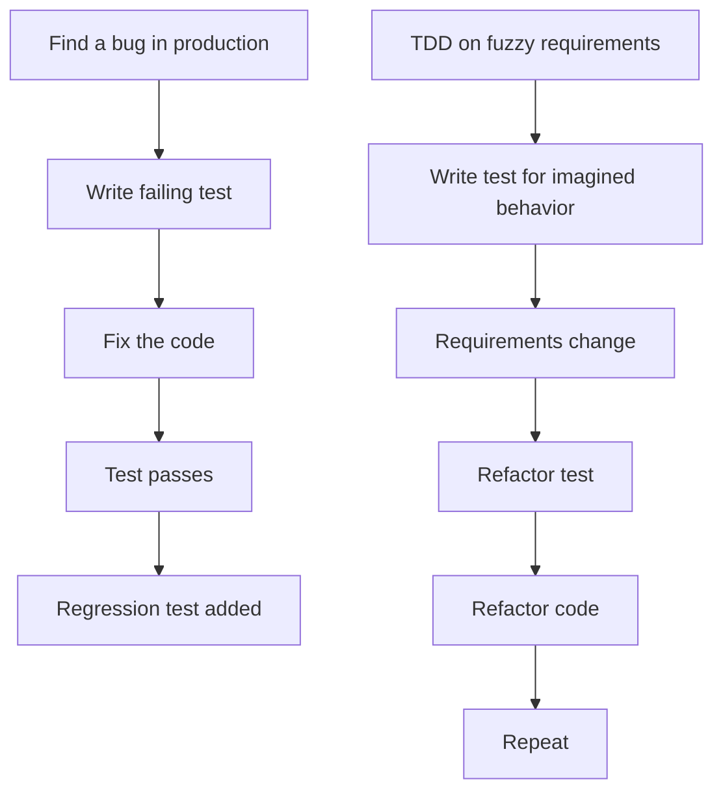
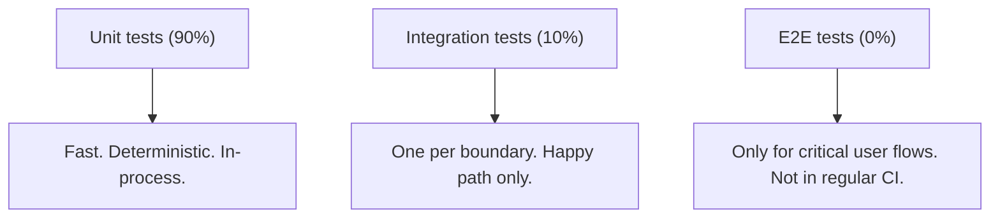

<Principle>Your tests are either fast or honest. Real in-memory implementations are both. Mocks are neither.</Principle>

## Green CI, Burning Production

All tests passing. CI green. Deploy on a Friday afternoon, because nothing had ever broken before, and everything was tested.

The unique constraint on `email` fired in production. Every test had mocked `db.findByEmail` to return `null`, meaning "no duplicate, go ahead." That's what the tests needed it to return to reach the assertion. The mock was configured to succeed. It always succeeded. It never knew what the database actually contained, because it wasn't a database. It was a `jest.fn()` with instructions.

One unique constraint. Three hours of incident response. A revert. A postmortem with the word "mock" in it six times.

The mock didn't lie. It did exactly what you told it to do. That's the problem.

## Mocks Are Self-Fulfilling Prophecies

When you write `mockDatabase.findByEmail.mockReturnValue(null)`, you aren't testing whether the database returns null for a new email. You're testing whether your code handles a null return value correctly, assuming the database returns null, which you've decided it does, which is the thing you're supposed to be verifying.

The circular logic is invisible because it passes.

<Excalidraw>

</Excalidraw>

Mocks test your assumptions. Real implementations test your code. Those are not the same test.

## Build a Real Substitute

The alternative is more work upfront. Build a real in-memory implementation of your dependency: one that has actual logic behind it. A `MemDatabase` that stores rows in a hash map and enforces constraints. It lives alongside your code permanently. It's not a test artifact. It's a lightweight implementation that happens to be fast and in-process.

<Tabs items={['TypeScript', 'Rust', 'Python']}>
<Tab value="TypeScript">
```typescript
// The interface your code depends on
interface Database {
  findUserByEmail(email: string): Promise<User | null>;
  insertUser(user: NewUser): Promise<User>;
}

// The mock. Tests your assumptions, not your code.
const mockDb: Database = {
  findUserByEmail: jest.fn().mockResolvedValue(null),
  insertUser: jest.fn().mockResolvedValue({ id: "1", ...newUser }),
};

// The real substitute. Tests your code.
class MemDatabase implements Database {
  private users = new Map<string, User>();

  async findUserByEmail(email: string): Promise<User | null> {
    for (const user of this.users.values()) {
      if (user.email === email) return user;
    }
    return null;
  }

  async insertUser(user: NewUser): Promise<User> {
    const existing = await this.findUserByEmail(user.email);
    if (existing) throw new Error(`Email already exists: ${user.email}`);
    const created = { id: crypto.randomUUID(), ...user };
    this.users.set(created.id, created);
    return created;
  }
}
```
</Tab>
<Tab value="Rust">
```rust
// The trait your code depends on
#[async_trait]
trait Database: Send + Sync {
    async fn find_user_by_email(&self, email: &str) -> Result<Option<User>, DbError>;
    async fn insert_user(&self, user: NewUser) -> Result<User, DbError>;
}

// The real substitute
struct MemDatabase {
    users: Mutex<HashMap<String, User>>,
}

#[async_trait]
impl Database for MemDatabase {
    async fn find_user_by_email(&self, email: &str) -> Result<Option<User>, DbError> {
        let users = self.users.lock().unwrap();
        Ok(users.values().find(|u| u.email == email).cloned())
    }

    async fn insert_user(&self, user: NewUser) -> Result<User, DbError> {
        let mut users = self.users.lock().unwrap();
        if users.values().any(|u| u.email == user.email) {
            return Err(DbError::UniqueViolation("email".into()));
        }
        let created = User { id: Uuid::new_v4().to_string(), ..user.into() };
        users.insert(created.id.clone(), created.clone());
        Ok(created)
    }
}
```
</Tab>
<Tab value="Python">
```python
import uuid
from typing import Protocol

# The Protocol your code depends on
class Database(Protocol):
    async def find_user_by_email(self, email: str) -> User | None: ...
    async def insert_user(self, user: NewUser) -> User: ...

# The real substitute. Tests your code.
class MemDatabase:
    def __init__(self) -> None:
        self._users: dict[str, User] = {}

    async def find_user_by_email(self, email: str) -> User | None:
        return next(
            (u for u in self._users.values() if u.email == email),
            None,
        )

    async def insert_user(self, user: NewUser) -> User:
        existing = await self.find_user_by_email(user.email)
        if existing is not None:
            raise DuplicateEmailError(f"Email already exists: {user.email}")
        created = User(id=str(uuid.uuid4()), **vars(user))
        self._users[created.id] = created
        return created
```
</Tab>
</Tabs>

Now your tests enforce the uniqueness constraint. They catch the duplicate insert. They reflect what the database actually does, because the in-memory implementation has the same rules, just without the network round-trip.

The `MemDatabase` stays in your codebase. It's useful for local dev, for seeding test data, for running without a real database connection in CI. It earns its place.

## Decoupling Is a Feature, Not a Test Trick

Some things are genuinely hard to test: the clock, random number generators, external HTTP calls. The instinct is to mock them. The right move is to make them injectable.

The distinction matters. A mock is a lie you inject to make an assertion easier. An injectable dependency is a real design decision that makes your code more flexible.

<Tabs items={['TypeScript', 'Rust', 'Python']}>
<Tab value="TypeScript">
```typescript
interface Clock {
  now(): Date;
}

class SessionService {
  constructor(private clock: Clock) {}

  createSession(userId: string): Session {
    const now = this.clock.now();
    return { userId, createdAt: now, expiresAt: new Date(now.getTime() + 3600_000) };
  }
}

// Fixed clock makes the test deterministic
const fixedClock: Clock = { now: () => new Date("2024-01-15T12:00:00Z") };
const session = new SessionService(fixedClock).createSession("user-1");
assert.equal(session.expiresAt.toISOString(), "2024-01-15T13:00:00.000Z");
```
</Tab>
<Tab value="Rust">
```rust
trait Clock: Send + Sync {
    fn now(&self) -> DateTime<Utc>;
}

struct FixedClock(DateTime<Utc>);
impl Clock for FixedClock {
    fn now(&self) -> DateTime<Utc> { self.0 }
}

struct SessionService<C: Clock> { clock: C }

impl<C: Clock> SessionService<C> {
    fn create_session(&self, user_id: &str) -> Session {
        let now = self.clock.now();
        Session { user_id: user_id.to_string(), created_at: now, expires_at: now + Duration::hours(1) }
    }
}

#[test]
fn session_expires_one_hour_after_creation() {
    let clock = FixedClock(Utc.with_ymd_and_hms(2024, 1, 15, 12, 0, 0).unwrap());
    let session = SessionService { clock }.create_session("user-1");
    assert_eq!(session.expires_at.hour(), 13);
}
```
</Tab>
<Tab value="Python">
```python
from datetime import datetime, timezone, timedelta
from typing import Protocol

class Clock(Protocol):
    def now(self) -> datetime: ...

class FixedClock:
    def __init__(self, at: datetime) -> None:
        self._at = at
    def now(self) -> datetime:
        return self._at

class SessionService:
    def __init__(self, clock: Clock) -> None:
        self._clock = clock
    def create_session(self, user_id: str) -> Session:
        now = self._clock.now()
        return Session(user_id=user_id, created_at=now, expires_at=now + timedelta(hours=1))

def test_session_expires_one_hour_after_creation() -> None:
    fixed = datetime(2024, 1, 15, 12, 0, 0, tzinfo=timezone.utc)
    session = SessionService(FixedClock(fixed)).create_session("user-1")
    assert session.expires_at.hour == 13
```
</Tab>
</Tabs>

The bar for injection is this: would it be useful outside of tests? A `Clock` interface is useful in production. You can use it to freeze time in staging, to simulate midnight rollover in a demo, to replay historical scenarios. It belongs in the code.

If the only reason it exists is to make an assertion easier, it's a smell. Extract the logic into a pure function instead. Pure functions take inputs, return outputs, have no dependencies. Nothing to inject, nothing to mock, nothing to set up.

## Don't Write Tests on a Moving Target

TDD sounds like the answer. Write the test first. It fails. Write the code. It passes. Repeat. The logic is airtight.

The problem is the assumption underneath: that you know what you're building before you build it.

You don't. Requirements are fuzzy. You discover the right abstraction while implementing. The interface that seemed obvious at 9am is wrong by 2pm. You refactor. The tests you wrote at 9am either break or survive by being vague enough to pass anything, which means they weren't testing much.

Test-first is correct exactly once: when you find a bug. At that moment, you have explicit requirements: the production behavior you observed, the input that triggered it, the output you got vs. the output you expected. Write the failing test. Fix it. You now have a regression test that reflects a real failure mode, not a hypothetical one.

<Excalidraw>

</Excalidraw>

Build the feature. Then test what you built. Write regression tests the moment you find bugs. Over time you accumulate a suite that reflects real failure modes, not imagined ones.

## The Pyramid

90% unit tests. 10% integration tests. Zero end-to-end tests in your regular suite.

Unit tests run in milliseconds. They don't need the network. They don't need Docker. They pass or fail because of your code, not because of an overloaded CI runner or a rate-limited external API.

Integration tests cross a process or network boundary. They're slow. They're occasionally flaky for reasons unrelated to your code. You want exactly one per external boundary: one test that confirms your database adapter actually connects and runs a query, not one per feature that touches the database.

<Excalidraw>

</Excalidraw>

End-to-end tests have a place: login, checkout, the flows where a regression is catastrophic. Run them nightly, not on every PR. The moment they're in the critical path of a merge, they become the bottleneck everyone works around.

## When This Doesn't Apply

**Third-party integrations with no in-process alternative.** Stripe, Twilio, payment gateways. You can't run these in-memory. Write one narrow integration test at the adapter boundary. Wrap it in a `[integration]` tag and run it separately from your main suite. Don't skip it, but don't block merges on it either.

**Truly stateless pure functions.** If a function takes inputs and returns outputs with no dependencies, just call it in a test. No injection needed, no substitute needed, no setup. The test is three lines.

**Performance tests.** In-memory implementations don't simulate load. If you're testing that something handles 10,000 concurrent writes without degrading, you need a real database and a real load generator. That's not a unit test and it shouldn't pretend to be one.

## "Actually..."

<Objection>Building a MemDatabase is more work than a mock.</Objection>

Yes. By about two hours, once per dependency. You'll spend more than two hours debugging mock-related production incidents in the first month. The MemDatabase pays for itself in the first failure it prevents. Write it once, use it everywhere.

<Objection>We need integration tests to be confident the system works end-to-end.</Objection>

You need one integration test per boundary to confirm the adapter works. That's it. The end-to-end correctness of your system is what your unit tests are for: they cover every state, every error path, every edge case, in milliseconds, without infrastructure. Integration tests confirm wiring, not logic.

<Objection>TDD forces you to think about the interface before the implementation.</Objection>

Good design forces you to think about the interface. Writing the test first is one way to do that. Reading the existing code, sketching on paper, and talking it through are others, and they don't produce test files you have to delete when the requirements shift. Think about the interface. When you're ready to commit to it, write the test.

---

Here is what a mock-heavy, slow integration suite actually costs you.

A CI pipeline that takes 40 minutes. Developers who re-run flaky tests twice before investigating. A test suite that passes on every PR and still misses the unique constraint violation, the off-by-one in the expiry calculation, the null that came back from a dependency that wasn't configured to return null in production.

A new engineer who can't run the tests without Docker Compose, a Postgres container, a Redis container, and a `.env.test` file that isn't in the repo. They ask someone. That someone is annoyed. They paste the file contents into Slack. The file is outdated. The engineer asks again.

The receipt arrives slowly: in re-run counts, in incident hours, in onboarding friction that compounds. Then all at once, the week the senior engineer who understood the mock setup leaves the company and nobody knows why three tests are marked `.skip`.
