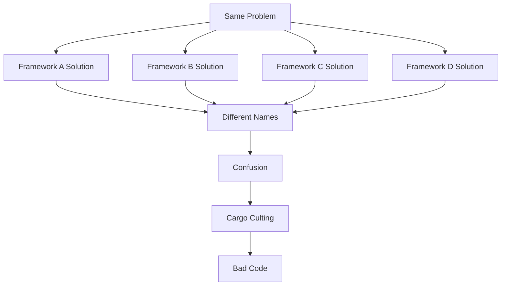
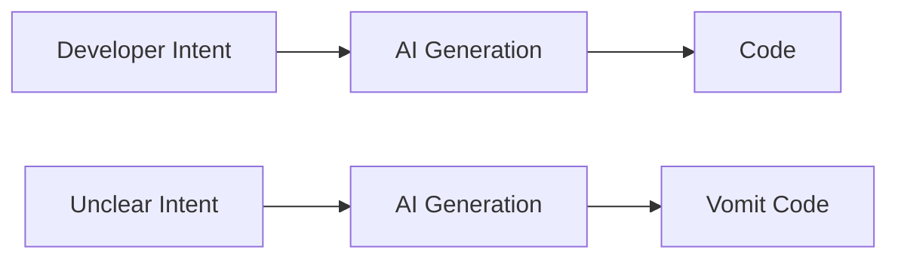
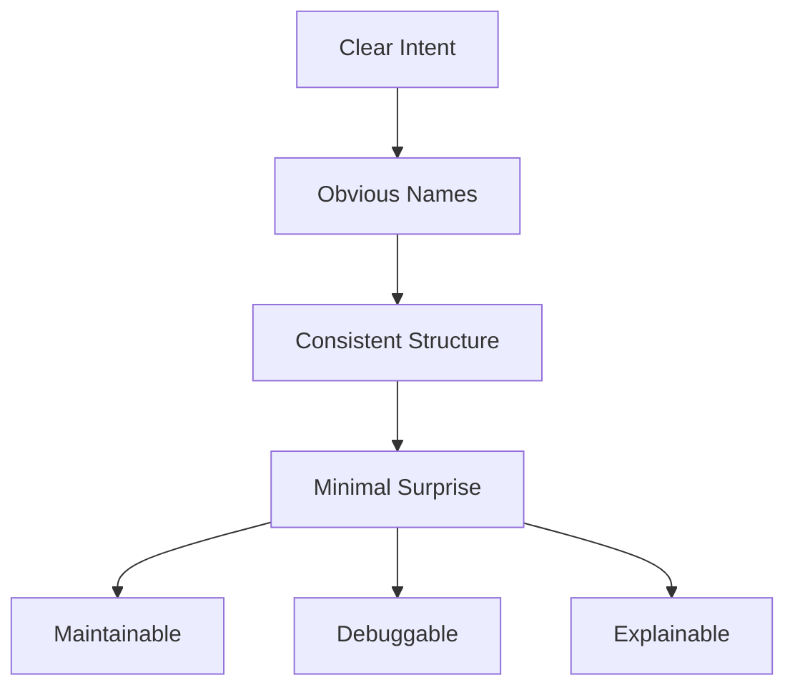

## The Problem

Programming is drowning in its own confusion.

You open a codebase. You see a `UserService` that doesn't serve anything. A `CustomerController` that doesn't control. A `PaymentUseCase` that... what does a use case even *do*? The developer who wrote this will tell you they're following Domain-Driven Design. They're not. They've cargo-culted the vocabulary without understanding the grammar.

Meanwhile, AI is making this worse. Much worse.

LLMs generate code that *works* but reads like a stream of consciousness from a very competent, very drunk programmer. It solves the problem. It passes the tests. It's also architectural vomit—inconsistent naming, mixed abstraction levels, no guiding principles. Just tokens predicting tokens.

**Here's the uncomfortable truth**: Most human-written code isn't much better.

## The Real Disease

Programming suffers from a naming crisis. Not the "naming things is hard" platitude—everyone knows that. The real problem: **there are too many ways to do the same thing, and we can't agree on what to call any of them**.

Want to organize business logic? Choose your poison:
- Service Layer
- Use Case Layer  
- Application Services
- Domain Services
- Handlers
- Managers
- Coordinators

All of these might do the exact same thing in your codebase. Or they might not. There's no standard. So developers reach for architectural vocabulary like life preservers, hoping the names will save them from drowning in their own complexity.

They won't.

**The names are a symptom, not a cure**. When you need a word like "Manager" or "Service" to explain what your code does, you're admitting you don't know what your code does.

## The DDD Delusion

"But we use Domain-Driven Design!"

Do you? Or did you read the blue book, nod sagely at the word "Aggregate," and then create a `CustomerAggregate` class that's actually just an anemic data container with 47 setter methods?

Domain-Driven Design has good ideas. The problem is everyone claims to do it, and almost everyone does it wrong. They adopt the terminology—Entities, Value Objects, Repositories—without understanding the underlying principles. They think DDD means "put your database tables in a folder called 'domain'."

It doesn't.

The result: codebases full of domain-ish words pointing at architectural mush.

## Why This Matters More Now

AI is a code-generation tsunami. In three years, most boilerplate will be LLM-generated. This is good—boilerplate is waste. But here's what won't be automated:

**Knowing what to ask for.**

If you can't articulate what you want clearly, AI will give you working garbage. The better AI gets at generating code, the more critical your architectural clarity becomes. You need principles, not just syntax.

You need craftsmanship.

## What This Blog Is

This is a knowledge garden for programming craftsmanship. Each article documents a principle—a theorem about how to write better code.

The format:
1. **The Principle**: What you should do
2. **The Demonstration**: Why it works, with evidence
3. **The Counterarguments**: When it doesn't apply

The goal: **Actionable insights that survive contact with reality.**

Not "consider organizing your code thoughtfully." That's useless. Instead: "Sort your methods alphabetically because there is no universal logical order and alphabetical needs no explanation." Specific. Testable. Defensible.

These articles exist because:
- I forget my own reasoning
- You're tired of architectural theater
- Someone needs to call bullshit on "best practices" that aren't
- AI makes beautiful code more valuable, not less

## What This Blog Isn't

This is not a tutorial site. I won't teach you React hooks or explain what a closure is. You already know how to program.

This is not neutral. Every article is opinionated. I'll make claims. I'll show evidence. You can disagree—that's fine. But I won't hedge with "arguably" or "it depends." Everything depends. We'll say things anyway.

This is not comprehensive. These are principles I've discovered through practice, mistakes, and thousands of code reviews. They're not universal laws. They're hard-won heuristics.

## The Standard We're Holding

Here's what beautiful code looks like:

- **Intent is obvious**: A human can read it and understand what it does
- **Names explain themselves**: No `UserService`, no `DataManager`, no generic nonsense
- **Structure is consistent**: Same problems solved the same way
- **Surprises are minimal**: Code does what it looks like it does

If AI-generated code meets this standard, great. If your hand-written code doesn't, fix it.

## The Coming Articles

Future articles will tackle specific principles:

- Why you should sort class methods alphabetically
- When to use inheritance (almost never)
- How to name things without generic suffixes
- Why "service" is not an architecture
- What Domain-Driven Design actually means
- How to structure code so AI can help instead of hurt

Each article will be opinionated, demonstrated, and useful.

## Why You Should Care

Because you've felt this pain. You've opened a codebase and thought "what the fuck is a `RequestProcessor`?" You've worked with developers who can't explain why their `UserManager` is different from their `UserService`. You've seen AI generate 200 lines that technically work but architecturally embarrass.

You want better. Not perfect—better.

This blog is for developers who:
- Care about craftsmanship
- Want principles, not platitudes  
- Are tired of architectural cosplay
- Know that AI makes clarity more important, not less

**Programming is a craft**. The tools get better, but the fundamentals don't change. Beautiful code is still beautiful. Vomit code is still vomit.

Let's make more of the former and less of the latter.

---

**Next**: Specific principles, proven techniques, and the arguments to defend them. Starting with the simplest possible rule that most codebases violate: alphabetical method ordering.

Welcome to the knowledge garden. Bring your pruning shears.