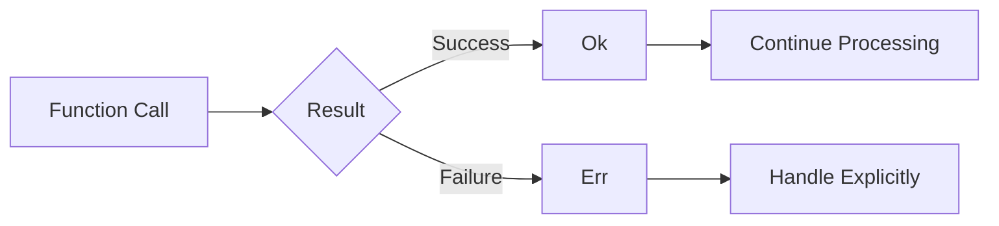
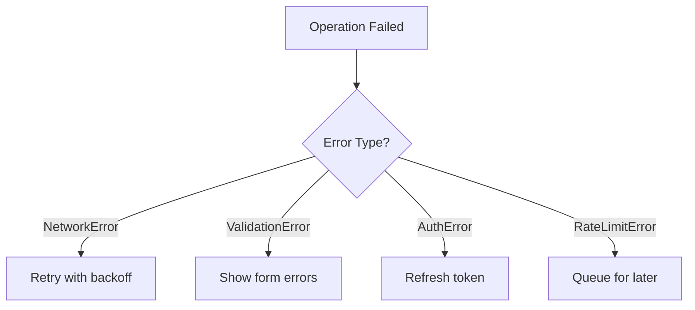
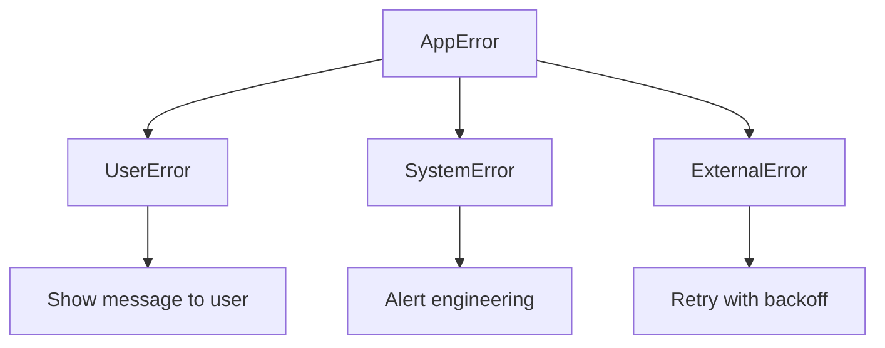
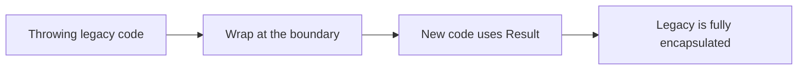

<Principle>Handle errors like any other value in your program. Every operation that can fail returns a discriminated union. No throws. No panics. Just honest return values that force you to confront reality.</Principle>

<Excalidraw>

</Excalidraw>

## Your Type Signatures Are Lying to You

It's 3am. Production alert. Something is swallowing errors and returning garbage to users, but you can't tell which layer is responsible. You open the call stack. There are six functions between the user's request and the response. You check the first one. Looks fine. The second. Also fine. The third has three nested try-catch blocks, two of which catch `Error` and return `null`. The fourth calls the third. The fifth calls the fourth. You've been reading for forty minutes and you still don't know which exception was swallowed or when.

You're not writing software at this point. You're doing archaeology through someone else's optimism.

The problem started before the bug. It started when someone wrote `getUserById(id): User` and called it honest.

When you write `getUserById(id)`, what does the type signature promise? A User. That's a lie. It might throw `NetworkError`, `ValidationError`, `NotFoundError`, or a dozen others depending on which developer touched it last and how tired they were. The type system doesn't track this. Your IDE can't help you. The only way to know is to read every line of the implementation and every callee it touches.

<Tabs items={['TypeScript', 'Rust']}>
<Tab value="TypeScript">
```typescript
// The Lie
function getUserById(id: string): User {
  // Could throw NetworkError
  // Could throw NotFoundError
  // Could throw ValidationError
  // Type signature reveals none of this
}

// The Truth
type Result<T, E> =
  | { type: "Ok"; data: T }
  | { type: "Err"; err: E };

type UserError =
  | { type: "NetworkError"; message: string; retryable: true }
  | { type: "NotFoundError"; userId: string; retryable: false }
  | { type: "ValidationError"; field: string; retryable: false };

function getUserById(id: string): Result<User, UserError> {
  // Now the signature tells the truth
  // Every error is documented
  // The compiler forces handling
}
```
</Tab>
<Tab value="Rust">
```rust
// Rust learned this lesson from the start
#[derive(Debug)]
enum UserError {
    NetworkError { message: String },
    NotFoundError { user_id: String },
    ValidationError { field: String },
}

fn get_user_by_id(id: &str) -> Result<User, UserError> {
    // The type system makes errors first-class
    // You literally cannot ignore them
}
```
</Tab>
</Tabs>

## The Pyramid of Despair

Oh, here's something beautiful. Someone called this "defensive programming":

<Tabs items={['TypeScript', 'Rust']}>
<Tab value="TypeScript">
```typescript
// Exception Hell
try {
  const user = getUserById(id); // might throw
  try {
    const posts = getPostsByUser(user); // might throw
    try {
      const comments = getCommentsByPosts(posts); // might throw
      return processComments(comments);
    } catch (e) { /* what do I even do here? */ }
  } catch (e) { /* is this the same error? */ }
} catch (e) { /* pyramid of despair */ }

// Result Heaven
function getCommentsForUser(id: string): Result<Comment[], AppError> {
  return getUserById(id)
    .andThen(user => getPostsByUser(user))
    .andThen(posts => getCommentsByPosts(posts))
    .map(comments => processComments(comments));
}
```
</Tab>
<Tab value="Rust">
```rust
// Rust's ? operator makes this beautiful
fn get_comments_for_user(id: &str) -> Result<Vec<Comment>, AppError> {
    let user = get_user_by_id(id)?;
    let posts = get_posts_by_user(&user)?;
    let comments = get_comments_by_posts(&posts)?;
    Ok(process_comments(comments))
}
// Each ? says: "if error, return early; otherwise, unwrap"
```
</Tab>
</Tabs>

The person who wrote the pyramid is at another company now. The pyramid is still there. Nobody knows what any of the inner catch blocks were supposed to do because `catch (e)` with an empty comment doesn't tell you anything. You find out what they caught the day it stops catching it.

Try-catch blocks don't compose. You can't map over them. You can't chain them. Every nested level loses context. Every silent catch is a future 3am.

Result types compose. You chain them. You map over them. Every failure case is visible in the return type, which means the compiler is your 3am backup.

## Typed Errors Let You Make Decisions

The real payoff isn't verbosity reduction. It's that typed errors let you respond to failure with precision instead of vibes.

<Excalidraw>

</Excalidraw>

<Tabs items={['TypeScript', 'Rust']}>
<Tab value="TypeScript">
```typescript
type ApiError =
  | { type: "NetworkError"; retryable: true; delay: number }
  | { type: "ValidationError"; retryable: false; fields: Record<string, string> }
  | { type: "AuthError"; retryable: true; refreshToken: string }
  | { type: "RateLimitError"; retryable: true; retryAfter: number };

// Pattern match on the error. Make a real decision.
switch (result.err.type) {
  case "NetworkError":
    await sleep(result.err.delay * Math.pow(2, attempt));
    break;
  case "AuthError":
    await refreshAuth(result.err.refreshToken);
    break;
  case "RateLimitError":
    await sleep(result.err.retryAfter * 1000);
    break;
  case "ValidationError":
    return result; // User needs to fix their input. Not retryable.
}
```
</Tab>
<Tab value="Rust">
```rust
match err {
    ApiError::NetworkError { delay, .. } => {
        sleep(Duration::from_millis(delay * 2_u64.pow(attempt))).await;
    }
    ApiError::AuthError { refresh_token } => {
        refresh_auth(&refresh_token).await?;
    }
    ApiError::RateLimitError { retry_after } => {
        sleep(Duration::from_secs(retry_after)).await;
    }
    ApiError::ValidationError { .. } => return Err(err),
}
```
</Tab>
</Tabs>

With exceptions, you catch `Error` and guess. With typed errors, you match the variant and act. The difference is whether your recovery logic is a strategy or a prayer.

## Build an Error Taxonomy

Not all errors deserve the same response. Three categories cover almost everything:

<Excalidraw>

</Excalidraw>

<Tabs items={['TypeScript', 'Rust']}>
<Tab value="TypeScript">
```typescript
type UserError = {
  category: "user";
  display: string; // Show to user
  recoverable: boolean;
};

type SystemError = {
  category: "system";
  display: "Something went wrong"; // Generic message
  alert: string; // Alert engineering team
  context: Record<string, unknown>;
};

type ExternalError = {
  category: "external";
  service: string;
  retryable: boolean;
  retryAfter?: number;
};

type AppError = UserError | SystemError | ExternalError;

function handleError(error: AppError): void {
  switch (error.category) {
    case "user":
      showToast(error.display, "error");
      if (error.recoverable) enableRetry();
      break;

    case "system":
      showToast(error.display, "error");
      alertEngineering(error.alert, error.context);
      break;

    case "external":
      if (error.retryable) {
        scheduleRetry(error.service, error.retryAfter);
      } else {
        showServiceUnavailable(error.service);
      }
      break;
  }
}
```
</Tab>
<Tab value="Rust">
```rust
#[derive(Debug)]
enum AppError {
    User(UserError),
    System(SystemError),
    External(ExternalError),
}

fn handle_error(error: AppError) {
    match error {
        AppError::User(e) => {
            show_toast(&e.display, ToastLevel::Error);
            if e.recoverable {
                enable_retry();
            }
        }
        AppError::System(e) => {
            show_toast("Something went wrong", ToastLevel::Error);
            alert_engineering(&e.alert, &e.context);
        }
        AppError::External(e) => {
            if e.retryable {
                schedule_retry(&e.service, e.retry_after);
            } else {
                show_service_unavailable(&e.service);
            }
        }
    }
}
```
</Tab>
</Tabs>

UserError: the user did something wrong. Tell them what. SystemError: you did something wrong. Tell engineering. ExternalError: a third-party did something wrong. Retry or degrade gracefully. These three responses cover 95% of production failure.

## When to Actually Panic

There is one case where throwing is correct: when the program cannot meaningfully continue.

Initialization failures. Missing config that the application requires to exist. Database connection on startup. Required environment variables. These are not recoverable at runtime. If the database isn't there when the app starts, returning a `Result` to whom, exactly?

Invariant violations that indicate programmer error. An index out of bounds after you just checked the length. A state transition that should be impossible. A lock poisoned in a single-threaded context.

<Tabs items={['TypeScript', 'Rust']}>
<Tab value="TypeScript">
```typescript
// OK to throw
const config = loadConfig(); // Throw if missing - can't run without it
const db = await connectDatabase(config.dbUrl); // Throw if can't connect

// NOT OK to throw
function getUser(id: string): User {
  const user = db.query("SELECT * FROM users WHERE id = ?", id);
  if (!user) throw new Error("User not found"); // NO. Return Result.
}

// Correct
function getUser(id: string): Result<User, NotFoundError> {
  const user = db.query("SELECT * FROM users WHERE id = ?", id);
  if (!user) {
    return { type: "Err", err: { type: "NotFoundError", userId: id } };
  }
  return { type: "Ok", data: user };
}
```
</Tab>
<Tab value="Rust">
```rust
// OK to panic
let config = load_config().expect("Config file required for startup");
let db = connect_database(&config.db_url).expect("Cannot run without database");

// NOT OK to panic
fn get_user(id: &str) -> User {
    db.query("SELECT * FROM users WHERE id = ?", id)
        .expect("User not found") // NO. Return Result.
}

// Correct
fn get_user(id: &str) -> Result<User, NotFoundError> {
    db.query("SELECT * FROM users WHERE id = ?", id)
        .ok_or(NotFoundError { user_id: id.to_string() })
}
```
</Tab>
</Tabs>

If you're reaching for `throw` or `panic!()` and it's not program initialization or an invariant that proves programmer error, you're wrong.

## When This Doesn't Apply

### Third-party libraries

If the library throws, wrap it at the boundary. One try-catch. Give it a type you control. Never let a third-party exception leak into your business logic.

<Tabs items={['TypeScript', 'Rust']}>
<Tab value="TypeScript">
```typescript
// Wrap throwing libraries at the door
function safeFetch<T>(url: string): Result<T, NetworkError> {
  try {
    const response = await fetch(url);
    const data = await response.json();
    return { type: "Ok", data };
  } catch (e) {
    return {
      type: "Err",
      err: {
        type: "NetworkError",
        message: e instanceof Error ? e.message : "Unknown error",
        retryable: true,
        delay: 1000,
      },
    };
  }
}
```
</Tab>
<Tab value="Rust">
```rust
fn safe_parse(s: &str) -> Result<Value, ParseError> {
    std::panic::catch_unwind(|| {
        some_panicking_parser(s)
    })
    .map_err(|_| ParseError::ParserPanicked)
}
```
</Tab>
</Tabs>

Third-party exceptions are their problem. Wrap them at the door.

### Performance-critical inner loops

If error checking adds measurable overhead in a tight inner loop: validate at the boundary, do unsafe operations inside, return to Result types at the exit. Measure first. Modern compilers optimize Result-based code well. You probably don't have this problem.

## "Actually..."

<Objection>Doesn't this make the code more verbose?</Objection>

Yes. About 15%. That verbosity is honest. Every error case is visible. Every recovery strategy is explicit. You cannot accidentally ignore a failure. Compare that 15% overhead to the 3am you spent tracing a silent exception that swallowed your error and returned `undefined`. The verbosity is the point.

<Objection>What about helper methods like `.unwrap()` or `!`?</Objection>

Use them in examples and tests. Never in production code. Every `.unwrap()` in production is a bet that this particular call site will never fail. You are wrong about that bet more often than you think, and you find out at the worst possible time.

<Objection>How granular should error types be?</Objection>

Granular enough to make different decisions. If two errors require identical handling, they're the same type. If they require different recovery strategies, split them.

<Excalidraw>

</Excalidraw>

Converting legacy code: start at the edges. Wrap third-party libraries first. Write all new code with Results. Refactor inward when you touch legacy code anyway. You don't need to boil the ocean.

---

Errors are not exceptional. They're expected. The network goes down. Users send garbage. Third-party APIs return 500s at 2am on a Sunday. The database hiccups. The disk fills up. Every operation that touches the outside world can fail, and most of them will, eventually, on the worst possible day.

The receipt for not doing this: one night you'll spend four hours reading nested catch blocks trying to find which one swallowed the error that caused the incident. You'll find a comment that says `// shouldn't happen`. It happened. The comment lied. You'll fix it by adding another catch block. The next person will spend five hours.

Treat failure as the default. Your type signatures should say so.
