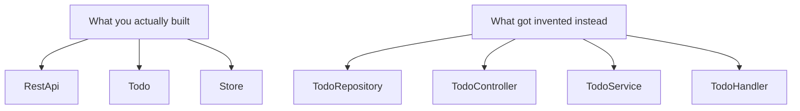
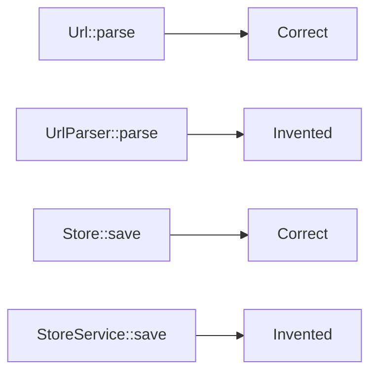

<Principle>Put behavior on the type it belongs to. Repository, Handler, and Service are names for decisions you haven't made yet.</Principle>

## The Graveyard

You open the codebase. You need to ban a user. Obvious feature. You start searching.

`UserController`. Route handlers. Some validation. Nothing about banning.

`UserService`. Has `createUser`, `updateUser`, `deleteUser`. No banning.

`UserRepository`. Database queries. Some of them duplicate what's in `UserService`. Still no banning.

`UserManager`. Added six months ago. Nobody knows why.

You pick `UserService`, add `banUser`, and ship it. Eight months later you get a bug report: banned users can still log in. You search for `banUser` and find two implementations. Someone added a second one to `UserController` three months ago because they didn't find yours. Both work slightly differently. One of them is wrong.

This is not bad luck. This is the direct consequence of inventing `UserRepository`.

`UserRepository` does not exist in your domain. Your domain has `User`. The moment you invented `UserRepository`, you created an entity that exists nowhere in the real world and a gravity well for duplicated logic. Every behavior that should live on `User` now has five candidate files and no obvious right answer.

## Name What You Actually Built

Here's the test. You're telling a colleague what you shipped last sprint. You say:

"I built the API and wired up the todos."

You don't say: "I built a `TodoRepository`, a `TodoController`, a `TodoService`, and a `RequestHandler`."

Your structs should match the first sentence. The second sentence is what happens when naming becomes a substitute for thinking.

A todo REST API has a `RestApi`, a `Todo`, a `Task`, a `Store`. Four things. You can hold them in your head simultaneously. You know what each one does without opening a file. `TodoController` tells you nothing except that someone read a tutorial in 2018 and cargo-culted the vocabulary.

<Excalidraw>

</Excalidraw>

Four names you'd say out loud. Four names that don't exist in your domain. Pick one set to build with.

## Methods Belong to the Thing

`User` needs to be saved. Where does `save` go?

<Tabs items={['TypeScript', 'Rust', 'Python']}>
<Tab value="TypeScript">
```typescript
// ❌ The Repository Way — behavior scattered across invented types
class UserRepository {
  async ban(userId: string): Promise<void> {
    await this.db.query("UPDATE users SET banned_at = NOW() WHERE id = ?", userId);
  }
}
// Six months later, UserService gets this too. Now you have two.

// ✅ The thing owns its behavior
class User {
  ban(): User {
    return new User(this.id, this.email, new Date());
  }

  async save(store: Store): Promise<Result<void, SaveError>> {
    return store.persist(this);
  }
}

// user.ban().save(store) — one place to look, one way to do it
```
</Tab>
<Tab value="Rust">
```rust
// ❌ The Repository Way — behavior scattered across invented types
impl UserRepository {
    async fn ban(&self, user_id: &str) -> Result<(), Error> {
        self.db.query("UPDATE users SET banned_at = NOW() WHERE id = ?", user_id).await
    }
}
// Six months later, UserService gets this too. Now you have two.

// ✅ The thing owns its behavior
impl User {
    fn ban(self) -> Self {
        Self { banned_at: Some(Utc::now()), ..self }
    }

    async fn save(&self, store: &Store) -> Result<(), SaveError> {
        store.persist(self).await
    }
}

// user.ban().save(&store).await — one place, one way
```
</Tab>
<Tab value="Python">
```python
# ❌ The Repository Way — behavior scattered across invented types
class UserRepository:
    def ban(self, user_id: str) -> None:
        db.query("UPDATE users SET banned_at = NOW() WHERE id = ?", user_id)

# Six months later, UserService gets this too. Now you have two.

# ✅ The thing owns its behavior
@dataclass
class User:
    id: str
    email: str
    banned_at: datetime | None = None

    def ban(self) -> "User":
        return replace(self, banned_at=datetime.now(timezone.utc))

    def save(self, store: "Store") -> Result[None, SaveError]:
        return store.persist(self)

# user.ban().save(store) — one place to look, one way to do it
```
</Tab>
</Tabs>

The call site is `user.ban().save(store)`. There's one place to add logic that affects banning. One place to add logic that affects saving. The compiler knows `User` has those methods. You can't accidentally write two.

## The Fluency Test

Write the API you want to use before you write the implementation. If you can write:

```
User::create(email).validate()?.save(store)
```

and it reads like a sentence, your design is probably right. If you end up writing:

```
UserService::new(db).save(UserFactory::create(UserValidator::validate(email)?))
```

something has gone wrong. Not stylistically. Architecturally. The method chain is a diagnostic. When you can't figure out what dot-method goes on something, the design is telling you it doesn't know what it is yet.

But fluency has a direction. You don't write `string.add_to_vec(vec)`. You write `vec.push(string)`. The question is always: what is the subject?

A `Vec`'s purpose is to hold and manage elements. Pushing is its job. The string is the argument.

A `User`'s purpose is to exist and be persisted. Saving is its job. The store is the argument.

A `Url`'s purpose is to represent a URL. Parsing and encoding are its jobs. The raw string is input.

Ask: what is this thing fundamentally for? That's the struct. Everything else is a parameter or a return type.

## Infrastructure Is Not Exempt

A `Store` and a `String` are both structs with methods. One is "domain," the other is "infrastructure." That distinction exists in architecture diagrams. It does not exist in code.

Treating infrastructure as second-class is how `UrlParser` gets invented. `Url` feels too domain-y to own parsing, so you write a separate struct. Now you have an entity that doesn't exist in the real world, the parsing logic lives in a different file from the URL representation, and the next person to work on URLs has to find both.

If a struct has behavior that logically belongs to it, it owns that behavior. Whether it lives in `domain/` or `infra/` is a folder organization question. It is not an ownership question.

<Excalidraw>

</Excalidraw>

## Free Functions Are a Smell

A free function almost always has a home. Either in its return type or in its primary parameter.

`parse_url(s)` belongs on `Url`.

`format_user(user)` belongs on `User`.

`calculate_distance(lat1, lon1, lat2, lon2)` belongs on `GpsCoordinates`.

The 1% exception exists. `clamp(value, min, max)` takes three numbers and returns a number. It doesn't belong to any of them. That's a genuine free function. Stateless math with no natural subject.

Everything else should make you pause. Write the struct that makes it a method.

## When This Doesn't Apply

**Genuinely stateless math.** `min`, `max`, `clamp`, `lerp`. No state, no subject, no home. Keep them free.

**Top-level orchestration.** `App`, `Program`, `RestApi`. Something has to hold everything together at the very top. Calling it `App` is honest. The rule targets the middle layer — where `UserManager`, `RequestHandler`, and `DataService` hide unclear thinking. At the top, something genuinely orchestrates everything. That's fine. Name it `App`.

**Cross-type operations.** Sometimes an operation spans two types and belongs to neither. `Transaction::commit(store, orders)` — the transaction owns the commit, not the store or the orders. The test: would it be weird to put it on either type? If yes, the third thing that's orchestrating both is probably the right home.

## "Actually..."

<Objection>Repository is a legitimate DDD pattern. It has a real definition.</Objection>

In DDD, a Repository is a specific contract: it abstracts persistence behind a collection-like interface, and the domain is completely unaware of SQL. Most codebases don't implement that contract. They call something `UserRepository` because it touches the `users` table. That's a database accessor. Cargo-culting the name without the contract gives you the overhead of DDD with none of the benefits.

If you're genuinely implementing the Repository pattern — domain objects unaware of persistence, repository hiding all SQL behind an interface — that's a real choice. Own it. Write down why. But that's not what most `*Repository` files are.

<Objection>If everything goes on the struct, I'll end up with 30 methods.</Objection>

Then you haven't split your struct yet. A `User` with 30 methods is three types that haven't been separated: the user identity, the billing information, the notification preferences. Split them. `User`, `BillingProfile`, `NotificationSettings`. Each focused. Each with five methods that actually belong to it.

The goal is not "all methods on one struct." The goal is "each method on the struct it belongs to." Sometimes that means splitting.

---

Six weeks ago you added `banUser` to `UserService`. Today there's a bug: banned users can still do the thing `UserController.banUser` was supposed to prevent. Except you didn't know `UserController` had a `banUser`. Why would you? Nothing about the name suggests that's where banning lives.

Two implementations of the same rule. One wrong. An incident. A post-mortem. An action item nobody follows up on.

That's what fake architectural names cost. Not elegance. Not aesthetics. Duplicate logic, diverging behavior, bugs that come from not knowing where the rule lives.

Put behavior where it belongs. Name things after what they are. The rest takes care of itself.
