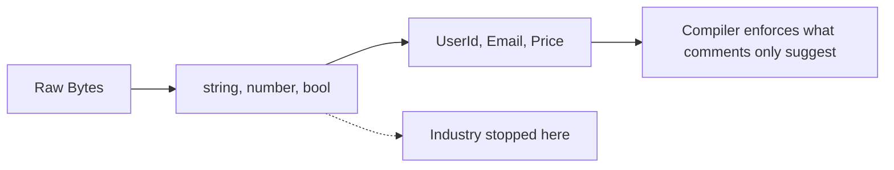
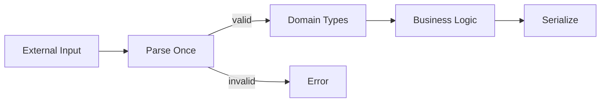
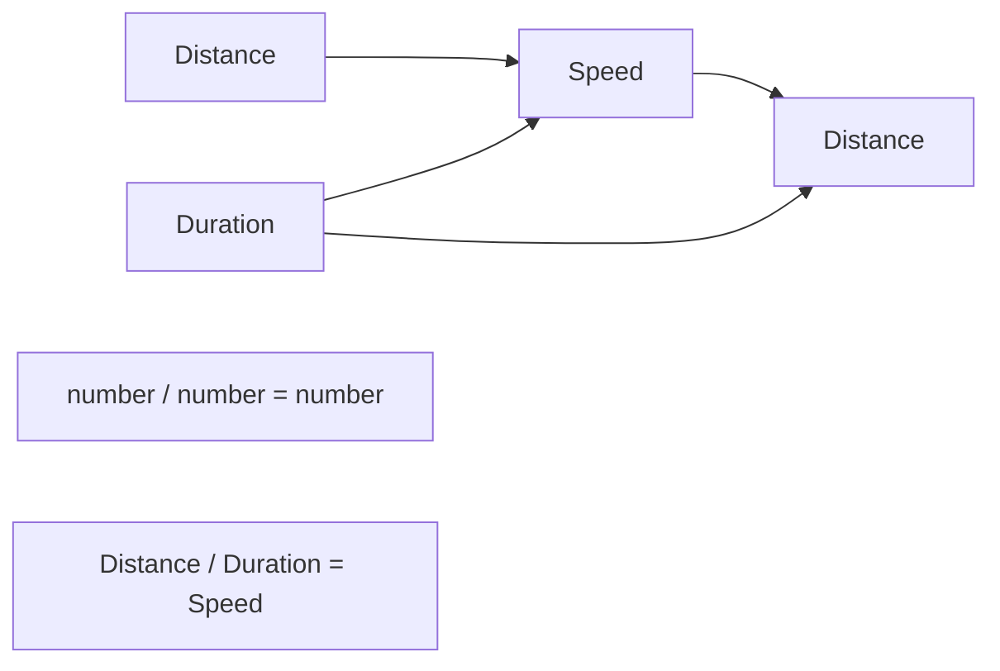

<Principle>Wrap every primitive that carries domain meaning in a dedicated type. Let the compiler enforce what your variable names only suggest.</Principle>

1999. NASA loses a $327 million Mars orbiter. Not to a solar flare. Not to cosmic radiation. To a `float`. One engineering team measured thrust in pound-force·seconds. Another measured it in newton-seconds. Both were `float`. The type system had nothing to say about it. The orbiter hit the atmosphere at the wrong angle and burned up.

Your bug will be smaller. The mechanism is identical: a raw value that meant one thing was treated as a raw value that meant something else, and nothing caught it.

<Excalidraw>

</Excalidraw>

You replaced `char*` with `string` and called it progress. You were right. The abstraction ladder doesn't end there.

## Three Bugs. All Type-Safe.

Look at this function signature:

<Tabs items={['TypeScript', 'Rust', 'Python']}>
<Tab value="TypeScript">
```typescript
// ❌ Primitive Soup
function sendInvoice(userId: string, email: string, invoiceId: string) {
  sendEmail(userId, invoiceId); // Swapped parameters <- Bug!
  logAccess(invoiceId, email);  // Wrong order <- Bug!
}
```
</Tab>
<Tab value="Rust">
```rust
// ❌ Primitive Soup
fn send_invoice(user_id: String, email: String, invoice_id: String) {
    send_email(&user_id, &invoice_id); // Swapped <- Bug!
    log_access(&invoice_id, &email);   // Wrong order <- Bug!
}
```
</Tab>
<Tab value="Python">
```python
# ❌ Primitive Soup
def send_invoice(user_id: str, email: str, invoice_id: str) -> None:
    send_email(user_id, invoice_id)  # Swapped parameters <- Bug!
    log_access(invoice_id, email)    # Wrong order <- Bug!
```
</Tab>
</Tabs>

Three bugs. All type-safe. The compiler is happy. Your users are not.

This is not a contrived example. This is every senior developer I've ever worked with, including me, at some point. Five `string` parameters. The function has no idea which one is which. Neither do you, three weeks later.

Fix it once:

<Tabs items={['TypeScript', 'Rust', 'Python']}>
<Tab value="TypeScript">
```typescript
// ✅ Domain Types
type UserId = { readonly _tag: "UserId"; value: string };
type Email = { readonly _tag: "Email"; value: string };
type InvoiceId = { readonly _tag: "InvoiceId"; value: string };

function sendInvoice(userId: UserId, email: Email, invoiceId: InvoiceId) {
  sendEmail(userId, invoiceId); // <- Compile error. Type mismatch.
  logAccess(invoiceId, email);  // <- Compile error. Type mismatch.
}
```
</Tab>
<Tab value="Rust">
```rust
// ✅ Domain Types
struct UserId(String);
struct Email(String);
struct InvoiceId(String);

fn send_invoice(user_id: UserId, email: Email, invoice_id: InvoiceId) {
    send_email(&user_id, &invoice_id); // <- Compile error.
    log_access(&invoice_id, &email);   // <- Compile error.
}
```
</Tab>
<Tab value="Python">
```python
# ✅ Domain Types
from typing import NewType

UserId = NewType("UserId", str)
Email = NewType("Email", str)
InvoiceId = NewType("InvoiceId", str)

def send_invoice(user_id: UserId, email: Email, invoice_id: InvoiceId) -> None:
    send_email(user_id, invoice_id)  # <- mypy error. Type mismatch.
    log_access(invoice_id, email)    # <- mypy error. Type mismatch.
```
</Tab>
</Tabs>

You can't swap them. The compiler won't let you. The review process doesn't have to catch it because the build does.

## A Comment Is Not a Constraint

You know `price` must be positive. You wrote a comment saying so. Six months ago. Since then, two developers have read that comment and trusted it. One of them passed `-50` and the crash landed in production at 3am.

A comment is a suggestion. Suggestions get ignored. Types don't:

<Tabs items={['TypeScript', 'Rust', 'Python']}>
<Tab value="TypeScript">
```typescript
// ❌ Runtime validation everywhere: someone will forget
function calculateDiscount(price: number, percentage: number): number {
  if (price < 0) throw new Error("Price must be positive");
  if (percentage < 0 || percentage > 100) throw new Error("Percentage must be 0-100");
  return price * (percentage / 100);
}
```
</Tab>
<Tab value="Rust">
```rust
// ❌ Runtime validation everywhere
fn calculate_discount(price: f64, percentage: f64) -> f64 {
    assert!(price >= 0.0, "Price must be positive");
    assert!(percentage >= 0.0 && percentage <= 100.0, "Invalid percentage");
    price * (percentage / 100.0)
}
```
</Tab>
<Tab value="Python">
```python
# ❌ Runtime validation everywhere: someone will forget
def calculate_discount(price: float, percentage: float) -> float:
    assert price >= 0, "Price must be positive"
    assert 0 <= percentage <= 100, "Invalid percentage"
    return price * (percentage / 100)
```
</Tab>
</Tabs>

Validate once. At construction. Never again:

<Tabs items={['TypeScript', 'Rust', 'Python']}>
<Tab value="TypeScript">
```typescript
// ✅ Validation at construction
class PositiveNumber {
  private constructor(private readonly value: number) {}

  static create(n: number): Result<PositiveNumber, ValidationError> {
    if (n < 0) return { type: "Err", err: { type: "Negative", value: n } };
    return { type: "Ok", data: new PositiveNumber(n) };
  }

  getValue(): number { return this.value; }
}

class Percentage {
  private constructor(private readonly value: number) {}

  static create(n: number): Result<Percentage, ValidationError> {
    if (n < 0 || n > 100) return { type: "Err", err: { type: "OutOfRange", value: n } };
    return { type: "Ok", data: new Percentage(n) };
  }

  getValue(): number { return this.value; }
}

function calculateDiscount(price: PositiveNumber, percentage: Percentage): PositiveNumber {
  // No validation. The types already guarantee it.
  return PositiveNumber.create(price.getValue() * (percentage.getValue() / 100)).unwrap();
}
```
</Tab>
<Tab value="Rust">
```rust
// ✅ Validation at construction
struct PositiveNumber(f64);
struct Percentage(f64);

impl PositiveNumber {
    fn new(n: f64) -> Result<Self, ValidationError> {
        if n < 0.0 { return Err(ValidationError::Negative(n)); }
        Ok(PositiveNumber(n))
    }
}

impl Percentage {
    fn new(n: f64) -> Result<Self, ValidationError> {
        if n < 0.0 || n > 100.0 { return Err(ValidationError::OutOfRange(n)); }
        Ok(Percentage(n))
    }
}

fn calculate_discount(price: PositiveNumber, percentage: Percentage) -> PositiveNumber {
    // No validation. Types guarantee correctness.
    PositiveNumber::new(price.0 * (percentage.0 / 100.0)).unwrap()
}
```
</Tab>
<Tab value="Python">
```python
# ✅ Validation at construction
from dataclasses import dataclass


@dataclass(frozen=True)
class PositiveNumber:
    value: float

    def __post_init__(self) -> None:
        if self.value < 0:
            raise ValueError(f"Value must be positive, got {self.value}")


@dataclass(frozen=True)
class Percentage:
    value: float

    def __post_init__(self) -> None:
        if not (0 <= self.value <= 100):
            raise ValueError(f"Percentage must be 0-100, got {self.value}")


def calculate_discount(price: PositiveNumber, percentage: Percentage) -> PositiveNumber:
    # No validation. The types already guarantee it.
    return PositiveNumber(price.value * (percentage.value / 100))
```
</Tab>
</Tabs>

The invariant lives in the type. It cannot be violated without going through the constructor. The constructor rejects violations. This is not complicated. It just requires doing it.

## Parse at the Boundary. Once.

Validation belongs at the edge of your system: the API handler, the queue consumer, the CSV parser. Not in the service. Not in the repository. Not scattered across every function that touches the value wondering if someone else already checked.

<Excalidraw>

</Excalidraw>

<Tabs items={['TypeScript', 'Rust', 'Python']}>
<Tab value="TypeScript">
```typescript
class Email {
  private constructor(private readonly value: string) {}

  static parse(s: string): Result<Email, ValidationError> {
    if (!s.includes("@")) {
      return { type: "Err", err: { type: "InvalidEmail", value: s } };
    }
    return { type: "Ok", data: new Email(s.toLowerCase()) };
  }

  getValue(): string { return this.value; }
}

// API boundary: parse once
app.post("/users", async (req, res) => {
  const emailResult = Email.parse(req.body.email);
  if (emailResult.type === "Err") return res.status(400).json({ error: emailResult.err });

  const nameResult = Name.parse(req.body.name);
  if (nameResult.type === "Err") return res.status(400).json({ error: nameResult.err });

  // Everything from here is typed. Nothing needs rechecking.
  const user = new User(UserId.generate(), nameResult.data, emailResult.data);
  await user.save(store);
  res.json(user.toJSON());
});
```
</Tab>
<Tab value="Rust">
```rust
struct Email(String);

impl Email {
    fn parse(s: &str) -> Result<Self, ValidationError> {
        if !s.contains('@') {
            return Err(ValidationError::InvalidEmail(s.to_string()));
        }
        Ok(Email(s.to_lowercase()))
    }
}

// API boundary: parse once
async fn create_user(
    Json(body): Json<CreateUserRequest>,
    State(store): State<Store>,
) -> Result<Json<User>, ApiError> {
    let email = Email::parse(&body.email).map_err(ApiError::ValidationError)?;
    let name = Name::parse(&body.name).map_err(ApiError::ValidationError)?;

    // Everything from here is typed.
    let user = User::new(UserId::generate(), name, email);
    user.save(&store).await?;
    Ok(Json(user))
}
```
</Tab>
<Tab value="Python">
```python
from dataclasses import dataclass


@dataclass(frozen=True)
class Email:
    value: str

    def __post_init__(self) -> None:
        if "@" not in self.value:
            raise ValueError(f"Invalid email: {self.value!r}")

    @classmethod
    def parse(cls, s: str) -> Email:
        return cls(s.lower())


# API boundary: parse once (e.g. with FastAPI)
@app.post("/users")
async def create_user(body: CreateUserRequest) -> UserResponse:
    email = Email.parse(body.email)  # raises ValueError if invalid
    name = Name.parse(body.name)

    # Everything from here is typed. Nothing needs rechecking.
    user = User(user_id=UserId.generate(), name=name, email=email)
    await user.save(store)
    return user.to_response()
```
</Tab>
</Tabs>

Data comes in as primitives. It leaves as domain types. It stays as domain types until it leaves the system. No exceptions.

## Types Encode What Comments Describe

Physical quantities compose in specific ways. Distance divided by duration equals speed. Speed multiplied by duration equals distance. Speed multiplied by distance equals nonsense. Your types can say this:

<Excalidraw>

</Excalidraw>

<Tabs items={['TypeScript', 'Rust', 'Python']}>
<Tab value="TypeScript">
```typescript
// ❌ What unit is this? What does multiplying them mean?
function calculateSpeed(distance: number, time: number): number {
  return distance / time;
}
const speed = calculateSpeed(100, 50); // 100 what? 50 what?
const bad = speed * distance;          // speed * distance? Sure, why not.

// ✅ The types encode the physics
class Distance { constructor(private meters: number) {} getMeters() { return this.meters; } }
class Duration { constructor(private seconds: number) {} getSeconds() { return this.seconds; } }

class Speed {
  constructor(private mps: number) {}
  times(d: Duration): Distance { return new Distance(this.mps * d.getSeconds()); }
}

function calculateSpeed(d: Distance, t: Duration): Speed {
  return new Speed(d.getMeters() / t.getSeconds());
}

const speed = calculateSpeed(new Distance(1000), new Duration(60));
speed.times(new Duration(30));  // Distance. Compiles.
speed.times(new Distance(500)); // <- Type error. As it should be.
```
</Tab>
<Tab value="Rust">
```rust
struct Distance(f64); // meters
struct Duration(f64); // seconds
struct Speed(f64);    // meters per second

// Distance / Duration = Speed
impl std::ops::Div<Duration> for Distance {
    type Output = Speed;
    fn div(self, t: Duration) -> Speed { Speed(self.0 / t.0) }
}

// Speed * Duration = Distance
impl std::ops::Mul<Duration> for Speed {
    type Output = Distance;
    fn mul(self, t: Duration) -> Distance { Distance(self.0 * t.0) }
}

let speed = Distance(1000.0) / Duration(60.0); // Type: Speed
let _ = speed * Duration(30.0);  // Distance. Compiles.
// let _ = speed * Distance(500.0); // <- Compile error. Good.
```
</Tab>
<Tab value="Python">
```python
# ❌ What unit is this? What does multiplying them mean?
def calculate_speed(distance: float, time: float) -> float:
    return distance / time

speed = calculate_speed(100, 50)  # 100 what? 50 what?
bad = speed * distance            # speed * distance? Sure, why not.

# ✅ The types encode the physics
from dataclasses import dataclass


@dataclass(frozen=True)
class Distance:
    meters: float


@dataclass(frozen=True)
class Duration:
    seconds: float


@dataclass(frozen=True)
class Speed:
    mps: float

    def times(self, t: Duration) -> Distance:
        # Speed * Duration = Distance. Anything else is a type error.
        return Distance(self.mps * t.seconds)


def calculate_speed(d: Distance, t: Duration) -> Speed:
    return Speed(d.meters / t.seconds)


speed = calculate_speed(Distance(1000), Duration(60))
speed.times(Duration(30))   # Fine.
# speed.times(Distance(500))  # <- mypy error: expected Duration, got Distance.
```
</Tab>
</Tabs>

The Mars orbiter burned up because two teams both used `float` for incompatible units. The type system above makes that impossible to write. Not hard. Impossible.

## When This Doesn't Apply

**You're still exploring the domain.** Primitives are fine when you don't know what the domain actually needs yet. Figure it out first, then formalize. Wrapping half-understood concepts in types just moves the confusion up a level.

**Performance-critical inner loops.** If profiling shows newtype construction is a bottleneck, strip it in the hot path. Keep the boundary types. Measure first; this is almost never the actual problem.

**Interop with external systems.** When you must match an external API's shape exactly, you use their primitives. But you parse them immediately:

<Tabs items={['TypeScript', 'Rust', 'Python']}>
<Tab value="TypeScript">
```typescript
// External API uses primitives. Parse at the boundary.
function parseApiResponse(
  response: ExternalApiResponse
): Result<User, ParseError> {
  const userId = UserId.parse(response.user_id);
  const email = Email.parse(response.email);
  const createdAt = Timestamp.fromUnixSeconds(response.created_at);

  // ...
}
```
</Tab>
<Tab value="Rust">
```rust
// External API uses primitives. Parse at the boundary.
fn parse_api_response(
    response: ExternalApiResponse
) -> Result<User, ParseError> {
    let user_id = UserId::parse(&response.user_id)?;
    let email = Email::parse(&response.email)?;
    let created_at = Timestamp::from_unix_seconds(response.created_at)?;

    Ok(User::new(user_id, email, created_at))
}
```
</Tab>
<Tab value="Python">
```python
# External API uses primitives. Parse at the boundary.
def parse_api_response(response: ExternalApiResponse) -> User:
    user_id = UserId.parse(response.user_id)
    email = Email.parse(response.email)
    created_at = Timestamp.from_unix_seconds(response.created_at)

    return User(user_id=user_id, email=email, created_at=created_at)
```
</Tab>
</Tabs>

The primitive exists for one function and gets converted immediately. It does not propagate.

## "Actually..."

<Objection>This is verbose. The original code was three lines.</Objection>

You write the type once. You use it everywhere. The "verbose" version catches parameter swaps at compile time. The "concise" version catches them in production at 3am. Pick your verbose.

<Objection>What about performance? Wrapping and unwrapping has overhead.</Objection>

Zero cost in Rust. The newtype pattern compiles to the same representation as the underlying type. Near-zero in TypeScript. Measure if you're concerned. You won't be concerned.

<Objection>How granular do I go? Do I really need a type for everything?</Objection>

Values with constraints (positive numbers, valid emails), values with distinct meaning (user ID vs order ID), and values with domain operations (distance / duration = speed) get types. Local loop variables and internal counters don't. If you're unsure, ask: "Can I accidentally use this where something else belongs?" If yes, wrap it.

---

Here's what not doing this actually costs: you spend three hours debugging a 3am incident where a user ID was passed as a session token. You spend one sprint tracking down why banned users can receive emails. You spend an afternoon figuring out why the pricing calculation is producing negative discounts. All of these bugs type-checked perfectly. All of them were caught by a compiler that could have told you in 200 milliseconds, if you'd given it the vocabulary.

Primitives are the assembly language of your domain. You stopped writing assembly because it makes you think at the wrong level. Stop writing `string` for the same reason.
