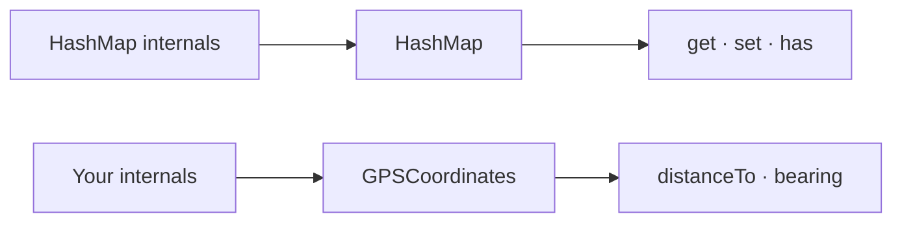
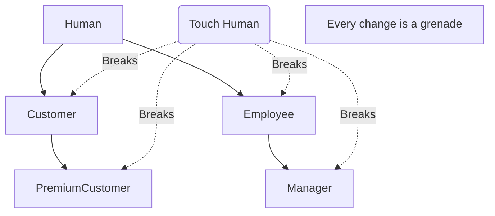
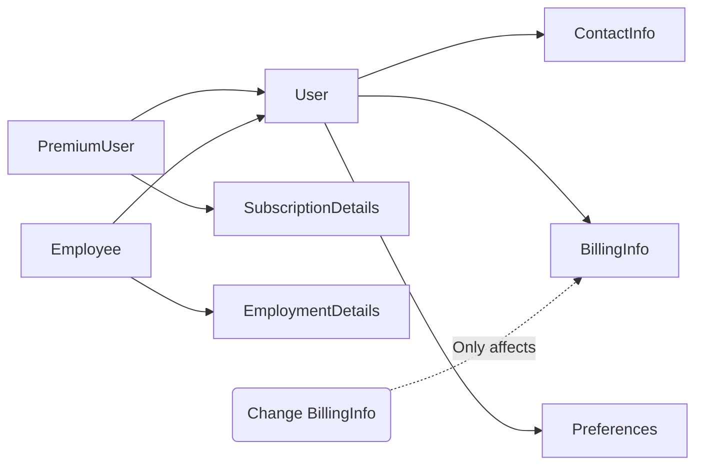

<Principle>Obsess over your data structures, not your algorithms. Structs are the load-bearing walls of your program. Get them right and everything else falls into place. Get them wrong and you're debugging forever.</Principle>

You already know this works. You use `HashMap` every day without once caring about the collision resolution function or bucket layout. You use `Array` without thinking about memory allocation. Nobody reimplements these. That's the point. The whole point. Your job is to build the same thing for your domain.

<Excalidraw>

</Excalidraw>

The complexity doesn't disappear. It gets contained. That's the trade.

## The Crime Scene

You open a codebase. You're looking for where the app calculates how far a store is from the user. You search for `calculateDistance`. You get twelve results. Twelve. Spread across six files. Every one of them is the Haversine formula written slightly differently by a different person who didn't know the others had already done it.

Then you find the incident. Three months ago, someone changed the parameter order during a refactor. `calculateDistance(lat1, lon1, lat2, lon2)` became `calculateDistance(from, to)` where `from` and `to` were objects. Except two call sites were missed. They were passing raw numbers. TypeScript didn't complain because the runtime coercion was just wrong enough to produce bad coordinates instead of a crash. Nobody wrote unit tests for those call sites because the function was "obviously correct."

Two locations went live showing stores 9,000 kilometers away. Three hours of debugging. A hotfix at midnight.

The fix was ten lines. The fix was `GPSCoordinates`.

## The Before

<Tabs items={['TypeScript', 'Rust', 'Python']}>
<Tab value="TypeScript">
```typescript
// Scattered across 12 files. Written 12 times.
function calculateDistance(
  lat1: number,
  lon1: number,
  lat2: number,
  lon2: number,
): number {
  const R = 6371;
  const dLat = toRad(lat2 - lat1);
  const dLon = toRad(lon2 - lon1);
  // ... 10 more lines of Haversine
}

// Every call site has to remember the order.
calculateDistance(userLat, userLon, storeLat, storeLon);
// Was it user first or store first?
// The function does not tell you.
// The type system cannot help you.
// You will be wrong eventually.
```
</Tab>
<Tab value="Rust">
```rust
// Scattered across 12 files. Written 12 times.
fn calculate_distance(
    lat1: f64, lon1: f64,
    lat2: f64, lon2: f64,
) -> f64 {
    // Haversine formula, copy-pasted
    let r = 6371.0;
    // ... 10 more lines
}

// Every call site guesses the order.
calculate_distance(user_lat, user_lon, store_lat, store_lon);
// Is that right? Check the signature.
// The signature is four f64s.
// Good luck.
```
</Tab>
<Tab value="Python">
```python
# Scattered across 12 files. Written 12 times.
def calculate_distance(
    lat1: float,
    lon1: float,
    lat2: float,
    lon2: float,
) -> float:
    # Haversine formula, copy-pasted
    r = 6371.0
    # ... 10 more lines

# Every call site guesses the order.
calculate_distance(user_lat, user_lon, store_lat, store_lon)
# Is that right? Check the signature.
# The signature is four floats.
# Good luck.
```
</Tab>
</Tabs>

## The After

<Tabs items={['TypeScript', 'Rust', 'Python']}>
<Tab value="TypeScript">
```typescript
class GPSCoordinates {
  constructor(
    private latitude: number,
    private longitude: number,
  ) {}

  distanceTo(other: GPSCoordinates): Distance {
    // Haversine lives here. One place. Forever.
    // ...
    return Distance.fromKilometers(d);
  }
}

// Call sites cannot get this wrong.
const userLocation = new GPSCoordinates(37.7749, -122.4194);
const distance = userLocation.distanceTo(storeLocation);
```
</Tab>
<Tab value="Rust">
```rust
struct GPSCoordinates {
    latitude: f64,
    longitude: f64,
}

impl GPSCoordinates {
    fn distance_to(&self, other: &GPSCoordinates) -> Distance {
        // Haversine lives here. One place. Forever.
        Distance::from_kilometers(d)
    }
}

// Call sites cannot get this wrong.
let user_location = GPSCoordinates { latitude: 37.7749, longitude: -122.4194 };
let distance = user_location.distance_to(&store_location);
```
</Tab>
<Tab value="Python">
```python
@dataclass(frozen=True)
class GPSCoordinates:
    latitude: float
    longitude: float

    def distance_to(self, other: GPSCoordinates) -> Distance:
        # Haversine lives here. One place. Forever.
        # ...
        return Distance.from_kilometers(d)


# Call sites cannot get this wrong.
user_location = GPSCoordinates(latitude=37.7749, longitude=-122.4194)
distance = user_location.distance_to(store_location)
```
</Tab>
</Tabs>

Now when you need to fix the Earth's radius constant, there's one place to fix it. Now when you need to add `bearing`, there's an obvious place to add it. Now when a new engineer joins and wonders how distance works, they search for `GPSCoordinates` and read one file. The Haversine formula is no longer tribal knowledge scattered across the git blame of six different engineers.

## utils.ts Is Where Orphaned Logic Goes to Die

<RoughSketch
  width={540}
  height={195}
  shapes={[
    { type: "rectangle", x: 10, y: 10, width: 220, height: 175 },
    { type: "text", x: 80, y: 32, text: "utils.ts" },
    { type: "rectangle", x: 22, y: 45, width: 150, height: 28 },
    { type: "text", x: 30, y: 63, text: "calculateDistance()" },
    { type: "rectangle", x: 48, y: 83, width: 155, height: 28 },
    { type: "text", x: 56, y: 101, text: "formatCoordinates()" },
    { type: "rectangle", x: 25, y: 121, width: 140, height: 28 },
    { type: "text", x: 33, y: 139, text: "validateLatLon()" },
    { type: "rectangle", x: 55, y: 155, width: 140, height: 25 },
    { type: "text", x: 63, y: 172, text: "haversineCalc()" },
    { type: "line", x1: 238, y1: 97, x2: 303, y2: 97 },
    { type: "rectangle", x: 308, y: 10, width: 220, height: 175, options: { fill: "rgba(34,197,94,0.12)", fillStyle: "solid" } },
    { type: "text", x: 358, y: 32, text: "GPSCoordinates" },
    { type: "rectangle", x: 320, y: 48, width: 195, height: 28 },
    { type: "text", x: 380, y: 66, text: "distanceTo(other)" },
    { type: "rectangle", x: 320, y: 86, width: 195, height: 28 },
    { type: "text", x: 387, y: 104, text: "isNear(other, r)" },
    { type: "rectangle", x: 320, y: 124, width: 195, height: 28 },
    { type: "text", x: 389, y: 142, text: "bearing(other)" },
    { type: "rectangle", x: 320, y: 157, width: 195, height: 25 },
    { type: "text", x: 380, y: 174, text: "formatDisplay()" },
  ]}
/>

You've seen this file. You've written to this file. Everyone has a `utils.ts`, a `helpers.py`, a `common.rs`. It starts with one function that doesn't have an obvious home. Then another. Then fifteen. Then it's 800 lines and nobody can tell you what it's "about" because it's not about anything. It's a drawer.

Every function in your `utils` file is a method on a type that doesn't exist yet. The type is there. You just haven't named it.

When five functions all take the same three parameters, those parameters want to live together. That's a struct. When you're passing `userId`, `userEmail`, and `userTimezone` into every function in a file, that's a `UserContext` struct waiting to be born. When you keep writing `formatEmailAddress`, `validateEmailAddress`, `normalizeEmailAddress` as free functions, that's an `EmailAddress` type telling you something.

Name it. The orphan logic finds its home. The utils file shrinks. The codebase makes sense again.

## Inheritance Is Coupling in a Trenchcoat

You touched `Human`. Everything broke.

<Excalidraw>

</Excalidraw>

The inheritance hierarchy sounds like a good idea when you draw the boxes. Then the product manager asks what happens when a person is both a Customer and an Employee. Then you need to add a field to `Human` and you spend forty minutes running tests for `PremiumCustomer` to find out if you broke something three levels up. Then someone adds `Contractor` and isn't sure if it should extend `Employee` or `Human` directly, and the answer is wrong either way.

Composition doesn't do this:

<Excalidraw>

</Excalidraw>

<Tabs items={['TypeScript', 'Rust', 'Python']}>
<Tab value="TypeScript">
```typescript
// ❌ Touch Human and everything breaks. Someone is both? No answer.
class Human { constructor(public name: string, public dateOfBirth: Date) {} }
class Customer extends Human { constructor(name: string, dob: Date, public customerId: CustomerId) { super(name, dob); } }
class Employee extends Human { constructor(name: string, dob: Date, public employeeId: EmployeeId) { super(name, dob); } }

// ✅ Composition: pieces are independent, combinations are free
type Customer = { personal: PersonalInfo; customer: CustomerDetails };
type Employee = { personal: PersonalInfo; employee: EmployeeDetails };
type CustomerAndEmployee = { personal: PersonalInfo; customer: CustomerDetails; employee: EmployeeDetails };
```
</Tab>
<Tab value="Rust">
```rust
// Rust has no inheritance. This is not an accident.

// ✅ Composition: pieces are independent, combinations are free
struct Customer { personal: PersonalInfo, customer: CustomerDetails }
struct Employee { personal: PersonalInfo, employee: EmployeeDetails }
struct CustomerAndEmployee { personal: PersonalInfo, customer: CustomerDetails, employee: EmployeeDetails }

// Change CustomerDetails. Only Customer and CustomerAndEmployee are affected.
// The blast radius is exactly what you'd expect.
```
</Tab>
<Tab value="Python">
```python
# ❌ Touch Human and everything breaks. Someone is both? No answer.
class Customer(Human):
    def __init__(self, name: str, dob: date, customer_id: CustomerId) -> None:
        super().__init__(name, dob)
        self.customer_id = customer_id

# ✅ Composition: pieces are independent, combinations are free
@dataclass
class Customer:
    personal: PersonalInfo
    customer: CustomerDetails

@dataclass
class CustomerAndEmployee:
    personal: PersonalInfo
    customer: CustomerDetails
    employee: EmployeeDetails
```
</Tab>
</Tabs>

Change `BillingInfo`. Only `BillingInfo` callers are affected. No surprises six levels up. No regression in `PremiumCustomer` because you touched something three parents removed. Each piece stands alone.

## When This Doesn't Apply

**Genuinely stateless math.** `clamp(value, min, max)` doesn't need a home. It takes numbers, returns a number, has no context. That's a free function. Keep it a free function.

**Scripts and throwaway code.** If you're writing a one-off migration script or exploring a problem, structure is premature. But prototypes have a way of becoming production code. Add the struct before that happens. Not after the midnight incident.

The signal that you need a struct: you're passing the same three parameters to five different functions. Those parameters are trying to tell you something.

## "Actually..."

<Objection>Is this just OOP?</Objection>

No. OOP has specific baggage: class hierarchies, inheritance chains, polymorphism theater, the `extends` keyword you'll regret in eight months. None of that is what I'm describing.

This is organization. Data and the operations that belong with that data, living together. Rust does this with structs and impl blocks. No classes. No inheritance. No OOP nonsense. Rust is one of the most disciplined languages for this exact pattern precisely because it refuses the rest of the OOP toolkit.

What I'm arguing against is scattering `GPSCoordinates` logic through twelve files with four-parameter signatures. Call it a class, a module, a struct with an impl block. The name doesn't matter. The organization does.

<Objection>What if my struct has 20+ methods?</Objection>

A struct with 25 methods is usually three structs that haven't been separated yet. Ask: do all these methods operate on the same data? Or are some of them operating on a subset that could stand alone? If you can split the struct and nothing breaks, split it.

<Objection>Should everything be a struct?</Objection>

Everything that represents a concept in your domain. `User`. `Email`. `Order`. `GPSCoordinates`. `Invoice`. These deserve structs. Pure transformations that take a value and return a value can stay as free functions.

---

The Haversine formula, scattered across eight files. You discover the Earth's radius constant is wrong: someone used 6,378 km (equatorial radius) instead of 6,371 km (mean radius). How long does it take to find every copy? How confident are you that you found them all?

Not confident. You run the grep, you find eight matches, you fix eight files, you ship. Three months later someone finds a ninth. It was in a file nobody looked at because the function was named slightly differently.

One `GPSCoordinates` struct. One fix. One place to look. The grep returns one result. You have confidence because there's nothing to miss.

That's the trade. Not "this is more elegant." The trade is: one midnight incident versus none. One grep versus eight. One place to add `bearing` versus eight files to update and one you'll forget.

You don't think about how `Vec` works internally. You just push and pop. Build your domain types so callers can do the same.
