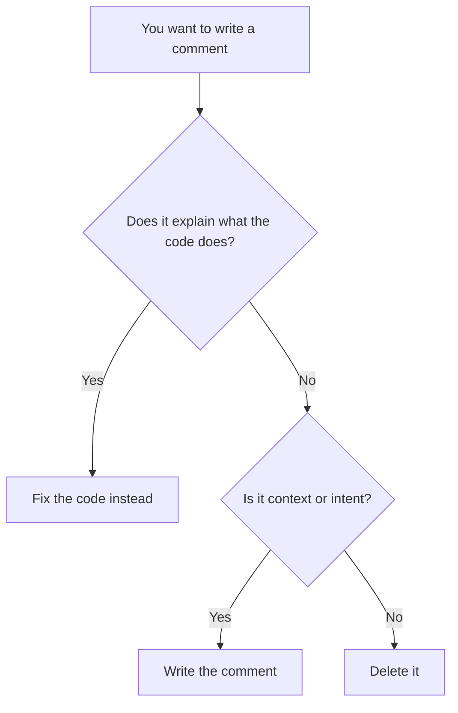

<Principle>Delete the comment. Fix the code.</Principle>

A comment that explains what code does is not documentation. It's a confession. The code had something to say and couldn't say it. So you wrote a second layer of meaning on top of the first. Now you're maintaining two representations of the same thing, and they will drift. They always drift.

The code is already a language. Use it.

## The Comment Is Lying

I wrote this in 2021. Twice. Both times with "Senior" in my job title.

```typescript
// Get active users from the database
function getUsers(db: Database): User[] {
  return db.query('SELECT * FROM users WHERE deleted_at IS NULL');
}
```

The comment says "active users." The code says "not deleted." Those are not the same thing. We added `banned_at` last quarter. Nobody updated the comment. The function now returns banned users. The comment still says active. For six months, banned accounts showed up in the support queue. We filed the ticket as "cannot reproduce." It reproduced every time a banned user logged in. We just couldn't explain it because the comment said it was fine, and why would you read the code if the comment says it's fine.

Someone eventually read the code. That someone was me, at 2am, with a CTO asking why banned users could check out.

Code that's wrong breaks. A comment that's wrong just misleads, quietly, until something explodes in production and you spend three hours reading the wrong code path because the comment pointed you there. The comment saved two minutes when it was written. The incident cost a full sprint.

Fix the function name:

<Tabs items={['TypeScript', 'Rust']}>
  <Tab value="TypeScript">
  ```typescript
  function getNonDeletedUsers(db: Database): User[] {
    return db.query('SELECT * FROM users WHERE deleted_at IS NULL');
  }
  ```
  </Tab>
  <Tab value="Rust">
  ```rust
  fn get_non_deleted_users(db: &Database) -> Vec<User> {
      db.query("SELECT * FROM users WHERE deleted_at IS NULL")
  }
  ```
  </Tab>
</Tabs>

Now the name and the implementation agree by definition. No second layer to maintain. No comment to forget to update.

## Comments as a Smell

Every comment that explains code is pointing at a problem. The problem is not the comment. The problem is the code.

**"// convert price from cents to dollars"**

You have a `number` where you need a `Money` type. The comment is papering over a missing abstraction. Create the type, add a `toDollars()` method, delete the comment.

**"// only admins can call this"**

Your function accepts `User` when it should accept `Admin`. The comment is documenting an unchecked precondition. Right now it's documented with text that nobody reads before passing the wrong thing. Make it a type error instead. The compiler reads it every time.

**"// step 1: validate, step 2: transform, step 3: persist"**

You have three functions trapped inside one. Extract them. The comment is an informal table of contents for code that should have been split. The section headers become function names. The function names become the documentation.

The pattern is always the same: the comment describes something the type system, the function structure, or the naming could express directly. The comment is a workaround for code that hasn't been finished yet. You didn't write a comment. You left a note that the work isn't done.

<Excalidraw>

</Excalidraw>

## What "Fix the Code" Looks Like

Most explanatory comments dissolve when you apply techniques from the rest of this guide.

**Rename the thing.** If you need a comment to explain what a variable or function does, the name is wrong. The name is the documentation. Rename it until the comment is redundant. Then delete the comment.

**Extract a function.** If a block of code needs a comment header, it's a function waiting to be born. The function name becomes the comment.

**Use a newtype.** If you're commenting what a primitive represents, wrap it. `// user ID, not product ID` disappears when you have `UserId` and `ProductId`. Suddenly the compiler enforces what the comment was hoping you'd remember.

**Use an enum.** If you're commenting valid values for a field, those values belong in a type. The comment `// status: 'pending' | 'approved' | 'rejected'` is a `Status` enum that hasn't been written yet. Write it. Delete the comment.

<Tabs items={['TypeScript', 'Rust']}>
  <Tab value="TypeScript">
  ```typescript
  // Before: comment explains the code
  function process(order: Order) {
    // Can only process if payment is confirmed and stock is reserved
    if (order.paymentStatus === 'confirmed' && order.stockStatus === 'reserved') {
      // Mark as processing
      order.status = 'processing';
      // Send to fulfillment
      fulfillment.dispatch(order);
    }
  }

  // After: code explains itself
  type ReadyOrder = Order & {
    paymentStatus: 'confirmed';
    stockStatus: 'reserved';
  };

  function dispatchToFulfillment(order: ReadyOrder) {
    order.status = 'processing';
    fulfillment.dispatch(order);
  }
  ```
  </Tab>
  <Tab value="Rust">
  ```rust
  // Before: comment explains the code
  fn process(order: &mut Order) {
      // Can only process if payment is confirmed and stock is reserved
      if order.payment_status == PaymentStatus::Confirmed
          && order.stock_status == StockStatus::Reserved
      {
          // Mark as processing
          order.status = OrderStatus::Processing;
          // Send to fulfillment
          fulfillment::dispatch(order);
      }
  }

  // After: code explains itself
  struct ReadyOrder {
      id: OrderId,
      // only constructible after payment + stock checks pass
  }

  fn dispatch_to_fulfillment(order: ReadyOrder) {
      fulfillment::dispatch(order);
  }
  ```
  </Tab>
</Tabs>

The after version has no explanatory comments. It also has no ambiguity. The type is the precondition. The function name is the intent. Nothing to keep in sync.

## The Two Legitimate Comments

Not all comments are confessions. Two kinds are genuinely useful.

**Context you can't put in the code.** A link to the ticket that explains why this workaround exists. A reference to the RFC that defined this behavior. The bug number for the regression test you're writing.

```typescript
// Regression test for AUTH-4521: admin tokens were not invalidated
// on password reset. Fixed in commit a3f9b2c.
it('invalidates admin tokens on password reset', async () => {
  ...
});
```

This comment adds information the code cannot express. The bug number, the fix reference — these live outside the codebase. The comment is a bridge to that history. Without it, someone deletes the test in six months because it looks redundant.

**Intent for the future.** A note that this is V1 and should be replaced. A TODO with actual substance: what needs to change, and why it wasn't done now.

```typescript
// TODO: this linear scan works at current scale (~500 users) but will
// need an index once we hit the enterprise tier. See PERF-112.
function findUserByEmail(users: User[], email: Email): User | undefined {
  return users.find(u => u.email === email);
}
```

The comment isn't explaining the code. It's documenting a known tradeoff and pointing at the follow-up. That's useful. That's not something the code can say.

What's not useful: `// TODO: refactor this`. Refactor what? Why? When? A TODO without context is noise with a timestamp. It will sit there for three years, mocking every developer who reads it. Nobody will ever act on it because nobody knows what "this" is. You didn't leave a note. You left a passive-aggressive sticky on the wall and walked out.

## When This Doesn't Apply

**Public API documentation.** Doc comments (`/** */`, `///`) for exported functions and types are a different thing. They document the contract, not the implementation. If you publish a library, document your public surface. That's not a confession. That's a service.

**Intentionally non-obvious algorithms.** If you're implementing a Bloom filter or a specific cryptographic primitive and the implementation follows a published paper, cite the paper. The code can't link to an arXiv URL. The comment can. "Why does this work" is a legitimate question when the answer involves math the reader can't be expected to reconstruct from variable names.

## "Actually..."

<Objection>My code is complex. Comments help junior developers understand it.</Objection>

Complex code is the problem. If the code needs a guide to be navigated, simplify the code. Comments help junior developers survive complex code. They don't help them understand it. They definitely don't help them change it safely. You're not doing juniors a favor by documenting a mess. You're teaching them that this is how codebases work. They will write the same thing next year and cite your precedent.

<Objection>What about explaining WHY, not WHAT?</Objection>

Yes. Why is exactly what the context and intent comments cover. The rule is against comments that explain what the code does, because the code already does that. Comments explaining why a decision was made, why a tradeoff was accepted, or why a ticket exists: those are valuable. Keep them.

<Objection>Commented-out code is fine as a temporary thing.</Objection>

You have git. There is no temporary. Commented-out code is code that wasn't deleted. It creates noise, confuses readers, and never gets cleaned up. Delete it. If you need it back, `git log` exists. And if you can't find it in `git log`, you didn't need it.

---

Here is what maintaining lying comments actually costs: three hours debugging the wrong code path because the comment pointed you there. Six months of support tickets about banned users appearing in active lists. A 2am incident you're explaining to your CTO with the comment `// Get active users` still on your screen, doing its best, getting everything wrong.

The comment saved two minutes. The incident cost a sprint.

Delete the comment. Fix the code.
