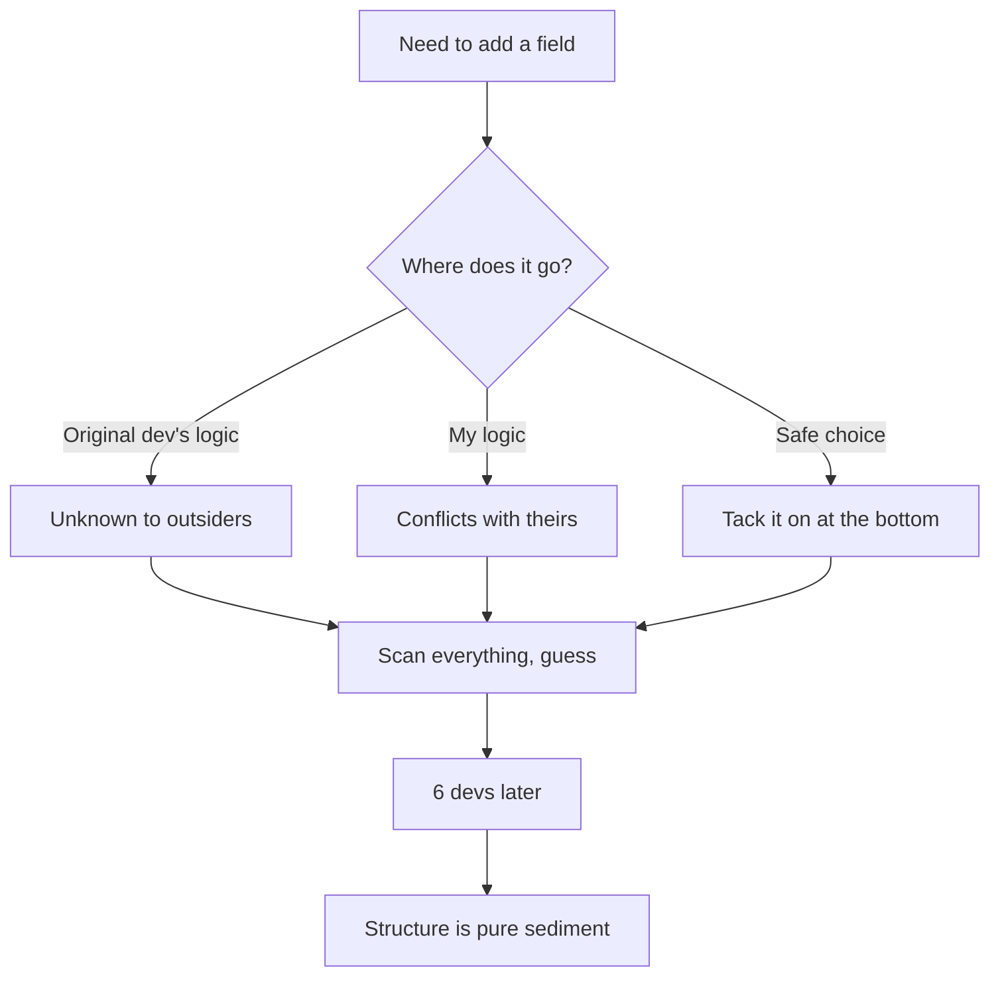
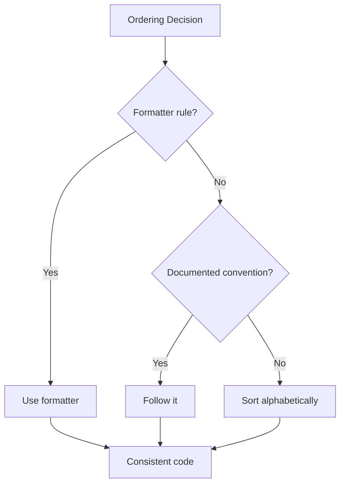

<Principle>Sort your code alphabetically unless you have a documented reason not to.</Principle>

Right. Where does `phoneNumber` go.

I know how this goes. You have a system. The system lives in your head. "Primary key first, metadata last, important business fields in the middle." Very logical. Completely invisible to the next person. And in six months, completely invisible to you too.

You're going to have this conversation. Or you're going to have the version where you don't have it out loud and instead just watch the struct grow into sediment. Either way, you're paying.

Sort alphabetically. Every time. Object properties, table columns, function parameters, class methods, React component props, import statements, enum values. Everything that forms a list.

## The Crime Scene

Developer A builds a struct:

<Tabs items={['TypeScript', 'Rust']}>
<Tab value="TypeScript">
```typescript
// Developer A's "logical" order
interface User {
  id: string;           // Primary key goes first, obviously
  email: string;        // Main identifier
  name: string;         // Important info
  role: UserRole;       // Important info
  createdAt: Date;      // Metadata at the end
  updatedAt: Date;      // Metadata at the end
  lastLoginAt?: Date;   // Optional metadata last
}
```
</Tab>
<Tab value="Rust">
```rust
// Developer A's "logical" order
struct User {
    id: String,           // Primary key goes first, obviously
    email: String,        // Main identifier
    name: String,         // Important info
    role: UserRole,       // Important info
    created_at: DateTime, // Metadata at the end
    updated_at: DateTime, // Metadata at the end
    last_login_at: Option<DateTime>, // Optional metadata last
}
```
</Tab>
</Tabs>

Developer A is proud of this. There's a logic. The logic lives entirely inside Developer A's head. Developer A will explain it in the code review. Nobody asked.

Developer B adds a field:

<Tabs items={['TypeScript', 'Rust']}>
<Tab value="TypeScript">
```typescript
// Developer B adds phone number
interface User {
  id: string;
  email: string;
  name: string;
  role: UserRole;
  createdAt: Date;
  updatedAt: Date;
  lastLoginAt?: Date;
  phoneNumber?: string;  // Where does this go?
}
```
</Tab>
<Tab value="Rust">
```rust
// Developer B adds phone number
struct User {
    id: String,
    email: String,
    name: String,
    role: UserRole,
    created_at: DateTime,
    updated_at: DateTime,
    last_login_at: Option<DateTime>,
    phone_number: Option<String>,  // Where does this go?
}
```
</Tab>
</Tabs>

Developer B doesn't know the system. Is `phoneNumber` important like `email`, or optional metadata like `lastLoginAt`? No idea. So they tack it at the bottom. Safe move. Don't disturb the order. Don't own the decision. Don't make enemies.

Six months later:

<Tabs items={['TypeScript', 'Rust']}>
<Tab value="TypeScript">
```typescript
// The inevitable chaos
interface User {
  id: string;
  email: string;
  name: string;
  role: UserRole;
  createdAt: Date;
  updatedAt: Date;
  lastLoginAt?: Date;
  phoneNumber?: string;
  department: string;
  isActive: boolean;
  preferences: UserPreferences;
  avatarUrl?: string;
  bio?: string;
}
```
</Tab>
<Tab value="Rust">
```rust
// The inevitable chaos
struct User {
    id: String,
    email: String,
    name: String,
    role: UserRole,
    created_at: DateTime,
    updated_at: DateTime,
    last_login_at: Option<DateTime>,
    phone_number: Option<String>,
    department: String,
    is_active: bool,
    preferences: UserPreferences,
    avatar_url: Option<String>,
    bio: Option<String>,
}
```
</Tab>
</Tabs>

Developer A's original logic is dead. What you have now is geological: layers of sediment, each layer representing a developer who didn't want to fight about it. Finding anything means scanning top to bottom, every time. You built a list you have to read like a novel.

Nobody asked for a novel.

## Every Developer's Logic Conflicts With Every Other Developer's Logic

<Excalidraw>

</Excalidraw>

Six developers. Six mental models. Zero documentation. The result is entropy baked into your data structures before a single business rule is written.

Now watch what happens with alphabetical order:

<Tabs items={['TypeScript', 'Rust']}>
<Tab value="TypeScript">
```typescript
// Alphabetically sorted
interface User {
  avatarUrl?: string;
  bio?: string;
  createdAt: Date;
  department: string;
  email: string;
  id: string;
  isActive: boolean;
  lastLoginAt?: Date;
  name: string;
  phoneNumber?: string;
  preferences: UserPreferences;
  role: UserRole;
  updatedAt: Date;
}
```
</Tab>
<Tab value="Rust">
```rust
// Alphabetically sorted
struct User {
    avatar_url: Option<String>,
    bio: Option<String>,
    created_at: DateTime,
    department: String,
    email: String,
    id: String,
    is_active: bool,
    last_login_at: Option<DateTime>,
    name: String,
    phone_number: Option<String>,
    preferences: UserPreferences,
    role: UserRole,
    updated_at: DateTime,
}
```
</Tab>
</Tabs>

Developer A doesn't like that `id` isn't first. Too bad. Developer B thinks timestamps should be together. Doesn't matter. Developer C just joined last week and has never seen this codebase. They know exactly where `phoneNumber` goes.

One rule. Zero documentation required. Culturally neutral. When you need to find `phoneNumber`, you don't scan: you binary search mentally. P comes after N, before R. Found it.

No politics. No ego. No archaeology.

## When This Doesn't Apply

You can break the rule. You must document the exception.

**Class methods with visibility grouping:**

<Tabs items={['TypeScript', 'Rust']}>
<Tab value="TypeScript">
```typescript
/**
 * Method ordering convention:
 * 1. Constructor
 * 2. Public methods (alphabetical)
 * 3. Private methods (alphabetical)
 */
class UserRepository {
  constructor(private db: Database) {}

  // Public methods (alphabetical)
  async createUser(data: UserData): Promise<User> {}
  async deleteUser(id: string): Promise<void> {}
  async findUserById(id: string): Promise<User | null> {}
  async updateUser(id: string, data: Partial<UserData>): Promise<User> {}

  // Private methods (alphabetical)
  private async executeQuery(sql: string): Promise<any> {}
  private validateUserData(data: UserData): void {}
}
```
</Tab>
<Tab value="Rust">
```rust
/// Method ordering convention:
/// 1. Constructor/new
/// 2. Public methods (alphabetical)
/// 3. Private methods (alphabetical)
impl UserRepository {
    pub fn new(db: Database) -> Self {
        Self { db }
    }

    // Public methods (alphabetical)
    pub async fn create_user(&self, data: UserData) -> Result<User> {}
    pub async fn delete_user(&self, id: &str) -> Result<()> {}
    pub async fn find_user_by_id(&self, id: &str) -> Result<Option<User>> {}
    pub async fn update_user(&self, id: &str, data: UserData) -> Result<User> {}

    // Private methods (alphabetical)
    async fn execute_query(&self, sql: &str) -> Result<QueryResult> {}
    fn validate_user_data(&self, data: &UserData) -> Result<()> {}
}
```
</Tab>
</Tabs>

Fine. It's documented at the top of the class. Within each section, still alphabetical. The exception is written down; it isn't just living in someone's head waiting to leave.

**Semantically inseparable methods:**

```typescript
/**
 * Method ordering convention:
 * distanceTo and isNear are grouped: isNear is a direct wrapper.
 * Neither makes sense without the other.
 */
class GPSCoordinates {
  distanceTo(other: GPSCoordinates): Distance { /* ... */ }
  isNear(other: GPSCoordinates, radius: Distance): boolean {
    return this.distanceTo(other).lessThan(radius);
  }
}
```

Fine. Document it. One sentence says why they're together. If it takes more than one sentence, you've got a separate type trying to escape.

**SQL primary keys:**

```sql
/**
 * Column ordering convention:
 * 1. Primary key declared first for readability
 * 2. All other columns alphabetical
 */
CREATE TABLE orders (
  id UUID PRIMARY KEY,  -- Exception: PK first

  -- Alphabetical columns
  created_at TIMESTAMP DEFAULT NOW(),
  customer_id UUID REFERENCES users(id),
  status VARCHAR(50),
  total_amount DECIMAL(10,2),
  updated_at TIMESTAMP DEFAULT NOW()
);
```

**Measured performance exceptions (rare):**

```typescript
/**
 * Props ordered by render frequency (hot path optimization):
 * - Frequently changing props first
 * - Static props last
 * See: docs/performance.md#prop-ordering
 */
interface ChartProps {
  data: number[];      // Updates every 100ms
  isLoading: boolean;  // Updates on fetch
  title: string;       // Static
  width: number;       // Static
}
```

The key: the exception is written somewhere. In the code, or as a lint rule that enforces it automatically. If it's only in your head, it's not an exception. It's just chaos with better intentions.

## Automate It and Stop Thinking About It

<Excalidraw>

</Excalidraw>

The best outcome is you stop making this decision at all:

<Tabs items={['TypeScript', 'Rust']}>
<Tab value="TypeScript">
```json
// .eslintrc.json
{
  "rules": {
    "sort-keys": ["error", "asc", { "natural": true }],
    "sort-imports": ["error", {
      "ignoreCase": true,
      "ignoreDeclarationSort": false
    }]
  }
}
```
</Tab>
<Tab value="Rust">
```toml
# rustfmt.toml
reorder_imports = true
reorder_modules = true
# Note: Rust doesn't have built-in struct field sorting in rustfmt
# Consider using cargo-machete or custom lints
```
</Tab>
</Tabs>

When the formatter handles it, you don't think about it. That's the goal. A rule nobody has to enforce is a rule nobody has to argue about.

## "Actually..."

<Objection>Doesn't alphabetical ordering hide semantic relationships?</Objection>

If semantic relationships matter, make them explicit in your architecture. Use types, modules, and clear naming. Don't rely on spatial proximity to carry meaning — proximity is invisible to the compiler and invisible to anyone who didn't write the code.

<Tabs items={['TypeScript', 'Rust']}>
<Tab value="TypeScript">
```typescript
// Trying to show relationships through ordering
interface User {
  firstName: string;
  lastName: string;   // "These go together!"
  email: string;
  phone: string;      // "These go together!"
}

// Make relationships explicit through types
interface UserName {
  first: string;
  last: string;
}

interface UserContact {
  email: string;
  phone: string;
}

interface User {
  contact: UserContact;  // Alphabetical. Relationship explicit.
  name: UserName;
}
```
</Tab>
<Tab value="Rust">
```rust
// Trying to show relationships through ordering
struct User {
    first_name: String,
    last_name: String,   // "These go together!"
    email: String,
    phone: String,       // "These go together!"
}

// Make relationships explicit through types
struct UserName {
    first: String,
    last: String,
}

struct UserContact {
    email: String,
    phone: String,
}

struct User {
    contact: UserContact,  // Alphabetical. Relationship explicit.
    name: UserName,
}
```
</Tab>
</Tabs>

<Objection>What about function parameters that have a natural order?</Objection>

Function parameters are fine to order by calling convention. `createUser(name, email, role)` makes sense; `createUser(email, name, role)` is genuinely worse to call. That's a real exception.

The function itself in a class? Alphabetical with everything else.

<Objection>Our codebase is already inconsistent. Do we refactor everything?</Objection>

No. Apply alphabetical ordering to all new code going forward. To any file you're already modifying. When sorting takes under five minutes, do it. Don't create churn for its own sake. Establish the convention and migrate on contact.

The mess didn't accumulate in a day. You're not fixing it in one either.

<Objection>What about imports? Sometimes I group by source — stdlib, external, internal.</Objection>

That's a documented exception, and it's in most style guides. Grouping by source is fine. Within each group: alphabetical. You're not breaking the rule. You're applying it one layer down.

---

Here's what no sorting convention actually costs you, because someone always asks.

Code reviews arguing about where a field goes: ten minutes each, twenty reviews a month, they add up. Merge conflicts because two developers added fields to "logical" positions that happened to be the same line. Time spent scanning a fifteen-field struct looking for `isActive`. The new hire who doesn't know the unspoken system and puts everything at the bottom because it's safer.

None of these are catastrophic. They're just friction. Constant, low-grade friction that accumulates across every struct, every interface, every PR, for as long as the codebase lives.

Sort alphabetically. Write down the exceptions. Go do something that matters.
