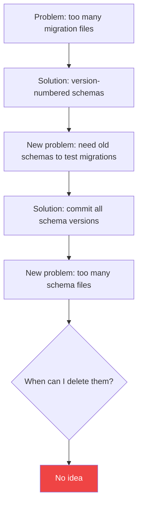
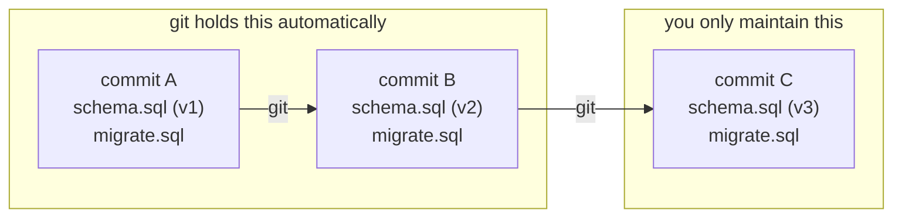

<Principle>Commit two files per schema change: `schema.sql` (what your database should look like now) and `migrate.sql` (how to get there from the last version). Git holds the rest.</Principle>

Your CI validates the migration by creating a database from the previous commit's `schema.sql`, applying `migrate.sql`, and diffing the result against the current `schema.sql`. If they match, the migration is correct.

## How Migrations Break Down

When you start a project, incremental migrations feel right. You're modeling your database evolution explicitly, the way it's taught. You use sqlx, Flyway, Alembic, pick your tool. You write `V1__create_users.sql`, then `V2__add_email_column.sql`, then `V3__drop_email_add_contact.sql`.

It works. Until it doesn't.

The problem surfaces early when the schema is still moving fast. Every design mistake becomes a permanent artifact. You end up with a shit ton of files like:

```
migrations/
  V001__create_users.sql
  V002__add_email.sql
  V003__drop_email_rename.sql
  V004__create_orders.sql
  V005__drop_orders_wrong_schema.sql
  V006__recreate_orders.sql
  V007__add_user_id_to_orders.sql
  ...
  V043__fix_typo_in_column_name.sql
```

Nobody on the team knows what the database actually looks like without running all 43 migrations in sequence. Your CI runs every single one on every build. Half of them are `create this` immediately followed by `drop this and try again`. Pure noise. Zero production value.


The accumulated history doesn't describe your schema. It describes every mistake you made along the way. Congratulations, you've version controlled your own confusion.

## Git Doesn't Work This Way

Here's what bothered me: version control doesn't do this.

When I push a change to a Rust file, git doesn't keep the old code next to the new code. I don't have `user_service_v1.rs` and `user_service_v2.rs` sitting in my repository. I have `user_service.rs`, and git stores the diff. If something breaks, I roll back. The history lives in git, not in the directory tree.

But with migrations, I was doing exactly the opposite: keeping every transformation step as a permanent file, forever, in the repo.

Why is the database different from source code?

It isn't.

## The Failed Attempts

### Version-Numbered Schemas

My first attempt: schema versioning. Assign an integer to each schema state. When the application starts, read the current database version and run migrations until it reaches the latest.

```
db/
  schema_v3.sql         ← current schema
  migrate_v2_to_v3.sql  ← how to upgrade
```

This solved the readability problem. I could open `schema_v3.sql` and immediately understand the current database structure. Clean.

But one problem remained: how do you test `migrate_v2_to_v3.sql`?

You need a `schema_v2.sql` to create the starting point. So you commit that too.

### Back to Square One

```
db/
  schema_v1.sql
  schema_v2.sql
  schema_v3.sql         ← current
  migrate_v1_to_v2.sql
  migrate_v2_to_v3.sql
```

Now I'm back to accumulating files. Not migration files, schema files. I traded one archaeology problem for another.

I knew I could delete old schema files when I was done with them. But when am I done with them? When every production database has passed through that version? How do I track that?



Going in circles.

## The Obvious Thing

If I commit `schema.sql` with every change, then the previous commit's `schema.sql` *is* my `from.sql`. It already exists. It's in git. It's safe. It's the ground truth.

I don't need to keep old schema versions in the repository. Git already stores them.



Every schema version ever committed is retrievable via `git checkout`. You never need to explicitly keep `schema_v1.sql` because `git show HEAD~2:db/schema.sql` gives it to you instantly.

## The Pattern

Your `db/` directory stays permanently clean:

```
db/
  schema.sql   ← desired state of the database
  migrate.sql  ← upgrade script from the previous version
```

`schema.sql` is the complete, current schema. It's the document you read when you want to understand the database. No migration history, no archaeology required. Just tables, indexes, constraints.

`migrate.sql` is the script that transforms the previous schema into the current one. You write it by hand (or generate it) when you change the schema.

### CI Validation

The CI validates that `migrate.sql` actually does what you think:

```bash
#!/bin/bash
# Get the previous schema from the last commit
git show HEAD~1:db/schema.sql > /tmp/schema_before.sql

# Create a fresh database from the previous schema
psql -c "CREATE DATABASE migration_test_before"
psql migration_test_before < /tmp/schema_before.sql

# Apply the migration
psql migration_test_before < db/migrate.sql

# Compare against the desired schema
# Use a schema-aware diff tool, not raw text diff
migra postgresql://localhost/migration_test_before \
      postgresql://localhost/migration_test_desired
```


If the schemas match, the migration is correct by definition.

### Writing the Files

When you change the schema, update `schema.sql` to reflect the new desired state, write `migrate.sql` to get there, and commit both.

```sql
-- schema.sql (after change)
CREATE TABLE users (
  created_at  TIMESTAMP NOT NULL DEFAULT NOW(),
  email       VARCHAR(255) NOT NULL UNIQUE,
  id          UUID PRIMARY KEY DEFAULT gen_random_uuid(),
  name        VARCHAR(100) NOT NULL,
  updated_at  TIMESTAMP NOT NULL DEFAULT NOW()
);

CREATE TABLE sessions (
  created_at  TIMESTAMP NOT NULL DEFAULT NOW(),
  expires_at  TIMESTAMP NOT NULL,
  id          UUID PRIMARY KEY DEFAULT gen_random_uuid(),
  token       VARCHAR(255) NOT NULL UNIQUE,
  user_id     UUID NOT NULL REFERENCES users(id) ON DELETE CASCADE
);
```

```sql
-- migrate.sql (this change: adding sessions table)
CREATE TABLE sessions (
  created_at  TIMESTAMP NOT NULL DEFAULT NOW(),
  expires_at  TIMESTAMP NOT NULL,
  id          UUID PRIMARY KEY DEFAULT gen_random_uuid(),
  token       VARCHAR(255) NOT NULL UNIQUE,
  user_id     UUID NOT NULL REFERENCES users(id) ON DELETE CASCADE
);
```

### Application Startup

At startup, check if the current `migrate.sql` has been applied (by checksum) and run it if not. There is always at most one pending migration. No chain to manage.

```sql
CREATE TABLE IF NOT EXISTS migrations_log (
  applied_at   TIMESTAMP NOT NULL DEFAULT NOW(),
  checksum     VARCHAR(64) NOT NULL,
  filename     VARCHAR(255) NOT NULL
);
```

If the checksum of `migrate.sql` isn't in `migrations_log`, run it. Store the result. Done.

On a fresh database, skip `migrate.sql` entirely and bootstrap directly from `schema.sql`.

## When This Doesn't Apply

**When your schema is stable.** Post-MVP, when the schema barely changes, the cost of tracking numbered migration files drops. If you have `V143__...sql` and the team knows the schema by heart, don't blow up working infrastructure for a principle.

**Regulated environments.** Some compliance requirements demand an explicit, append-only audit log of every database change. In that case, the file accumulation is a feature.

**Multiple independent deployment targets.** If different customers run different schema versions and need to jump from N to N+5 without intermediate steps, you need an upgrade matrix. The two-file pattern doesn't help you there.

## "Actually..."

<Objection>What if two developers change the schema at the same time?</Objection>

Same as merge conflicts in code. Both `schema.sql` and `migrate.sql` will conflict. Merge the schema changes, rewrite `migrate.sql` to handle both transformations as one operation. It's actually easier than two numbered migration files that both increment the same version counter.

<Objection>What about rollbacks?</Objection>

Write a `rollback.sql` alongside `migrate.sql` if you need it. The two-file pattern doesn't prevent rollbacks, it just doesn't force them. In practice, rolling forward with a fix is faster than rolling back, especially for data-destroying migrations like dropping columns. That's painful regardless of your migration strategy.

<Objection>Doesn't `migrate.sql` become stale after deployment?</Objection>

Yes, and that's fine. Once applied everywhere, `migrate.sql` is just documentation until the next schema change overwrites it. The full migration history is in git for anyone who needs it.
