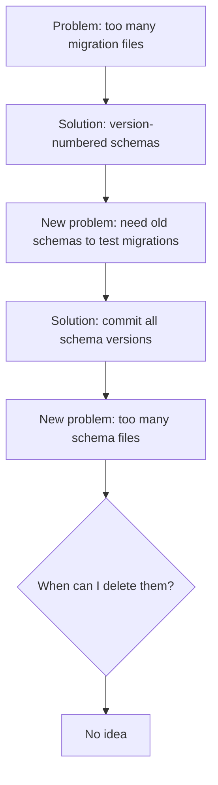
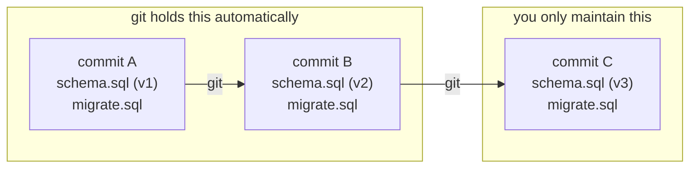
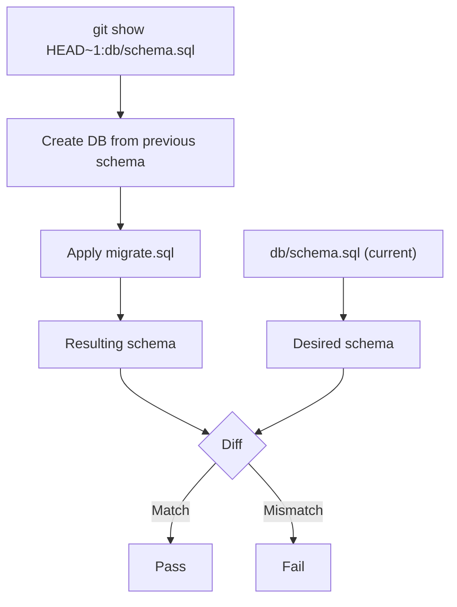
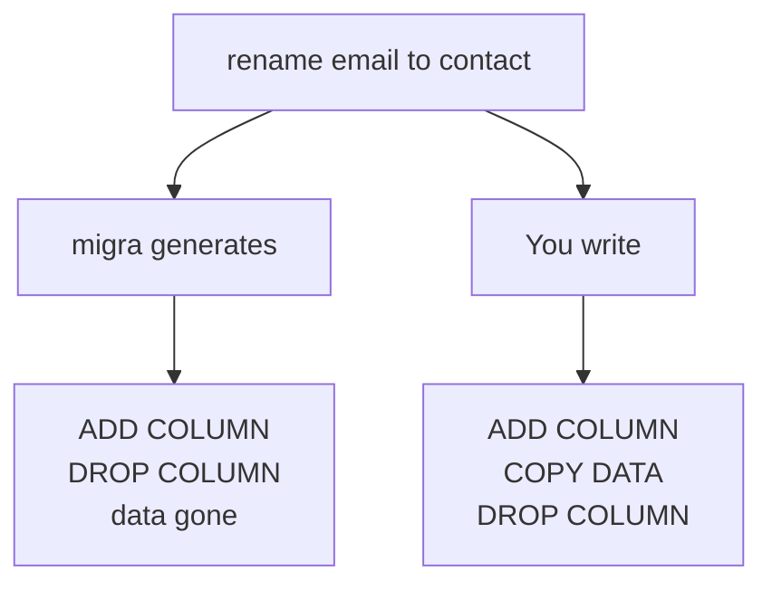
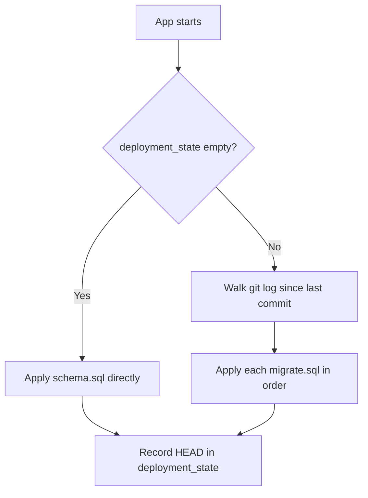

<Callout type="warn">This article is a work in progress. The two-file pattern is solid. The startup migration script is a direction I'm exploring, not a proven recipe. Use your judgment.</Callout>

<Principle>Commit two files per schema change: `schema.sql` (what your database should look like now) and `migrate.sql` (how to get there from the last version). Git holds the rest.</Principle>

## The Archaeology Problem

You inherited a codebase. The previous team was diligent. They wrote a migration for everything.

```
migrations/
  V001__create_users.sql
  V002__add_email.sql
  V003__drop_email_rename.sql
  V004__create_orders.sql
  V005__drop_orders_wrong_schema.sql
  V006__recreate_orders.sql
  V007__add_user_id_to_orders.sql
  ...
  V043__fix_typo_in_column_name.sql
```

Nobody on the team knows what the database actually looks like without running all 43 migrations in sequence. Your CI runs every single one on every build. Half of them are "create this" immediately followed by "drop this and try again." Pure noise. Zero production value.

<Excalidraw>

</Excalidraw>

The accumulated history doesn't describe your schema. It describes every mistake the team made along the way, in chronological order, forever. `V043__fix_typo_in_column_name.sql` is someone's embarrassment, preserved in amber. You've version controlled your own confusion.

## Git Doesn't Work This Way

Here's what bothered me: version control doesn't do this.

When I push a change to a Rust file, git doesn't keep the old code next to the new code. I don't have `user_service_v1.rs` and `user_service_v2.rs` sitting in my repository. I have `user_service.rs`, and git stores the diff. If something breaks, I roll back. The history lives in git, not in the directory tree.

But with migrations, I was doing exactly the opposite: keeping every transformation step as a permanent file, forever, in the repo.

Why is the database different from source code?

It isn't.

## The Failed Attempts

### Version-Numbered Schemas

First try: schema versioning. Assign an integer to each schema state. When the application starts, read the current database version and run migrations until it reaches the latest.

```
db/
  schema_v3.sql         ← current schema
  migrate_v2_to_v3.sql  ← how to upgrade
```

This solved the readability problem. Open `schema_v3.sql` and immediately understand the current database structure. Clean.

But one problem remained: how do you test `migrate_v2_to_v3.sql`?

You need a `schema_v2.sql` to create the starting point. So you commit that too.

### Back to Square One

```
db/
  schema_v1.sql
  schema_v2.sql
  schema_v3.sql         ← current
  migrate_v1_to_v2.sql
  migrate_v2_to_v3.sql
```

Back to accumulating files. Not migration files, schema files. I traded one archaeology problem for another.

I knew I could delete old schema files when I was done with them. But when am I done with them? When every production database has passed through that version? How do I track that? I had no idea.

<Excalidraw>

</Excalidraw>

Going in circles.

## The Obvious Thing

If I commit `schema.sql` with every change, then the previous commit's `schema.sql` is my `from.sql`. It already exists. It's in git. It's safe. It's the ground truth.

I don't need to keep old schema versions in the repository. Git already stores them.

<Excalidraw>

</Excalidraw>

Every schema version ever committed is retrievable via `git checkout`. You never need to explicitly keep `schema_v1.sql` because `git show HEAD~2:db/schema.sql` gives it to you instantly.

## The Pattern

Your `db/` directory stays permanently clean:

```
db/
  schema.sql   ← desired state of the database
  migrate.sql  ← upgrade script from the previous version
```

`schema.sql` is the complete, current schema. It's the document you read when you want to understand the database. No migration history, no archaeology required. Just tables, indexes, constraints.

`migrate.sql` is the script that transforms the previous schema into the current one. You write it by hand (or generate it) when you change the schema.

### CI Validation

The CI validates that `migrate.sql` actually does what you think:

```bash
#!/bin/bash
# Get the previous schema from the last commit
git show HEAD~1:db/schema.sql > /tmp/schema_before.sql

# Create a fresh database from the previous schema
psql -c "CREATE DATABASE migration_test_before"
psql migration_test_before < /tmp/schema_before.sql

# Apply the migration
psql migration_test_before < db/migrate.sql

# Compare against the desired schema
# Use a schema-aware diff tool, not raw text diff
migra postgresql://localhost/migration_test_before \
      postgresql://localhost/migration_test_desired
```

<Excalidraw>

</Excalidraw>

If the schemas match, the migration is correct by definition.

### The Two Files in Practice

Change the schema, write the migration, commit both:

```sql
-- schema.sql (after change)
CREATE TABLE users (
  created_at  TIMESTAMP NOT NULL DEFAULT NOW(),
  email       VARCHAR(255) NOT NULL UNIQUE,
  id          UUID PRIMARY KEY DEFAULT gen_random_uuid(),
  name        VARCHAR(100) NOT NULL,
  updated_at  TIMESTAMP NOT NULL DEFAULT NOW()
);

CREATE TABLE sessions (
  created_at  TIMESTAMP NOT NULL DEFAULT NOW(),
  expires_at  TIMESTAMP NOT NULL,
  id          UUID PRIMARY KEY DEFAULT gen_random_uuid(),
  token       VARCHAR(255) NOT NULL UNIQUE,
  user_id     UUID NOT NULL REFERENCES users(id) ON DELETE CASCADE
);
```

```sql
-- migrate.sql (this change: adding sessions table)
CREATE TABLE sessions (
  created_at  TIMESTAMP NOT NULL DEFAULT NOW(),
  expires_at  TIMESTAMP NOT NULL,
  id          UUID PRIMARY KEY DEFAULT gen_random_uuid(),
  token       VARCHAR(255) NOT NULL UNIQUE,
  user_id     UUID NOT NULL REFERENCES users(id) ON DELETE CASCADE
);
```

### Data Migrations

Schema diff tools like `migra` can tell you what SQL to run to transform one structure into another. They cannot tell you what to do with the data that already lives in those columns.

That part you write by hand. A column rename shows the gap:

```sql
-- migrate.sql  (commit: "rename email to contact")

-- 1. Add the new column
ALTER TABLE users ADD COLUMN contact VARCHAR(255);

-- 2. Copy the data (migra has no idea this needs to happen)
UPDATE users SET contact = email;

-- 3. Drop the old column
ALTER TABLE users DROP COLUMN email;
```

Same logic for a table split:

```sql
-- migrate.sql  (commit: "split users into users + contacts")
CREATE TABLE contacts (
  id      UUID PRIMARY KEY DEFAULT gen_random_uuid(),
  user_id UUID NOT NULL REFERENCES users(id),
  email   VARCHAR(255),
  phone   VARCHAR(50)
);

INSERT INTO contacts (user_id, email)
SELECT id, email FROM users;

ALTER TABLE users DROP COLUMN email;
ALTER TABLE users DROP COLUMN phone;
```

The data move lives in the same commit that caused it.

<Excalidraw>

</Excalidraw>

### Startup Migration

The database tracks one thing: the last deployed commit.

```sql
CREATE TABLE deployment_state (
  deployed_commit  VARCHAR(40) NOT NULL,
  deployed_at      TIMESTAMP  NOT NULL DEFAULT NOW()
);
```

That is the entire migration registry. No checksums, no version numbers, no migration tables. The commit SHA is the version. Git is the ledger.

Run this before your application starts: in an entrypoint script, a Dockerfile `CMD`, or a Kubernetes init container. If the app is up, the schema is current.

```bash
#!/bin/bash
# migrate.sh — run before the application starts

LAST_COMMIT=$(psql -t -c "SELECT deployed_commit FROM deployment_state ORDER BY deployed_at DESC LIMIT 1" | xargs)

# Fresh database: bootstrap directly from schema.sql, skip migration history
if [ -z "$LAST_COMMIT" ]; then
  psql prod < db/schema.sql
  psql -c "INSERT INTO deployment_state (deployed_commit) VALUES ('$(git rev-parse HEAD)')"
  exit 0
fi

# Walk every commit that touched migrate.sql since the last deployment, oldest first
COMMITS=$(git log --reverse ${LAST_COMMIT}..HEAD --format="%H" -- db/migrate.sql)

for COMMIT in $COMMITS; do
  echo "Applying migration from $COMMIT..."
  git show ${COMMIT}:db/migrate.sql | psql prod
done

psql -c "INSERT INTO deployment_state (deployed_commit) VALUES ('$(git rev-parse HEAD)')"
```

The `-- db/migrate.sql` filter skips commits that didn't touch the schema. Feature commits, bug fixes, doc changes: ignored.

<Excalidraw>

</Excalidraw>

If the migration fails, the app never starts. The deploy fails fast before serving a single request against a broken schema.

## The Receipt

Here's what 43 migration files actually costs you.

Every new developer runs all 43 to set up a local database. CI runs all 43 on every build, including the ones that exist only to undo the mistakes in the ones before them. You spend 10 minutes reading migration files to figure out what the database looks like today, because `schema.sql` doesn't exist and there's no other way to know. `V043__fix_typo_in_column_name.sql` is a public record of someone's bad day, sitting in your repository forever, doing nothing except slowing down your test suite.

The two-file pattern costs you nothing at setup. Every schema change is two files. That's it. A new developer clones the repo, reads `schema.sql`, and knows exactly what the database looks like. CI validates the migration in one script. The history lives in git where it belongs.

## When This Doesn't Apply

**When your schema is stable.** Post-MVP, when the schema barely changes, the cost of tracking numbered migration files drops. If you have `V143__...sql` and the team knows the schema by heart, don't blow up working infrastructure for a principle.

**Regulated environments.** Some compliance requirements demand an explicit, append-only audit log of every database change. In that case, the file accumulation is a feature.

**Multiple independent deployment targets.** If different customers run different schema versions and need to jump from N to N+5 without intermediate steps, you need an upgrade matrix. The two-file pattern doesn't help you there.

## "Actually..."

<Objection>What if two developers change the schema at the same time?</Objection>

Same as merge conflicts in code. Both `schema.sql` and `migrate.sql` will conflict. Merge the schema changes, rewrite `migrate.sql` to handle both transformations as one operation. It's actually easier than two numbered migration files that both increment the same version counter.

<Objection>What about rollbacks?</Objection>

Write a `rollback.sql` alongside `migrate.sql` if you need it. The two-file pattern doesn't prevent rollbacks, it just doesn't force them. In practice, rolling forward with a fix is faster than rolling back, especially for data-destroying migrations like dropping columns. That's painful regardless of your migration strategy.

<Objection>Doesn't running migrations at startup slow down the container?</Objection>

Only on the first boot after a schema change. The `git log` walk is fast: it's filtering a handful of commits, not scanning the full history. On every subsequent restart, `LAST_COMMIT` matches `HEAD`, the loop produces zero iterations, and the script exits immediately. The overhead is a single database query.
